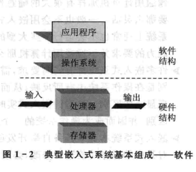

public:: true

- 🔵 **嵌入式系统**:以应用为中心，以计算机技术为基础，软硬件可剪裁、适应应用系统对功能、可靠性、成本、体积、功耗严格要求的专用计算机系统。
- 实际上是“嵌入式计算机系统”的简称，是相对于通用计算机而言的。是任何一个可包含可编程的计算机设备，但它本身却不是一个通用的计算机。
- 🔵 ==软件是嵌入式系统的核心
- 🔵 **嵌入式系统软件包含**：操作系统、引导程序、一个或多个应用程序
- 🔵 嵌入式系统往往采用实时操作系统
- 🔵 **嵌入式系统的组成：**==嵌入式处理器、外围设备、嵌入式操作系统和应用软件==
- 🔵 1.**嵌入式处理器：**==是嵌入式系统的核心部件==。嵌入式处理器与通用处理器的最大区别在于它大多工作在为特定用户群设计的系统中，具有高效率、高可靠性等特征。其中使用最广泛的嵌入式处理器有ARM、MIPS、PowerPC、MC68000等。
- 🔵 2.**外围设备：**是指在一个嵌入式系统中，除了嵌入式处理器以外用于完成存储、通信、调试、显示等辅助功能的其他部件。==根据功能可分为：存储器、接口、人机交互。==
	- 存储器 ：静态易失性存储器（RAM/SRAM）、动态存储器（DRAM）和非易失性存储器（Flash）。其中，Flash以可擦写次数多、存储速度快、容量大及价格低等优点，在嵌入式领域得到了广泛的应用。
	- 接口：应用广泛的包括并口、RS-232串口、IrDA红外接口、SPI串行外围设备接口、Inter IC总线接口、USB通用串行总线接口、Ethernet网口等。
	- 人机交互：LCD、键盘和触摸屏等人机交互设备。
- 🔵 3.**嵌入式操作系统：**在大型嵌入式应用系统中，为了使嵌入式开发更方便、快捷，需要具备一种稳定、安全的软件模块集合，用以管理存储器分配、中断处理、任务间通信和定时器响应，以及提供多任务处理等。
- 嵌入式操作系统的引入大大提高了嵌入式系统的功能，方便了应用软件的设计，但同时也占用了宝贵的嵌入式系统资源。==一般在比较大型或需要更多任务的应用场合才考虑使用嵌入式操作系统。==
- 🔵 4.**应用软件：**
- 嵌入式系统的应用软件是针对特定的实际专业领域，基于相对的嵌入式硬件平台，并能完成用户预期任务的计算机软件。应用软件是实现嵌入式系统功能的关键，对嵌入式系统软件和应用软件的要求也与通用计算机有所不同。
	- ==嵌入式软件的特点：==
	- 1.软件要求固态化存储
	- 2.软件代码要求高质量、高可靠性
	- 3.系统软件的高实时性是基本要求
	- 4.多任务实时操作系统成为嵌入式应用软件的必需。
- 
- 
- 🔵 **嵌入式系统的特点：**
	- 1.通常面向特定应用
	- 2.是将先进的计算机技术、半导体工艺、电子技术和通信网络技术与具体应用组合的产物
	- 3.与具体应用有机结合在一起，它的升级换代与具体产品同步进行
	- 4.软硬件必须高效率设计
	- 5.常有降低功耗的要求
	- 6.可靠性与稳定性对应嵌入式系统具有特别重要的意义
	- 7.提供的功能及面对的应用和过程都是预知的、相对固定的
	- 8.有实时性要求，需对外部事件作出迅速反应的能力
	- 9.本身不具备自举开发能力
	- 10.开发人员往往是各个应用领域的专家
	- 11.往往具有多操作，不同的操作可能以不同的速度发生
	- 12.往往需要复杂的图形用户接口（GUI）和其他用户接口
- **总结特点：**
	- ==1.软硬件一体化，集计算机技术、微电子技术和行业技术为一体
	- 2.需要操作系统支持，代码小，执行速度快
	- 3.专用紧凑，用途固定，成本敏感
	- 4.可靠性要求高
	- 5.多样性、应用广泛，种类繁多==
- 🔵 **嵌入式系统的应用：**
	- 军用：各种武器控制，我国嵌入式计算机最早用于导弹控制
	- 家用：各种信息家电产品，EMIT（嵌入式Internet技术）已用于社区对家用水、电、煤气表远程抄表及洗衣机遥控
	- 工业用：各种智能测量仪表、数控装置、可编程控制器、控制机、分布式控制系统、现场总线仪表及控制系统、工业机器人、机电一体化机械设备、汽车电子设备等
	- 商用：各类收款机、pos机、电子秤、条形码阅读机、商用终端、银行点钞机、IC卡读卡器、取款机、自动柜员机、自动服务终端、防盗系统、各种银行专业外围设备等
	- 办公用：复印机、打印机、传真机、扫描仪、激光照排系统、安全监控设备、手机、个人数字助理（PDA）、变频空调设备、通信终端、网络设备、录音录像及电视会议设备、数字音频广播系统等
	- 医用电子设备：各种医疗电子仪器，如：X光机、专家系统等
- 目前，嵌入式系统应用最热门的有以下几种：
- ①个人数字助理PDA（现在PDA已经被智能手机取代了）②机顶盒STB③IP电话
- 🔵 **实时系统：**是指产生系统输出的时间对系统至关重要的系统。
- 🔵 特征：实时性、并行性、多路性、独立性、可预测性、可靠性
- 🔵 分类：
	- ①根据响应时间的不同可分为三类：强实时系统、弱实时系统、一般实时系统
	- ②根据确定性的不同可分为两类：硬实时、软实时
- 🔵 特性：实时性、并行性、多路性、独立性、可预测性、可靠性、响应时间、生存时间、吞吐量、强实时系统、弱实时系统、一般实时系统（PDA、手机）、硬实时（对系统响应时间有严格要求）、软实时
- 🔵 ==**强实时系统：**在强实时系统中，各任务不仅要保证执行过程和结果的正确，同时还要保证在系统能够允许的时间内完成任务。==
- 🔵 **响应时间：**指计算机从识别一个外部事件到做出响应的时间
- 🔵 **生存时间：**指数据的有效等待时间，在这段时间里数据是有效的
- 🔵 **吞吐量：**指在一段给定时间内，系统可以处理事件的总数。
- 🔵 实时系统根据响应时间可分为三类：①强实时系统 ②弱实时系统 ③一般实时系统
- 🔵 根据确定性可分为：硬实时和软实时
	- 强实时系统：各任务不仅要保证执行过程和结果的正确，同时还要保证在系统能够允许的时间内完成任务
	- 弱实时系统：各个任务运行的越快越好，并没有严格限定完成时间
	- 一般实时系统：是强实时系统和弱实时系统的一种折衷
	- 硬实时：指系统对系统响应时间有严格的要求。如果系统响应时间不能满足，就会引起系统崩溃或出现致命的错误。
	- 软实时：指系统对系统响应时间有要求。如果系统响应时间不能满足，并不会导致系统崩溃或出现致命错误。