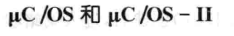

public:: true

- 🔵 **操作系统（OS）：**是一组计算机程序的集合，用来有效地控制和管理计算机的硬件和软件资源。
- 🔵 从资源管理的角度，操作系统的功能包括：
- ①处理器管理②存储器管理③设备管理④文件管理⑤用户接口
- 🔵 按程序运行调度的方法，可将计算机操作系统分为：①顺序执行系统②分时操作系统③实时操作系统
- 🔵 从应用的角度可将嵌入式系统分为：
- 
- 🔵 **任务：**是指一个程序分段，这个分段被操作系统当做一个基本工作单元来调度。任务是在系统运行前已设计好的。
- 🔵 **进程：**是指任务的一次运行过程，它是动态过程。有些操作系统把任务和进程等同看待，认为任务是一个动态过程，即执行任务体的动态过程。
- 🔵 **线程：**比进程更小的、能独立运行和调度的基本单位
- 🔵 **多用户：**允许多个用户通过各自的终端使用同一台主机，共享同一个操作系统
- 🔵 **多任务：**每个用户的应用程序可以设计成不同的任务，这些任务可以并发执行。
- ==多用户及多任务系统可以提高系统的吞吐量，更有效地利用系统资源。==
- 🔵 实时任务总是由事件或时间驱动。
- 
- 🔵 实时任务总是由于某事件发生或时间条件满足而被激活。==事件有两种：内部事件和外部事件。==
	- **内部事件驱动：**指某一程序运行的结果导致另一任务的启动。内部事件驱动的任务一般属于同步任务范畴。
	- **外部事件驱动：**最典型的实时任务是由外部事件驱动的。外部事件驱动常指工业现场状态发生变化或出现异常，立刻请求CPU处理。在实时系统中，外部事件的发生是不可预测的，由外部事件驱动的任务是最重要的任务，其优先级最高。
- 🔵 **由时间驱动的任务：**按绝对时间驱动、按相对时间驱动
	- **绝对时间驱动：**指在某指定时刻执行的任务
	- **相对时间驱动：**指周期性执行的任务
- 🔵 **中断：**是计算机中软件系统与硬件系统共同提供的功能。
	- 实时操作系统充分利用中断来改变CPU执行程序的顺序，达到实时处理的目的。
- 🔵 **中断优先级：**操作系统对每个中断源指定了优先级，成为中断优先级。在多个中断源同时发出申请时，CPU按优先级的高低顺序处理。
	- 这种总是保证优先级最高的任务占用CPU的方式，称为按优先级抢占式调度。
- 🔵 实时操作系统内的任务有数量限制，不同系统允许的任务数量不同。
- 🔵 **同步：**指与时间相关事件。
	- 由同步事件驱动的任务称为同步任务
- 🔵 **异步：**指随机发生的事件
	- 由异步事件驱动的任务称为异步任务
	- ==中断任务都是异步任务，优先级高于同步任务。==
- 🔵 **资源：**程序运行时可使用的软、硬件环境统称为资源
- 🔵 **临界资源：**如果系统中出现2个以上任务可能同时访问的共享资源
	- 系统中的公共数据区、打印机等都是临界资源
- 🔵 **容错：**指这样一种性能或措施，当系统内某些软、硬件出现故障时，系统仍能正常运转，完成预定的任务或某些重要的不允许间断的任务。
	- 容错是实时系统提供高可靠性的手段
- 🔵 **安全性：**安全性控制是操作系统对自身文件和用户文件的存取合法性的控制。
- 🔵 **实时操作系统RTOS:**是具有实时性且能支持实时控制系统工作的操作系统。
	- ==其首要任务是调度一切可利用的资源来完成实时控制任务。==
	- 在任何时刻，它总是保证优先级最高的任务占用CPU。
	- 实时操作系统是实时系统在启动之后运行的一段背景程序。应用程序时运行在这个基础之上的多个任务。
- 从性能上讲，实时操作系统与普通操作系统存在的区别主要体现在“实时”2字上。在实时计算中，系统的正确性不仅依赖于计算的逻辑结果，而且依赖于结果产生的时间。
- 🔵 **RTOS与通用计算机OS的区别：**
- 
- 🔵 **实时系统的发展：**
- ①早期的实时操作系统②专用实时操作系统③通用实时操作系统
- 🔵 **实时操作系统的组成：**
- ①实时内核（一般都是多任务的）②网络组件（可裁剪）③文件系统（可裁剪）④图形用户界面（GUI）
- 🔵 **实时操作系统的特点：**①支持异步事件的响应②中断和调度任务的优先级机制③支持抢占式调度④确定的任务切换时间和中断延迟时间⑤支持同步
- 🔵 **常见的嵌入式操作系统：**
- 1.VxWorks
- 特点：①高性能实时微内核②与POSIX兼容③自由配置能力④友好的开发调试环境
- 2. 
- 包含了进程调度、时钟管理、内存管理和进程间的通信与同步等基本功能，而没有包括I/O管理、文件系统、网络等额外模块。
- 3.WindowsCE
- 
- 4.嵌入式Linux
- 5.PalmOS
- 6.QNX
	- 是一个实时、可扩充的操作系统，遵循POSIX相关标准
- 7.Delta OS
	- 提供强实时和嵌入式多任务的内核，任务响应时间快速、确定，不随任务负载大小而改变，绝大部分代码由C语言编写，可移植性好。
- 8.Hopen OS
	- 占用空间小，且具有实时、多任务、多线程的系统特征
- 9.pSOS
	- 是世界上最早的实时操作系统之一，也是最早进入中国市场的实时操作系统。是一个模块化、高性能、完全可扩展的实时操作系统，专为嵌入式微处理器设计，提供了一个完全多任务环境，在定制或是商业化的硬件上提供高性能和高可靠性。