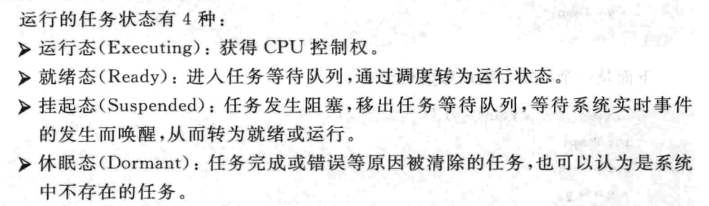
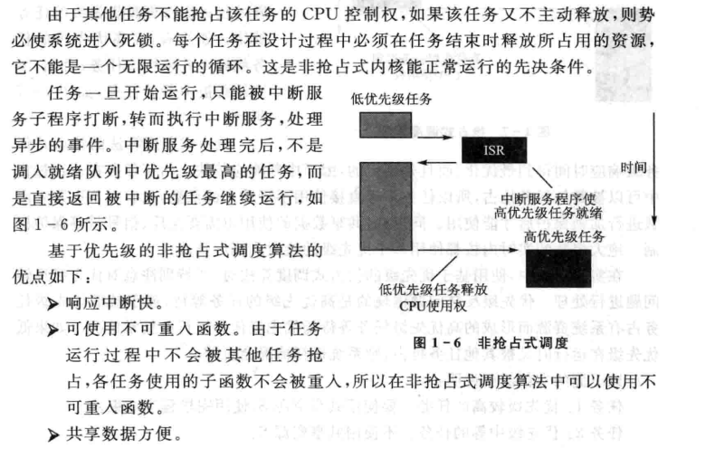

public:: true

- 🔵 在实时操作系统中最关键的部分是==实时多任务内核==。它主要实现任务管理、任务间通信与同步、存储器管理、定时器管理、中断管理等功能。
- 🔵 实时操作系统中的任务与操作系统中的进程相似。它是具有独立功能的无限循环程序段的一次运行活动。
	- 运行的任务状态：~~~~
	- 
- 任何时刻系统中只能有一个任务在运行状态，各任务按级别通过时间片分别获得对CPU的访问权。
- 🔵 实时内核的任务管理实现在应用程序中建立任务，删除任务，挂起任务，恢复任务以及对任务的响应、切换和调度等功能。
- 🔵 任务响应是从任务就绪到任务真正得到运行的过程。任务响应时间的大小依赖当前系统的负荷以及任务本身运行的优先级情况。
- 🔵 多任务运行的实现实际上是靠CPU在许多任务之间切换、调度。
- 🔵 可重入型函数：可以被一个以上的任务调用，而不必担心数据的破坏。它在任何时候都可以被中断，一段时间以后又可以运行，而相应数据不会丢失。可重入型函数只使用局部变量，即变量保存在CPU寄存器中或堆栈中。
- 🔵 **非抢占式调度：**也称合作型多任务，各个任务彼此合作共享一个CPU。
	- 中断服务可以使一个高优先级的任务由挂起状态变为就绪状态。
	- 特点：几乎不需要使用信号量保护共享数据。运行着的任务占有CPU，而不必担心被别的任务抢占。
- 
- 🔵 **抢占式调度：**当系统响应时间很重要时，要使用抢占式内核。
- 🔵 解决优先级反转问题有优先级继承和优先级封顶两种方法。
- 🔵 任务间通信的目的：在任务之间或任务与中断处理程序之间传递数据，共享资源管理。
- 🔵 任务间的通信方式：共享数据结构和消息机制
- 🔵 任务的同步：任务同步中也常常使用信号量。与任务通信不同的是，信号量的使用不再作为一种互斥机制，而是代表某个特定的事件是否发生。
- 🔵 任务的同步有：单向同步和多向同步
- 🔵 存储器管理：提供对内存资源的合理分配和存储保护功能。
- 🔵 实时内核要求用户提供定时中断以完成延时与超时控制等功能。实时系统中时钟是必不可少的硬件设备，它用来产生周期性的时钟节拍信号。
-
-