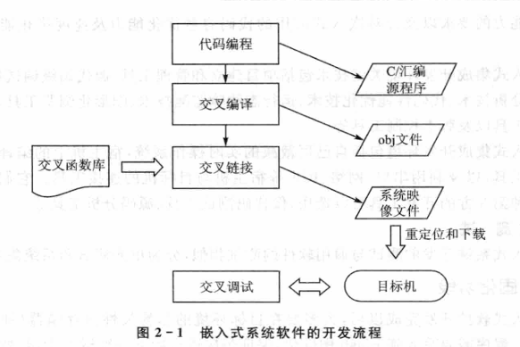

public:: true

- 🔵 **嵌入式软件的开发流程**：1.需求分析阶段 2.设计阶段 3.生成代码阶段 4.固化阶段
- 
- 嵌入式开发的需求分析阶段包括：①对问题的识别和分析②制定规格说明文档③需求评审
- DARTS设计方法的设计步骤：
- ①数据流分析②划分任务③定义任务间的接口
- 生成代码阶段包括：①代码编程②交叉编译和链接③交叉调试④测试
- 🔵 **嵌入式软件开发的要点**：①尽量用高级语言开发，少用汇编语言②局域化不可移植部分③提高软件的可重用性