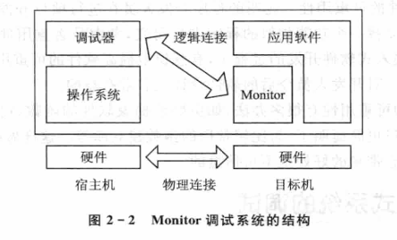

public:: true

- 🔵 **嵌入式系统调试的方式**：1.源程序模拟器方式 2.监控器方式 3.仿真器方式
- 
- 源程序模拟器是在PC机上，通过软件手段模拟执行为某种嵌入式处理器编写的源程序的测试工具。
- 模拟器软件独立于处理器硬件，一般与编译器集成在同一个环境中，是一种有效的源程序检验和测试工具。
- ARM公司的开发者有ARMulator模拟器，可以模拟开发各种ARM嵌入式处理器。它具有指令、周期和定时3级模拟功能。
- 进行监控器调试需要目标机与宿主机协调。监控程序是一段运行于目标机上的可执行程序，主要负责监控目标机上被调试程序的运行情况。
- ARM公司的angel是常驻在目标机flash中的监控程序。只需通过RS-232C串行口与PC主机相连，就可以在PC主机上对基于ARM架构处理器的目标机进行开发和调试。
- Angel的主要功能：①具有Debug调试功能②支持Angel调试协议ADP③指出目标机中的应用程序使用主机PC上的标准C函数库。④具有多任务调度和处理器模式管理功能⑤具有中断功能。
- 仿真器调试方式使用处理器内嵌的调试模块接管中断及异常处理。
- 🔵 **嵌入式系统调试的方法**：1.硬件调试 2.软件调试
- 使用硬件调试器，可以获得比软件功能强大得多的调试性能。
- 硬件调试器主要有ICE和ICD两种。前者主要完成仿真的功能，后者使用硬件上的调试口完成调试任务。
- ICE是一种完全仿造调试目标CPU设计的仪器。
- 软件调试包括：操作系统内核的调试和应用程序的调试
- 🔵 **嵌入式系统有哪几种调度方式？现在最流行的是哪种，使用什么接口？
	- ①源程序模拟器方式
	- ②监控器方式
	- ③仿真器方式（最流行，使用JTAG接口）
- 🔵 **嵌入式技术发展的趋势**：
  id:: 65765812-8269-45d8-9f6b-f9938b34613d
	- 经济性、小型化、高速度、智能性
-