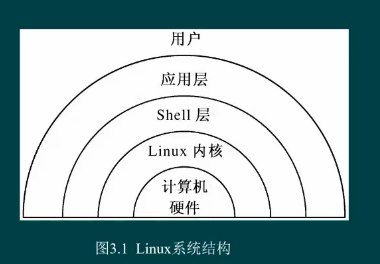
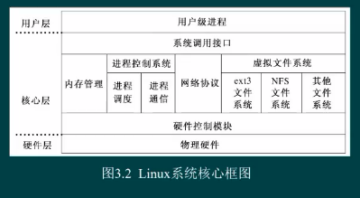

public:: true

- 🔵 **Linux**：是一个开源的操作系统，是一个基于POSIX和UNIX的多用户、多任务、支持多线程和多CPU的操作系统。
- Linux继承了UNIX以网络为核心的设计思想，是一个性能稳定的多用户网络操作系统。
- 🔵 特点：自由、免费、稳定、灵活、高效
- 🔵 **emacs**是Stallman编写的一套功能非常强大的编辑环境，也是第一个GUN软件产品。
- 🔵 **gcc**是一种支持多达11种操作系统平台的C、C++、Object C编译器。
- 🔵 **Linux的特点**：支持多任务、多用户、多处理器、跨平台、按需调入执行、分页机制、动态外存缓存、共享库支持、开放性、设备独立性、多种不同格式可执行文件支持、可靠的系统安全、支持不同种类的文件系统、丰富的网络功能、良好的用户界面、健壮性。
- 在Linux系统下开发的应用程序具有很好的可移植性。
- 🔵 **Linux的功能**：稳定的核心、丰富的应用软件、X window系统、多重启动、网络功能、软件开发工具
- 
-
- 
- 🔵 **Android**是一种以Linux为基础的开放源码操作系统，主要使用于便携设备。
-