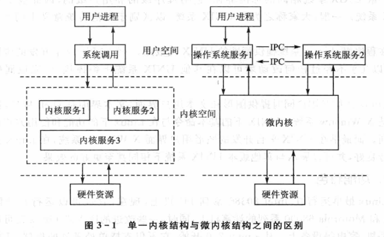
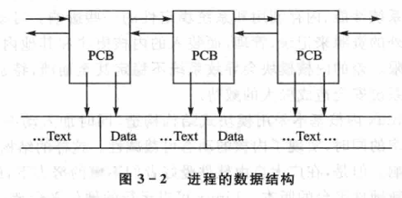
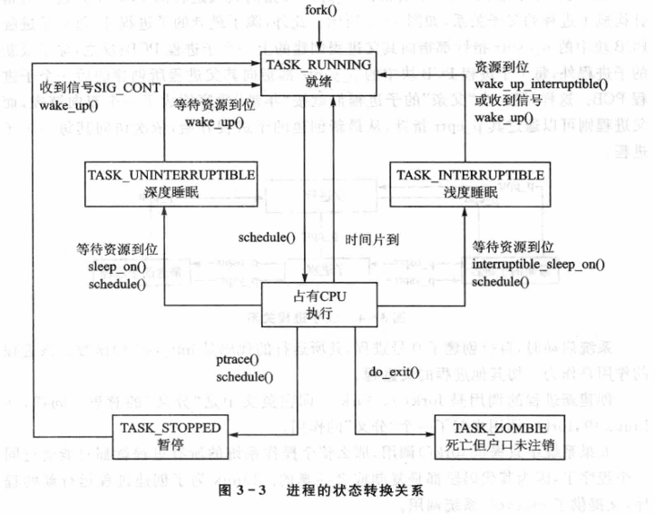
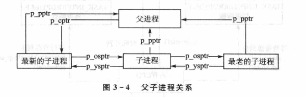
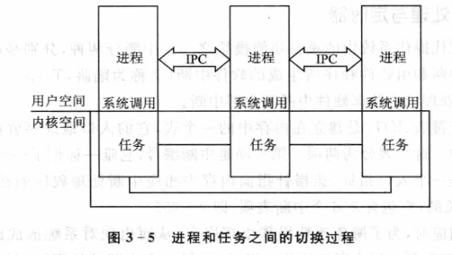
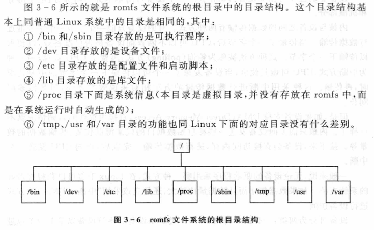
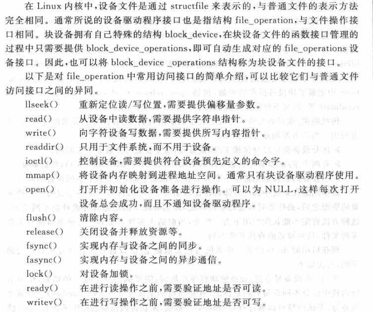
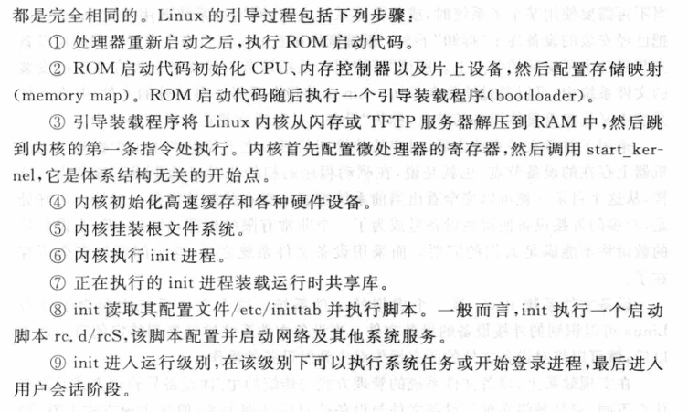

public:: true

- 🔵 **内核**：是操作系统的内部核心程序，它向外部提供了对计算机设备的核心管理调用。
- 🔵 **Linux内核的特征**：
	- 1.接口：符合Unix标准规范
	- 2.功能特色：多平台支持、多文件系统支持、多网络协议支持
	- 3.结构特征：采用动态模块结构的聚内核
- 🔵 操作系统的代码分成：内核空间和外部空间两部分。
- 🔵 微内核称为操作系统的主要潮流，微内核结构使操作系统具有良好的灵活性，其优点为：①内核本身小而且简单，容易理解，容易维护 ②各种特殊的模块、设备驱动，乃至中断处理程序都可以作为独立的进程开发，既简单又容易调试，并且容易在其它环境下模拟。 ③系统的配置也变得更灵活方便 ④微内核天生就是可抢占的
- 
- Linux不支持用户态线程。
- 🔵 **线程**是同时执行的共享资源的程序段，线程之间可以共享地址空间、物理内存页面，甚至打开的设备和文件。大量使用线程可以提高系统的效率。
- 🔵 Linux的内核为非抢占式的，Linux不能通过改变优先权来影响内核当前的执行流程。
- Linux系统具有内置的TCP/IP协议栈，可以提供各种高效的网络功能，包括基本的进程间通信、网络文件服务等。
- Linux内核基本采用模块结构，单内核模式，所以系统具有很高的运行效率，但系统的可扩展性和可移植性会受到影响。为了解决这个问题，Linux使用了附加模块技术。
- 总的来讲，Linux内核基本采用模块式结构构造，同时加入动态的模块技术，在追求系统整体效率的同时，实现了内核的动态可裁剪性。
- 🔵 **进程的特性**：①独立性②动态性③并发性
- 在Linux中，进程以进程号PID作为标识。任何对进程进行的操作都要给予其响应的PID号。每个进程都属于一个用户，进程要配备其所属的用户编号UID。此外，每个进程都属于多个用户组，所以进程还要配备其归属的用户组编号GID的数组。
- 进程的运行环境称为进程上下文。Linux中进程的上下文由进程控制块PCB、正文段、数据段以及用户堆栈组成。
- 
- 🔵 **进程的三种状态**：①就绪态②阻塞态③运行态
- 🔵 **Linux进程的状态**：①正在运行②不可中断阻塞状态③可中断阻塞状态④挂起状态⑤僵尸状态
- 🔵 调度程序用来实现进程状态之间的转换。
- 
- id:: 65742ad9-aa9a-4213-821e-9c712e5c14cf
- 🔵 进程切换的速度，是衡量一个操作系统性能的重要指标。
- 🔵 **进程要素**：程序、堆栈空间、进程控制块、其他进程资源
- 🔵 Linux中除了0号进程是启动时由系统创建外，其余进程都是由其它进程自行创建的。
- 
- 🔵 **中断**是现代操作系统中的重要功能模块之一。
- 🔵 中断分为：硬件中断和软件中断
- 🔵 **中断描述符表（IDT）**是建立在内存中的一个表，它的入口地址存放在一个中断入口寄存器中。这个表分为：中断编号和入口指针。
- 🔵 Linux的IDT是定长的，它包含256个中断表项，即0~255
- 🔵 **定时器**是建立在时钟中断基础上的一种Linux定时服务机制。可以设置一个定时器在特定时间发送信号唤醒一个特定的进程。时钟的处理程序主要是在bottom half中完成的。
- 🔵 **系统调用**是Linux中从用户状态进入内核态唯一的途径。
- Linux使用了中断的方法来实现系统调用。
- 在Linux中，当进程需要进行系统调用时，必须以C语言函数的形式写一句系统调用命令。
- 🔵 **进程**：处于用户态的程序
- 🔵 **任务**：处于内核态的指令
- 🔵 进程具有并发性，任务不具有并发性，所以Linux具有一个非抢占式内核。
- 
- 🔵 **原子操作**：指一系列基本操作组成的操作序列，其中不可被打断执行。
- 🔵 可串行性是数据库中广泛使用的一种正确标准。
- 🔵 在单处理机的情况下，用关中断的方法可以实现原子操作。在多处理机SMP的情况下，关中断的方法就无法对临界区进行保护了。于是，Linux中引入了自旋锁机制。
- 🔵 **自旋锁**：是在一个密封的循环中坚持反复尝试夺取一个资源，直到成功为止。
- 🔵 **信号量**：是另一种加锁操作。
- 🔵 用户态进程间处于并发状态。在Linux中，进程通信有以下几种方法：①管道机制 ②先进先出（FIFO）机制 ③IPC机制
- 🔵 **存储管理**：是Linux中负责管理内存的模块
- 🔵 **嵌入式Linux系统中，存储管理的任务**：
- ①  屏蔽各种硬件的内存结构，并向上层返回统一的访问界面。Linux支持各种各样的硬件体系结构。对每种硬件结构，其内存的组织形式不尽相同
- ②  解决多进程状态下内存不足的问题，按需调页
- ③ 阻止进程肆意访问其他进程的地址空间和内核地址空间
- ④  为进程中通信所需要的共享内存提供必要的基础
- 🔵 **存储管理的任务的特点**：①屏蔽各种硬件的内存结构，并向上层返回统一的访问界面 ②解决多进程状态下内存不足的问题 ③阻止进程肆意访问其它进程的地址空间和内核地址空间 ④为进程中通信所需要的共享内存提供必要的基础
- 🔵 **虚拟内存**：是现代操作系统的重要特征。
- 🔵 时间局部性和空间局部性原理是虚拟内存效率的重要保证。
- 🔵 **页面**：为存储管理中调人调出的基本单位。
- 🔵 Linux最大的特色是支持多种不同类型的文件系统
- 🔵 文件操作面向外存空间。Linux的办法是采用缓冲技术和hash解决外存与内存在I/O速度上的差异，从而提高系统效率。
- 🔵 **VFS**：是物理文件系统与服务之间的一个接口层，对用户程序隐去不同文件系统的实现细节。只存在于内存中，不存在于任何外存空间。
- 🔵 VFS的功能：
- ①记录可用的文件系统的类型 ②将设备同对应的文件系统联系起来
- ③处理一些面向文件的通用操作
- 🔵 文件系统由目录和文件构成。每个子目录或文件只能由唯一的inode描述。inode是Linux管理文件系统的最基本的单位，也是文件系统连接任何子目录和文件的桥梁。
- 🔵 在嵌入式系统中使用flash存储器，通常有两种方式：①只进行只读访问②在系统运行时既需要进行读操作，也需要进行写操作
- 🔵 文件系统类型：
- ①ext2文件系统②cramfs文件系统③romfs文件系统④日志文件系统⑤JFFS与JFFS2文件系统
- 
- 🔵 **设备管理**即输入输出子系统是操作系统的重要组成部分。
- 🔵 **设备驱动程序**：输入输出子系统可分为上下两部分，一部分是下层且与设备有关的，称为设备驱动程序。
- 🔵 **设备**可分为两部分：电子部分和机械部分
- 🔵 内核与设备之间的数据传输有两种方式：轮询方式和中断方式。
- 🔵 如果数据集中且数据量较大，采用“中断+DMA”的方式。
- 🔵 **设备**可以分为两类：字符设备和块设备。
- 🔵 **字符设备与块设备的区别**：
- ==**字符设备**以字节为单位进行数据处理，通常只允许按顺序访问，一般不使用缓存技术。==
- ==**块设备**将数据按可寻址的块为单位进行处理，块的大小通常为1KB到32KB不等。大多数块设备允许随机访问，而且常常采用缓存技术。==
- 🔵 **设备文件**：用来统一设备的访问接口。
- 🔵 **设备文件名**通常由两部分组成：第一部分较短，可能只有2或3个字母组成，用来表示设备大类。第二部分为数字或字母，用来区别设备实例。
- 
- 🔵 **设备文件系统devfs**是一个虚拟的文件系统。这个文件系统中包含了所有Linux可以识别的外接设备的设备文件。它只在系统内存中存在。
- 🔵 **设备文件系统devfs管理方式**：在devfs设备文件系统被引入操作系统内核之后，驱动程序的注册、使用从外表上看并没有太大的区别，而内部实现方法已经完全不同于过去了。在这种管理方式中，不必再根据主、次设备号去查找设备操作函数的接口。同时，devfs的注册函数自动在devfs设备文件系统挂接到的目录中生成对应的入口点。
- 
- 🔵 **Linux 2.6内核嵌入式应用特点：**
- ①可抢占式内核 ②更有效的调度算法 ③同步性提高与共享内存 ④面向应用 ⑤微控制器的支持 ⑥POSIX线程及NPTL
-
-