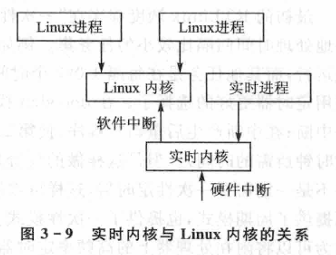

public:: true

- 🔵 **Monta Vista Linux**是针对嵌入式设备定制的实时的、专业的嵌入式操作系统。最大的特色是提供了一整套集成开发环境，包括CDK、图形化Trace工具等。
- 🔵 优点：
	- 1.支持多种硬件及平台
	- 2.提供多种实用的开发工具包（①交叉开发工具②C和C++语言工具③源代码调试工具和跟踪工具④目标配置工具⑤库优化工具⑥Java技术支持）
	- 3.性能优越的实时性（①完全的抢占性内核②透明的Monta Vista Linux实时调度器）
	- 4.完整的图形支持
- 🔵 **Monta Vista Linux**提供了四种程序调试模式：
	- 1.利用网络连接本机的gdb和嵌入式gdbserver来交叉调试应用程序
	- 2.利用kgdb通过串行口和网络连接来调试内核和驱动程序
	- 3.自主机的程序和内核调试
	- 4.利用JTAG和BDM调试器对内核和驱动程序基于硬件运行控制的调试
- 🔵**Monta Vista Linux**是第一个为IA-32/x86和PowerPC CPU提供交叉开发的跟踪工具。
- 🔵 **Monta Vista Graphics**的主要组件包括：
	- 1.X Window 系统
	- 2.用户图形界面开发包GTK+
	- 3.用户界面开发环境
	- 4.窗口管理器--IceWM
- 🔵 **RTLinux**是硬实时操作系统，是世界上最早的实时Linux系统，是一个小型的RTOS。
  id:: 657539bf-a83f-4d72-ad5b-81bb74333357
- 
- 🔵 **RTAI**是一个GUN的硬实时Linux扩展，起源于RTLinux。是一个GUN的项目，在Linux内核中加入一系列可以保证硬实时的编程接口，来实现Linux的实时性。
- 🔵 RTAI和RTLinux的区别在于它们的实现方法不同。