public:: true

- 🔵 ARM是一家设计公司，是知识产权的供应商，本身不生产芯片
- 🔵 最新的处理器核是：ARM 11
- 🔵 ARM7系列广泛应用于多媒体和嵌入式设备。
- 🔵 **ARM处理器的三大特点**：
	- ①耗电少、成本低、功能强
	- ②16位/32位双指令集
	- ③全球众多合作伙伴保证供应
- 🔵 ARM处理器是基于精简指令集计算机（RISC）思想设计的。
- 🔵 **CISC**：复杂指令集计算机
- 🔵 **RISC**:精简指令集计算机。它提高了微处理器的效率，但需要更复杂的外部程序。RISC的最大特点是指令长度固定，指令格式种类少，寻址方式种类少，大多数是简单指令并都能在一个时钟周期内完成，易于设计超标量与流水线，寄存器数量多，大量操作在寄存器之间进行。
- 🔵 **与CISC指令集相比，RISC指令集有何特点？**
	- 1.高的指令吞吐率
	- 2.出色的实时中断响应
	- 3.体积小、性价比高的处理器宏单元
- 
- 🔵 ARM架构中的处理器内核一般没有I/O的部件和模块，构成ARM架构的处理器中的I/O可通过AMBA总线来扩充。
- 🔵 **AMBA**：高级微控制器总线架构
- 🔵 **存储管理单元（MMU）**:它是中央处理器（CPU）中用来管理虚拟存储器、物理存储器的控制线路，同时也负责虚拟地址映射为物理地址，以及提供硬件机制的内存访问授权。
- 🔵 **MMU的功能**:MMU在CPU和物理内存之间进行地址转换，将地址从逻辑空间映射到物理空间。这个过程称为内存映射。
- 🔵 **MMU的工作内容**:
	- 1.虚拟存储空间到物理空间的映射
	- 2.存储器访问权限的控制
	- 3.设置虚拟存储空间的缓冲特性
- 🔵 ARM采用了存储器映射I/O的方式，即把I/O端口地址作为特殊的存储器地址。
- 🔵 **直接存储器存取（DMA）**
  id:: 65755de7-277d-4b81-9e89-d41fd3552209
- 🔵 **中断(IRQ)**
- 🔵 **快速中断(FIQ)**
- 🔵 **先进高性能总线(AHB)**
- 🔵 **先进系统总线(ASB)**
  id:: 65755ff6-4cd9-4a5a-aa9d-0c7687c6939e
- 🔵 **先进外围总线(APB)**
- 🔵 **测试接口控制器(TIC)**
- 🔵 **ARM11处理器**：采用ARMv6体系结构，采用8级流水线，动态转移预测与返回堆栈。
- 🔵 **Cortex处理器**:采用ARMv7体系结构。
- 🔵 在最基本的ARM处理器内核基础上，可增加cache、存储器管理单元MMU、协处理器CP15、AMBA接口以及EMT宏单元等，构成了ARM处理器核。
- 🔵 ARM7TDMI处理器使用了冯·诺依曼结构，指令和数据共用一条32位总线。 核心是32位的ALU。
- 🔵 在异常发生后，ARM7TDMI内核会作以下工作：
	- 1.在适当的LR中保存下一条指令的地址，当异常入口来自：
		- ①ARM状态，那么ARM7TDMI将当前指令地址+4或+8复制（取决于异常的类型）到LR中；
		- ②为Thumb状态，那么ARM7TDMI将当前指令地址+4或+8复制（取决于异常的类型）到LR中；异常处理器程序不必确定状态。
	- 2.将CPSR复制到适当的SPSR中
	- 3.将CPSR模式位强制设置为与异常类型相对应的值
	- 4.强制PC从相关的异常向量处取指。
- 🔵 当异常结束时，异常处理程序必须：
	- 1.将LR中的值减去偏移量后存入PC，偏移量根据异常的类型而有所不同
	- 2.将SPSR的值复制回CPSR
	- 3.清零在入口位置的中断禁止标志
	- 注：恢复CPSR的动作会将T、F和I自动恢复为异常发生前的值。
- 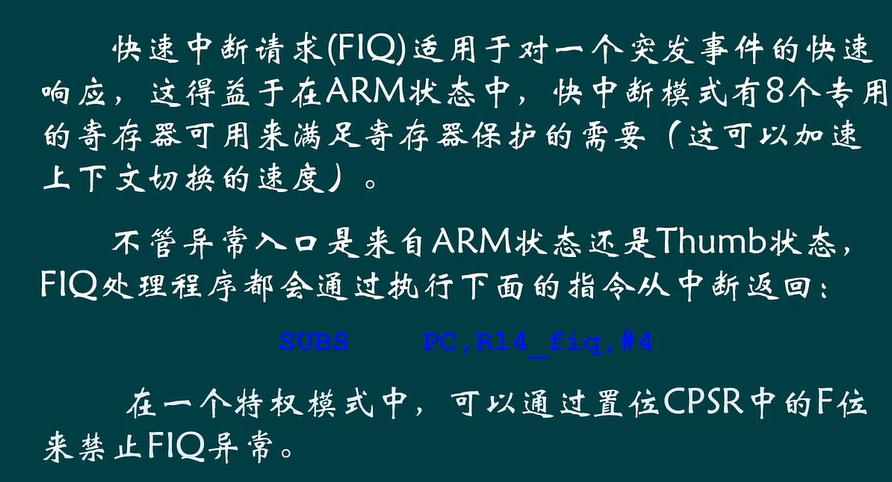
- 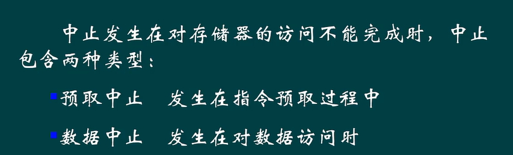
- 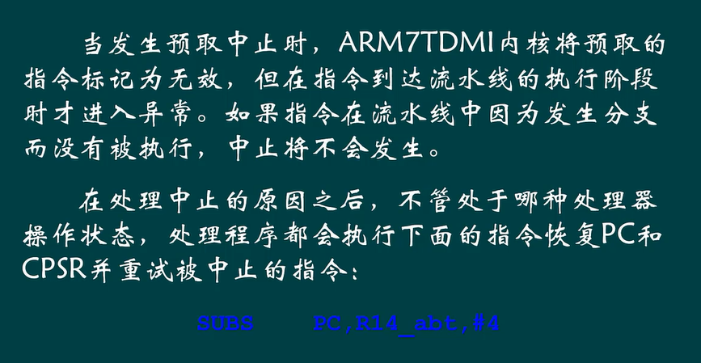
- 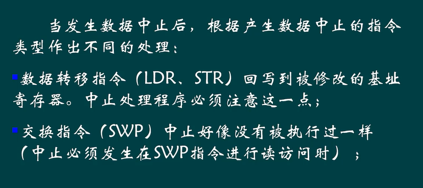
- 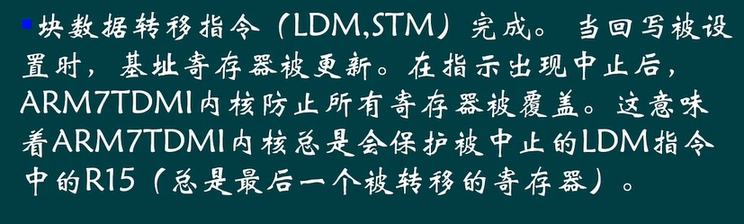
- 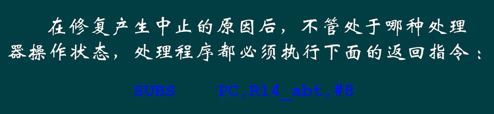
- 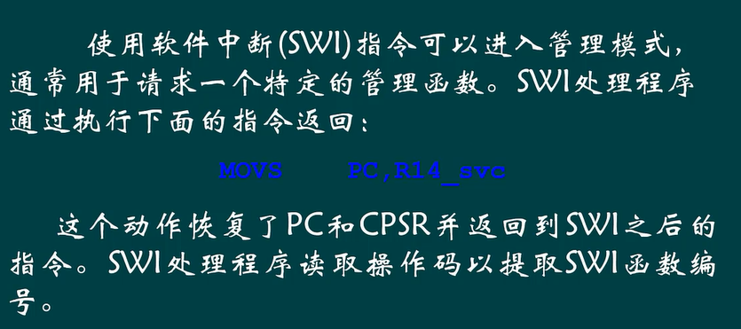
- 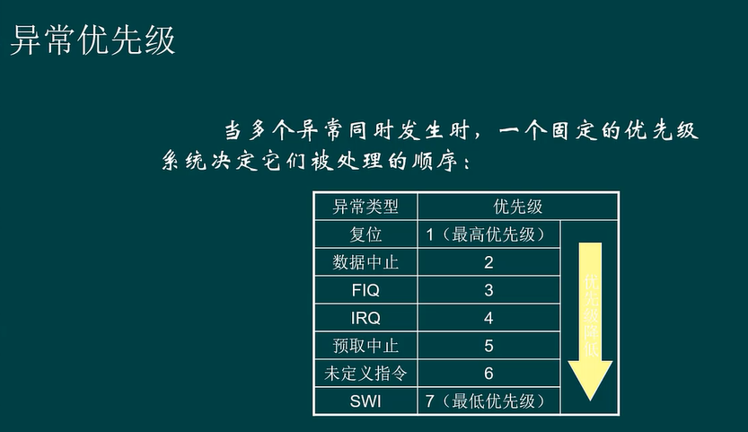
- 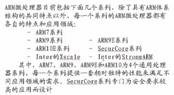
- 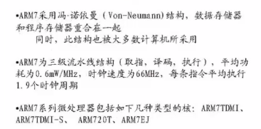
- 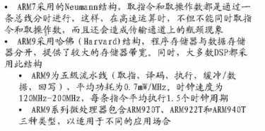
-