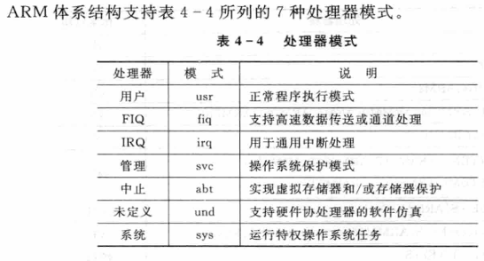
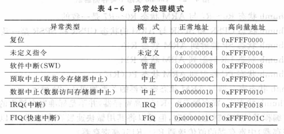
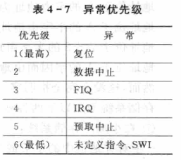

public:: true

- 🔵ARM处理器支持下列数据类型：
	- Byte             字节，8位
	- Halfword     半字，16位
	- Word           字，32位
- 🔵处理器模式：
	- 
- 🔵 ARM处理器的5种异常模式：
	- ①FIQ  ②IRQ  ③管理  ④中止  ⑤未定义
- 🔵ARM处理器的两种工作状态：
	- ARM             32位，这种状态下执行字对齐的ARM指令
	- Thumb         16位，这种状态下执行半字对齐的Thumb指令
- 🔵 ARM处理器在两种工作状态之间可以切换，不影响处理器的模式或寄存器的内容。
- 🔵 ARM处理器共有37个寄存器：31个通用寄存器、6个状态寄存器
- 🔵 **异常**：是由内部或外部源产生并引起处理器处理一个事件。
- 
- 
- 🔵 目的地址=当前指令的地址+8+偏移量
- 🔵 目的地址=当前指令的地址+4