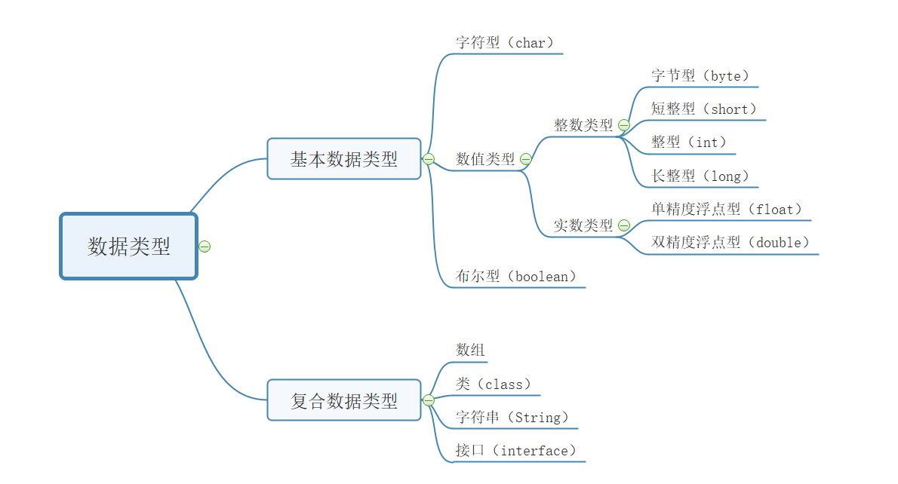
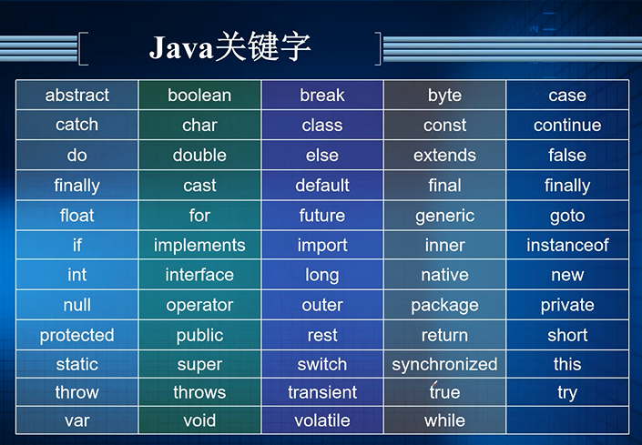
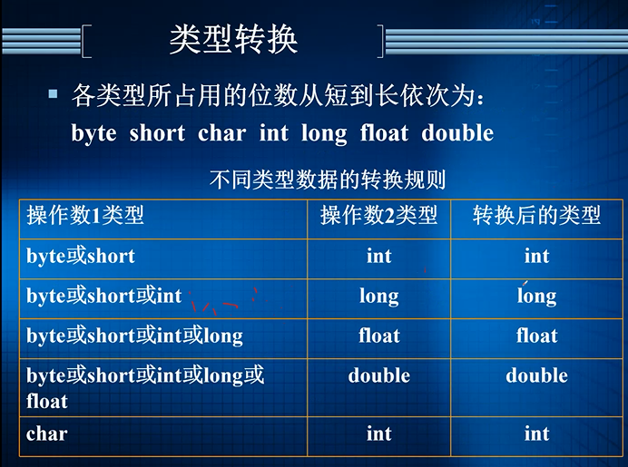
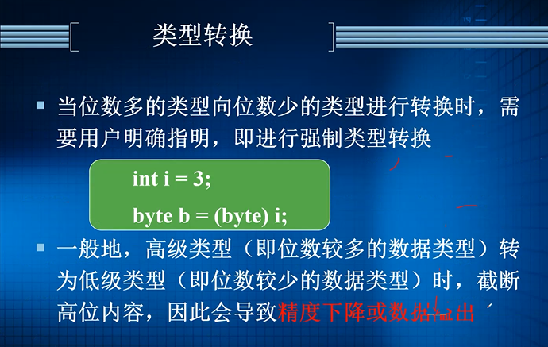

public:: false

- java语言前身是美国sun公司的
- Java语言是面向对象的程序设计语言
- 与机器无关的二进制格式的类文件
- Java虚拟机（用来执行类文件）
- 完整的软件程序包（跨平台的API和库）
- 🔵Java语言的特点：
- 类似于C++，去掉了C++中不常用且容易出错的地方
- 完全面向对象
- 🔵分布式与安全：
- 强调网络特性，内置TCP/IP、HTTP、FTP协议类库
- 三级代码安全检查机制
- 🔵与平台无关：
- 一次编写，到处运行，跨平台运行的是.java文件
- 🔵解释编译两种运行方式：
	- just-in-time编译器，简称JIT编译器
	- 多线程
	- 动态执行
- Java的计算模式：
	- 可用于客户机/服务器架构。将公共使用的程序放到应用程序服务器上，用户使用时从服务器上下载到客户端，各用户独立使用设备和程序。
- Java语言的目标：
- 提供一种解释环境
	- 这可以缩短系统开发的编译-连接-装载-测试周期，提高开发速度
- 去掉了影响代码健壮性的功能：
	- 如指针结构和
- Java虚拟机（JVM）：
	- 是运行Java程序必不可少的机制
	- 编译后的Java程序指令并不直接在硬件系统的CPU上执行，而是由JVM执行。
	- JVM是编译后的Java程序和硬件系统之间的接口，程序员可以把JVM看作一个虚拟的处理器。它不仅解释执行编译后的Java指令，而且还进行安全检查。
	- JVM是Java程序能够在多平台间进行无缝移植的可靠保证，同时也是Java程序的安全检查引擎。
- JVM代码格式为压缩的==字节码==（后缀是.class文件），效率较高
- Java源程序是.java文件，最终是将.class文件放在服务器上
- Java的编译命令是javac
-
-
- 第二章 Java语言基础
- **java标识符**：
	- 标识符用来表示变量、常量、类、方法、数组、文件、接口、包等元素的名字。Java语言中的标识符是由字母、下划线、美元符号$和数字组成，并需要遵守以下的规则：
		- ①区分大小写
		- ②应以字母、下划线或$符号开头，==不能以数字开头==
		- ③没有长度限制，标识符中最多可包含65535个字符
		- ④不能使用Java中的关键字
		- ⑤标识符中==不能==含有其它符号：例如+、—、*、%等特殊符号
		- ⑥标识符中不能插入空格
- ==Java程序的结构：==
- **package语句：**可以没有，或可以有多个，但必须放在文件开始的地方
- **import语句：**可以没有，或可以有多个，如果有import语句的话，必须放在所有类定义之前
- **public型的类定义：**每个文件中最多有一个，==文件名必须和public类名相同==
- **类定义：**每个文件中包含的类定义的个数没有限制
- **接口定义：**每个文件中包含的接口定义个数没有限制
- 基本语法单位：
- ==空白、注释及语句==
- **空白**：
	- 换行符及回车键、空格键、水平定位键（tab）都是空白。Java程序的元素之间可插入任意数量的空白，编译器将忽略掉多余的空白
	- 程序中除了加入适当的空白外，还应使用缩进格式，使得同一层语句的起始列位置相同
- **注释**：
	- 程序中适当的加入注释，会增加程序的==可读性==
	- 程序中允许加空白的地方就可以写注释。注释不影响程序的执行结果，编译器将忽略注释
	- Java中的三种注释形式：
		- 单行注释形式：//单行注释的内容
		- 多行注释的形式：
			- /*
			- 多行注释的内容
			- …
			- */
		- 文档注释的形式：
			- /**
			- 文档注释的内容
			- …
			- **/
- ==语句、分号和块==
- Java中的语句是最小的执行单位
- Java各语句间以分号“；”分隔，一个语句可写在连续的若干行内
- 花括号{ }包含的一系列语句称为语句块，简称块
- 语句块可以嵌套
	- 即语句块中可以含有子语句块。在词法上，块被当作一个语句看待
- Java中的一些命名约定：
	- 类：   应为名词，含有大小写，每个字的首字母大写
	- 接口：是一种特殊的类，命名约定和类名相同
	- 方法：应是动词，首字母小写，其余各字的首字母大写，尽量不要在方法中使用下划线
	- 常量：简单类型常量的名字应全部为大写字母，字与字之间用下划线分隔，对象常量可使用混合大小写
	- 变量：所有的实例变量、类变量和全局变量都使用混合大小写，首字符为小写，后面的字首用大写，作为字间的分隔符，**变量名中不要使用下划线**
- 数据基本类型：
- {:height 406, :width 738}
-
- 1个字节=8位
- **关键字**：
- Java 的关键字是被 Java 语言保留的、具有特殊含义的单词，它们用于表示语言的结构、功能或者限制。下面列出的是 Java 的关键字：
- 
-
- 
	-
- 
-
- 表达式的定义：
	- 由运算符和操作数组成，对操作数进行运算符指定的操作，并得出一个结果。
-
- 算术运算符：
	- 加+、减-、乘*
-
- 关系运算符：
	- 用来比较两个值，包括大于>、大于等于>=、
- 逻辑运算符
-
- 条件运算符（？：）是三元运算符，形式为表达式？语句1：语句2；表达式为真时，执行语句1 ，为假时，执行语句2
- 运算符的优先次序
	- 在对一个表达式进行计算时，
-
-
-
- **第四章：数组**
- 数组是一系列的匿名变量，数组中的元素可通过下标来访问
- 在Java中，
- 一维数组的定义：
	- type arryName[ ]
	- type [ ] arryName
-