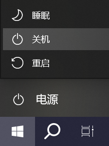
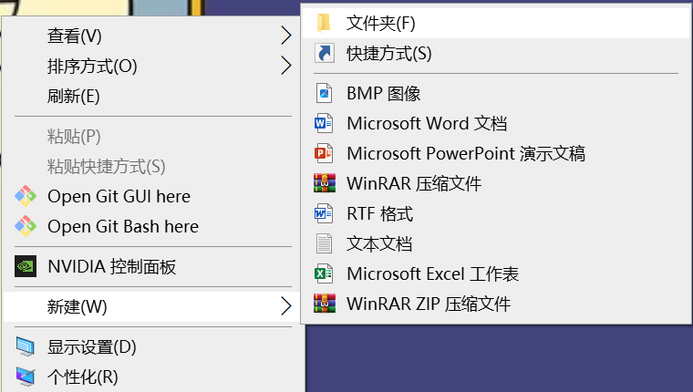
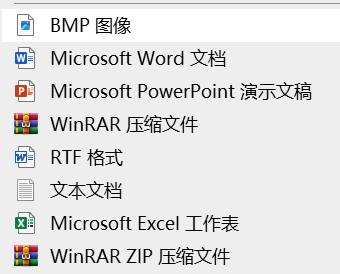
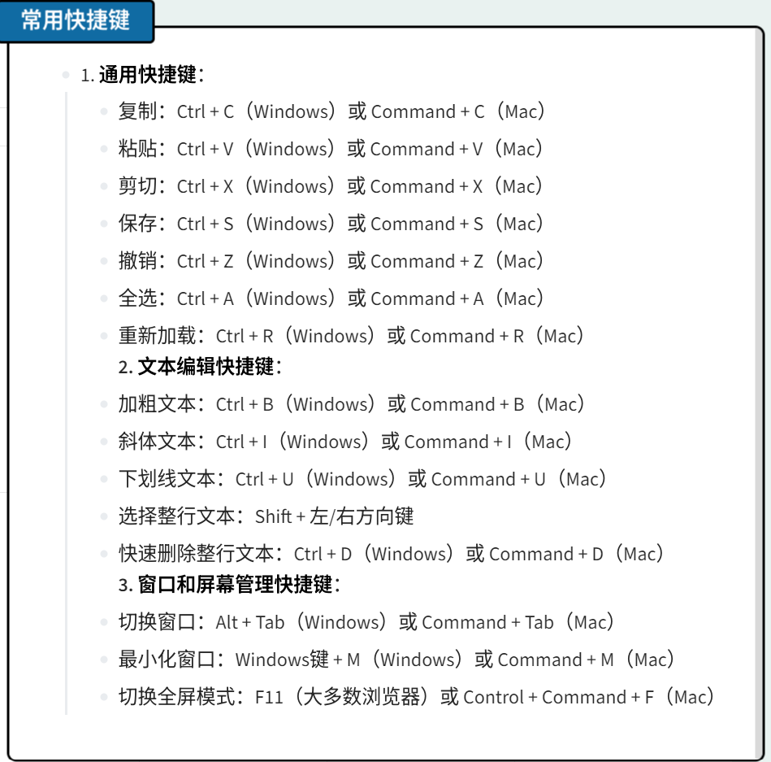
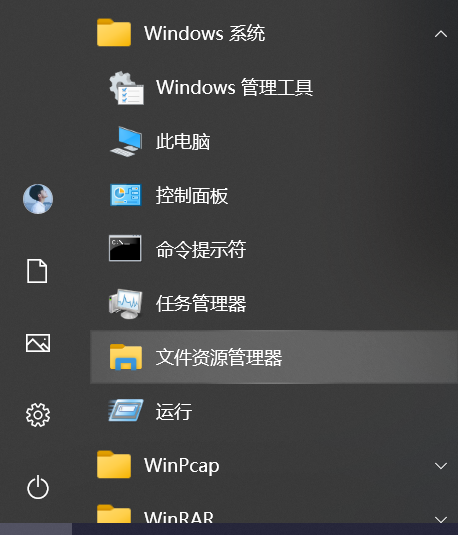
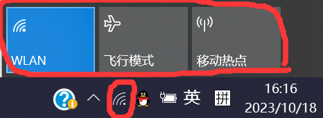
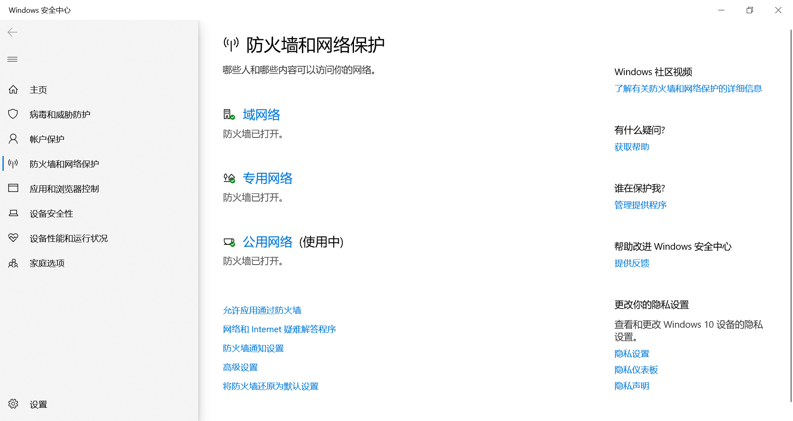

public:: true

- 🔵 **第一步：认识你的计算机**
- **1. 开机与关机**
  开机：
	- 寻找计算机的电源按钮，通常位于机箱的前面或笔记本电脑的键盘上。按下电源按钮，等待计算机启动。
	  关机：
	- 在Windows操作系统中，点击"开始"按钮，选择"关机"选项。
	- 在macOS中，点击左上角的苹果图标，选择"关机"。
	- 在Linux中，可以在终端中输入"shutdown"或"poweroff"来关闭计算机。
- 
- #### 2. 桌面和文件管理
	- 桌面是你的工作空间，你可以在上面存放常用的文件和快捷方式。
	- 了解如何创建新文件夹：右键单击桌面，选择"新建文件夹"。
- 
	- 了解如何创建新文件：右键单击桌面或文件夹，选择"新建"，然后选择文件类型。
- 
	- 学会使用快截指令
- 
- **3. 文件浏览器**
	- Windows中使用“资源管理器”，macOS中使用“Finder”来管理文件和文件夹。
- 
- 掌握如何在文件浏览器中导航、创建新文件夹、删除和重命名文件是必要的技能。
- 🔵 **第二步：互联网和网络安全**
- **1. 互联网连接**
	- 学会如何连接到Wi-Fi或有线网络。
- 
	- 在列表找到要连接的WiFi名称，输入正确的密码即可成功连接。
- **2. 网页浏览**
	- 使用常见的浏览器（如edge、Chrome、Firefox、Safari）来访问网站。
	- 学会如何输入网址、进行搜索、打开新标签页和书签网页。
- 
- 3.==打开防火墙，确保电脑能安全稳定运行==。
- 
- 🔵 **第三步：基本的应用程序使用**
- **1. 文字处理软件**
	- 使用文字处理软件（如Microsoft Word）来创建文档。
	- 学习如何编辑文本格式、插入图片、表格和页眉页脚等基本操作。
- **2. 电子表格软件**
	- 使用电子表格软件（如Microsoft Excel）来创建表格和进行基本数据分析。
	- 学会如何输入数据、进行计算和创建图表等。
- **3. 幻灯片制作软件**
	- 使用幻灯片制作软件（如Microsoft PowerPoint）来创建演示文稿。
	- 学会添加文本、图片、图表和幻灯片切换效果。
- **4.学会安装软件**
	- 可以在浏览器搜索该==软件官网==进行下载。
- **第四步：数据备份和安全**
- **1. 数据备份**
	- 学会如何备份重要文件。使用外部硬盘、云存储或备份软件来定期备份文件。
	- 创建备份计划，以确保数据安全。
- **2. 密码管理**
	- 使用复杂的密码，以防止账号被盗取。
	- 不要使用相同的密码在多个网站上，定期更改密码。
- 🔵 这份指南提供了大一计算机新生所需的关键电脑基本操作和知识。计算机技能是一个不断学习和提高的过程，希望这些建议能帮助你们快速了解计算机基础。
- #计算机基础 #电脑操作技巧 #互联网安全 #办公应用技能 #数据备份与管理 #大一新生 #计算机小白 #计算机入门