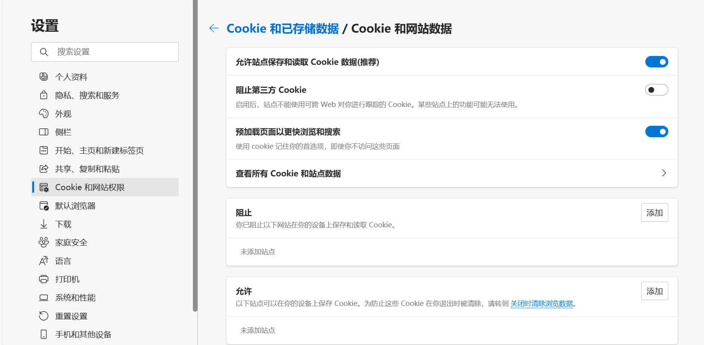

public:: true

- 🔵**1. 保护你的隐私：**
	- 在如今数字时代，隐私保护至关重要。确保你的电脑和手机都设置了密码，==不要轻易分享个人信息==。同时，定期清理浏览器的缓存和Cookie，以避免个人信息泄漏。在进入一些网站时，会弹出视窗要求你同意接受Cookie，可根据个人意愿自行选择。
- 
- 🔵**2. 防止病毒和恶意软件：**
	- 其实并不需要另外安装杀毒软件，windows系统自带的Windows安全中心，定期更新和扫描你的电脑，对普通人而言已经够用了。==不要轻信来自陌生人的文件或链接，下载软件时直接去该软件的官方网站下载==，避免下载不明文件，这能有效减少病毒和恶意软件的风险。
- 🔵**3. 学会数据备份：**
	- 计算机硬盘故障或误删文件是常见问题。习惯将重要文件备份到云存储或移动硬盘，这样即使出现问题，你的数据也能得以恢复。
- 🔵**4. 优化电脑性能：**
	- 电脑运行变慢是很烦人的事情。定期清理无用的程序和文件，升级硬件（如添加更多内存），可以显著提高电脑的性能。
- 🔵**5. 学会基本的快捷键：**
	- Ctrl+C（复制）、Ctrl+V（粘贴）、Ctrl+Z（撤销）等基本快捷键能极大提高你的工作效率。多学几个常用的快捷键，会让你的操作更加流畅。
- 🔵**6. 学习基本的代码技能：**
	- 不需要成为编程大佬，但了解基本的编程语言和脚本会让你在处理一些重复性任务时事半功倍。学习Python或JavaScript是个不错的选择。
- 🔵**7. 管理电子邮件：**
	- 学会使用电子邮件客户端来组织你的收件箱，标记重要邮件，设置过滤器，以便更好地管理邮件。这对于大学生来说特别有用，因为电子邮件通常是与老师和同学沟通的主要方式之一。
- 🔵**8. 使用云服务：**
	- 利用云存储和云办公套件，如Google Drive和Microsoft Office 365，可以轻松共享和协作文档，无论你在何处都可以访问你的文件。
- 🔵**9. 保持系统更新：**
	- 确保你的操作系统和应用程序都是最新版本，以获取最新的功能和安全性修复。
- 🔵**10. 学习在线资源：**
	- 要擅于通过在线教程、论坛和社交媒体来学习计算机技能。常见的学习资源如：中国大学mooc、B站等，可以学到很多有用的知识。
- 🔵**11. 谨慎使用公共Wi-Fi：**
	- 在使用公共Wi-Fi时，要注意保护自己的数据安全。==避免访问敏感账户（如银行账户）或输入密码==，因为公共Wi-Fi网络可能不够安全。
- 🔵**12. 学习基本的文件管理技巧：**
	- 可以将文件夹进行分类，文件命名要有意义，避免文件散乱，合理的分类文件，可以提高工作效率。
- 🔵**13. 关注系统通知：**
	- 定期检查操作系统的通知，以确保你的计算机处于最佳状态。有时，系统通知会提醒你需要更新、扫描或修复问题。
- 🔵**14. 了解常见的网络问题：**
	- 学会诊断常见的网络问题，如无法连接到互联网、Wi-Fi连接问题等。这将帮助你快速解决与网络相关的困扰。==我主页置顶笔记里也有相关教程，需要的朋友，可以关注一下==。
- 🔵**15. 培养良好的键盘和鼠标习惯：**
	- 使用键盘和鼠标时要注意姿势，以避免手部不适。学会使用鼠标滚轮、快捷键和手势来提高操作效率。
- 🔵**16. 学会利用搜索引擎：**
	- Google、百度或其他搜索引擎是你的朋友。当你遇到问题时，不要害怕搜索答案，因为几乎每个问题在互联网上都有解决方法。合理运用搜索引擎会让你避免很多麻烦。
- 🔵**17. 定期清理垃圾文件：**
	- 清理临时文件、无用的下载、垃圾邮件等垃圾文件，以释放磁盘空间并提高系统性能。
- 🔵**18. 维护你的硬件：**
	- 定期清洁你的电脑屏幕、键盘和鼠标，确保它们保持良好的工作状态。==尽量避免在被褥上使用电脑，这么做会影响电脑的散热。尽量不要在电脑旁边放水杯，吃东西，避免有东西进到键盘缝隙里。==此外，检查电脑的散热系统，确保它不会因过热而降低性能。
- 🔵**19. 制定时间管理策略：**
	- 在大学生活中，时间管理至关重要。使用时间管理工具和应用程序（可自行选择），制定合理的学习和工作计划。
- 🔵**20. 持续学习和探索：**
	- 计算机领域不断发展和演进，所以要持续学习并保持好奇心，关注最新的技术趋势，以提高自身技能。
- 这些是一些简单但实用的计算机技巧，能够帮助你更好地应对日常的计算机问题。不管你是计算机专业的还是小白一枚，掌握这些技能都会让你的计算机生活更轻松。希望这些技巧对大家有所帮助，让你的计算机使用更加顺畅。不要害怕尝试新事物，因为计算机世界充满了无限的可能性。如果你有任何问题或需要更多的建议，欢迎评论或私信留言向我提问。我会尽力帮助你解决。愿大家都能成为计算机高手！👩‍💻👨‍💻💻🚀
- #计算机技巧 #学生生活 #小红书博主 #生活小技巧 #大学生计算机技能