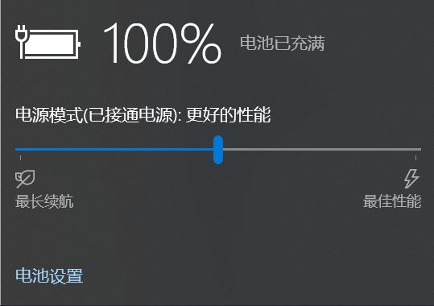
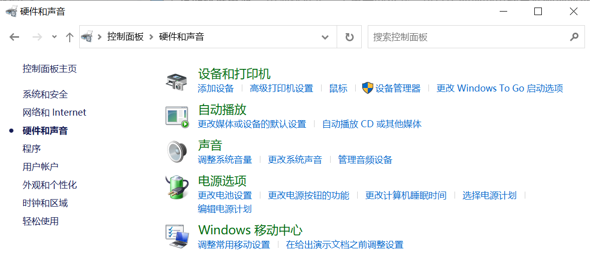
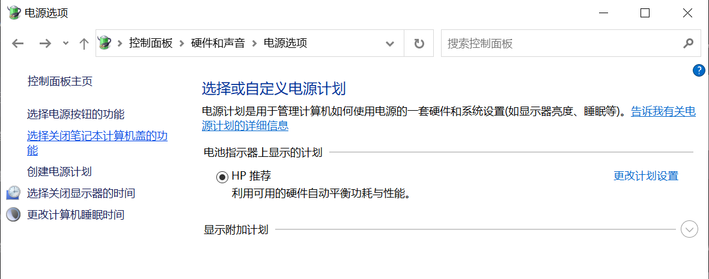
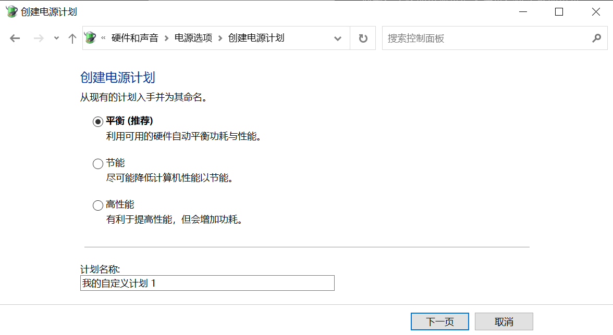

public:: true
---
🔋 电脑电池不够用？快来看看如何提升笔记本电脑电池续航时间吧！

- 你是否曾遇到笔记本电脑电池不持久、很快就没电的问题？别担心，这是一个常见的问题，但也有许多方法可以改善电池寿命。在这篇文章中，我将为你介绍电脑电池续航问题以及解决方法，让你的笔记本电脑电池焕发新生！
- 🔵 **问题描述：**
  笔记本电脑电池续航问题是许多人都会面临的挑战。当电脑电池不够用时，你可能会被迫频繁充电，这不仅烦人，还会降低电池寿命。
- 🔵 **解决方法：**
  以下是一些方法，可以帮助你提升笔记本电脑的电池续航时间：
- 🔵 1. **降低屏幕亮度：**笔记本电脑的屏幕通常是电池耗电的主要原因之一。亮度较高的屏幕会迅速消耗电池。降低屏幕亮度可以显著延长电池寿命。调整屏幕亮度至一个舒适的水平，以满足你的需求。大多数笔记本电脑都有专门的快捷键或设置，可以轻松调整亮度。此外，你还可以启用自动亮度调节功能，根据环境光线自动调整亮度，以降低功耗。
- 
- 🔵 2. **关闭不必要的背景程序：** ==后台运行的程序和进程会加重电脑的负担==，导致电池更快耗尽。检查任务管理器，关闭你不需要的后台应用程序。此外，==浏览器标签页和插件也可能消耗大量的电==，因此关闭不需要的标签页和插件可以减少功耗。
- 🔵 3. **定期校准电池：**==电池校准是一个重要的步骤==，可以帮助你的电脑更准确地显示电池寿命。电池指示器不准确，可能会导致意外关机。在电脑电池完全放电后，将其完全充电，然后再次完全放电，以校准电池，这有助于电脑识别电池的实际容量。==（我主页置顶笔记里有教程，可自行参考）==
- 🔵 4. **更换老化电池：**老化的电池可能无法再提供足够的电量。如果你的笔记本电脑电池已经使用了数年，可能已经老化，导致续航时间明显下降。考虑购买一块新的电池，以恢复电池性能。
- 🔵 5. **优化电源计划：** 操作系统通常提供不同的电源计划选项，如高性能、平衡和省电模式。选择合适的电源计划可以根据需求调整电脑性能，以延长电池寿命。根据你的需求选择合适的电源计划。在 Windows 操作系统中，你可以在控制面板中找到“电源选项”来配置计划。
- 
- 
- 
- 🔵 这些建议可以帮助你改善笔记本电脑的电池续航问题，让你的电脑更加节能和高效。电脑电池续航问题是常见的，但它并不是不可解决的。通过采取上述措施，你可以明显提高笔记本电脑的电池寿命，可以不必担心频繁充电。记住，合理使用你的笔记本电脑，可以使它的电池焕发新生！💻🔋
- #电池续航 #笔记本电脑 #小红书教程 #电脑常见问题 #电脑电池问题 #小知识