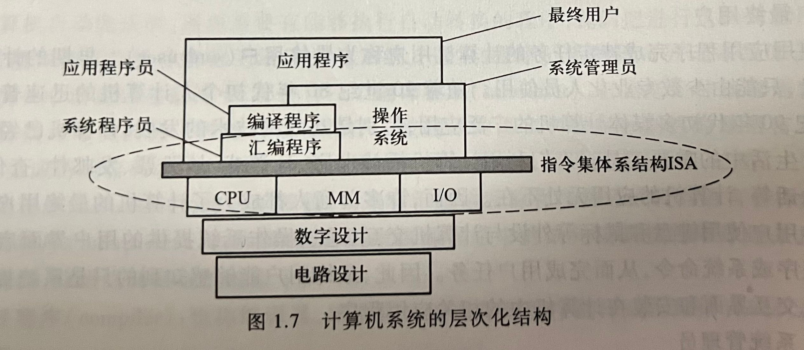
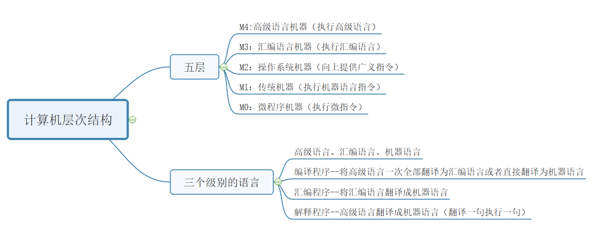

public:: true

- 🔵  计算机的特点：运算速度快、计算精度高、能记忆、会判断、高度自动化、存储能力强
- 🔵 计算机的发展趋势：巨型化、微型化、智能化、网络化、多媒体化
- 🔵 计算机的发展阶段:电子管、晶体管、集成电路、超大规模集成电路、极大规模集成电路
- 🔵 计算机系统由硬件和软件组成，具有数据处理、数据存储、数据传送三种基本功能。
- 🔵 计算机系统是一个层次结构系统，计算机解决应用问题的过程就是不同抽象层进行转换的过程。
- 🔵 **计算机的分类**：
	- **计算机从总体上来说分为两大类:**
		- **模拟计算机**和**数字计算机**。
	- **特点**：
		- **模拟计算机**：由模拟运算器件构成，处理在时间和数值上连续的模拟量（如：电压、电流等）；
		- **数字计算机**：由数字逻辑器件构成，处理离散的数字量。
		- **其中数字计算机又可分为:**
			- **专用计算机****和****通用计算机****。**
			- **专用机**：是以快速、经济和高集成度为主要指标的特殊计算机，它是针对**特定任务**设计的计算机，适应性较差（如：工控机、ATM等）
			- **通用机**：适应性较高，但是牺牲了**效率**、**速度**和**经济性**，如个人电脑。
		- **按照系统规模和计算能力，也可以分为：**
			- **巨型机（超算）**
			- **大型机**
			- **小型机**
			- **微型机**
			- **单片机**
			- **它们的系统规模和计算能力依次递减。**
			- **随着超大规模集成电路技术的不断发展，类型的划分会动态变化。**
- 第一台通用计算机ENIAC诞生于1940年
- 🔵 （重点）**冯·诺依曼结构**：
	- 基本思想：存储程序控制
	- （1）采用“存储程序”工作方式
	- （2）计算机由运算器、控制器、存储器、输入设备、输出设备五个基本部件组成
	- （3）存储器不仅能存放数据，也能存放指令，形式上数据和指令没有区别，但计算机能区分它们；控制器能自动执行指令；运算器能进行加减乘除4种基本算数运算，并且能进行逻辑运算；操作人员可通过输入输出设备使用计算机。
	- （4）计算机内部以**二进制**形式表示指令和数据；每条指令由**操作码**和**地址码**两部分组成，操作码指出操作类型，地址码指出操作数的地址；由一串指令组成程序。
- 🔵 现代计算机硬件主要包括：中央处理器（CPU）、存储器、外部设备、各类总线等。
	- 中央处理器（CPU）：是计算机的**核心部件**，主要用于指令的执行。CPU包含两个部分：数据通路和控制器。
	- **数据通路**：是指令执行过程中数据所流经的部件，包括各类运算部件。
	- 最重要的运算部件是**算数逻辑部件（ALU）**，它用来进行基本的算数和逻辑运算。ALU中最基本的部件是**加法器**，所有的算术运算都可以基于加法运算和逻辑运算来实现。
	- **控制器**：用来对指令进行译码，生成相应的控制信号，以控制数据通路进行特定的操作。
	- **存储器**分为：内存和外存
	- **内存**包括：主存（main memory）和高速缓冲存储器（cache）。==内存和主存都是指主存储器。插在主板上的内存条是主存储器的一部分。==
	- **外存**包括：辅助存储器和海量后备存储器
	- **辅助存储器**：简称辅存，是系统运行时直接和主存交换信息的存储器。
	- 海量后备存储器：主要用于信息的备份和脱机存档
	- **外部设备**：简称外设，也称I/O设备，每个外设都需要相应的控制逻辑，通常将控制外部设备工作的控制逻辑称为I/O控制器
	- 外设通过I/O控制器连接到主机上，I/O控制器统称为设备控制器，如（键盘接口、打印机、显卡、网卡）
	- **总线（bus）**：是传输信息的通路，用于在部件之间传输信息。
- 🔵 （重点）**计算机的工作方式**：由存储在其内部的程序控制，是冯诺依曼结构计算机的“存储程序”工作方式的重要特征。
- 🔵 （重点）**计算机硬件的组成**：
	- 计算机硬件：指计算机中的电子线路和物理装置。
	- 计算机硬件由多个组件组成，这些组件共同构成了计算机系统。以下是计算机硬件的主要组成部分：
	- 1. **中央处理器（ CPU）：** CPU 是计算机的大脑，负责执行指令、进行运算和控制计算机的操作。它包括算术逻辑单元（ALU）和控制单元（CU），执行计算和控制操作。
	- 2. **内存：** 内存用于临时存储数据和程序。RAM（随机存取存储器）是主要的内存类型，用于存储正在运行的程序和数据。
	- 3. **存储设备：** 存储设备用于长期存储数据和程序。硬盘驱动器（HDD）、固态硬盘（SSD）、光盘（如CD、DVD）、闪存驱动器等是常见的存储设备。
	- 4. **主板：** 主板是计算机系统的核心板块，连接和支持CPU、内存、存储设备、扩展卡等各种组件，提供了这些部件之间的通信和协调。
	- 5. **输入设备：** 输入设备允许用户将数据和指令输入到计算机中。键盘、鼠标、触摸屏、扫描仪等是常见的输入设备。
	- 6. **输出设备：** 输出设备将计算机处理后的数据显示或输出给用户。显示器、打印机、音频设备（如扬声器或耳机）等是常见的输出设备。
	- 7. **图形处理器（GPU）：** GPU 用于处理图形和图像相关的计算任务，主要用于图形渲染、视频处理和游戏等应用。
	- 8. **网络接口卡（NIC）：** NIC 允许计算机连接到网络，并进行数据的收发和通信。它们可用于有线或无线网络连接。
	- 9. **电源供应器 ：** 电源供应器提供计算机所需的电能，为计算机各部件提供稳定的电源。
- 🔵 **计算机软件**：
	- 计算机软件：计算机运行所需的程序及相关资料。
	- 发展过程分为三个阶段：第一阶段是1946-1956年，第一台计算机上的第一个机器代码程序出现到实用的高级语言出现；第二阶段是1956-1968年，从实用的高级语言出现到软件工程概念出现以前这段时间；第三阶段是1960末，软件工程出现以后至今。
	- **软件包括**：系统软件和应用软件。
- 🔵 **系统软件**：介于计算机硬件和应用程序之间，系统软件包括：操作系统、语言处理系统（如Visual Studio)和各类实用程序（如磁盘碎片整理程序、备份程序）。
	- **操作系统（OS）**：主要用来管理整个计算机系统的资源，还提供计算机用户和硬件之间的人机交互界面，并提供对应于软件的支持。
	- **语言处理系统**：主要用于提供一个用高级语言编程的环境
- 🔵 **应用软件**：指专门为数据处理、科学计算、事务管理、多媒体处理、工程设计以及过程控制等应用所编写的各类程序。
- 🔵 **操作系统**：
	- 操作系统是管理计算机硬件和软件资源的系统软件。它是计算机系统中的核心部分，为用户和应用程序提供了一个与硬件交互的环境。操作系统的功能包括：
	- 1. **资源管理：** 管理计算机的硬件资源，如处理器、内存、硬盘、网络设备等。它决定了资源如何分配、调度和管理，以最大化系统的效率和性能。
	- 2. **提供用户接口：** 操作系统为用户和应用程序提供了交互界面，使用户能够使用计算机系统。这可以是命令行界面、图形用户界面（GUI）或者其他形式的用户接口。
	- 3. **文件系统管理：** 管理计算机上的文件和文件夹，负责文件的存储、组织、访问和保护。文件系统管理允许用户对文件进行读取、写入、修改和删除等操作。
	- 4. **任务管理和调度：** 控制并管理计算机系统中运行的各个任务和进程。它决定了哪个程序在什么时候运行，以及如何有效地共享处理器时间和资源。
	- 5. **内存管理：** 负责管理计算机的内存资源，包括内存分配、回收和内存保护。它确保应用程序能够正确地访问内存，并防止程序之间的相互干扰。
	- 6. **设备管理：** 管理各种输入输出设备，使其能够与计算机系统进行交互，如键盘、鼠标、打印机、网络设备等。
	- 7. **错误检测与处理：** 操作系统能够监测和处理系统中的错误和异常，保证系统的稳定性和可靠性。
	- 操作系统是计算机系统的基础，为其他软件和应用程序提供了运行环境，使得计算机硬件能够高效地工作并为用户提供服务。
- 🔵 **语言处理程序**：
	- 语言处理程序是一种软件工具，用于将人类编写的高级语言（如C、Python、Java等）转换为计算机可以执行的机器代码。它涉及多个步骤来将源代码转换为可执行的程序或运行结果。主要步骤包括：
	- 1. **编译（Compilation）：** 编译器是语言处理程序的一部分，它将高级语言源代码转换为目标机器的机器代码。编译器将整个源代码文件转换为目标代码文件，这个目标代码文件可以在特定的计算机系统上执行。
	- 2. **解释（Interpretation）：** 解释器也是一种语言处理程序，它逐行或逐块地解释和执行源代码，而不是一次性将整个程序转换为机器代码。解释器会逐行读取源代码，将其转换为机器代码，并执行转换后的代码。这使得解释型语言的程序可以直接在特定平台上运行，而不需要预先编译成机器代码。
	- 3. **汇编（Assembly）：** 汇编程序是另一种语言处理程序，它将汇编语言（Assembly Language）转换为机器代码。汇编语言是一种更接近计算机硬件的低级语言，由汇编程序将其转换为特定计算机系统的机器指令。
- 🔵 **硬件与软件之间的关系**：
	- 硬件和软件是构成计算机系统的两个基本组成部分，它们之间有着密切的关系：
	- 1. **相互依存：** 硬件和软件是相互依存的。硬件是计算机系统的物理组件，如CPU、内存、硬盘等，而软件则是运行在硬件上的程序、指令集和数据。软件需要硬件提供执行的平台，而硬件则需要软件来发挥功能和实现其设计用途。
	- 2. **硬件提供基础：** 硬件提供了计算机系统的基本功能和处理能力。它包括执行计算、存储数据和处理输入输出等基本功能，但缺少软件的指令和逻辑，它们无法直接完成实际的任务。
	- 3. **软件赋予功能：** 软件是对硬件进行控制和指导的工具。它们提供了特定的任务和功能，允许用户进行各种操作，例如操作系统、应用程序等。软件通过对硬件发出指令来完成特定任务，使硬件具有更广泛的应用能力。
	- 4. **相互影响：** 软件可以影响硬件的使用方式和性能，而硬件的性能和功能限制了软件的运行效率和能力。优秀的软件设计可以充分利用硬件的功能，提高系统的效率和性能。
	- 5. **技术发展：** 硬件和软件的发展相互促进。硬件的进步为软件提供了更强大的计算能力和更快的处理速度，同时，软件的发展也推动了对硬件性能和功能的需求。
	- 综上所述，硬件和软件之间形成了紧密的相互关系，二者共同构成了计算机系统的基础，各自的发展和优化都对整个系统的性能和功能产生着重要影响。
- 🔵 （重难点）**计算机系统的层次化结构**：
	- 
	-
-
	- 
	- **机器语言**：是用二进制进行编码的机器指令，每条机器指令都是一个0/1序列。
	- **语言处理系统**：对程序进行编译、转换并链接的软件系统。
	- 在软件和硬件之间的界面是**指令体系结构（ISA）**，简称指令系统，ISA定义了一台计算机可以执行的所有指令的集合。
- 🔵 **应用程序**：因为编写程序并让其在计算机上执行，是为了解决最终用户的应用问题的，所以程序有时被称为应用程序或用户程序。
- 🔵 **文本文件**：是指用ASCII码字符或汉字字符表示的文件，源程序文件都是文本文件，是可显示可读的。
- 🔵 **源程序文件**：指未编译的按照一定的程序设计语言规范书写的文本文件，是一系列人类可读的计算机语言指令
- 🔵 **可执行（目标）文件**：是目标代码文件通过链接器处理后生成的最终文件，它包含计算机可以直接执行的指令和数据。可执行文件通常以特定的文件扩展名（如.exe、.app等）保存，并且可以在特定的操作系统和硬件平台上运行。
- 🔵 **指令**：是指示计算机执行某种操作的命令，是计算机运行的最小功能单位 。 一台计算机的所有指令的集合构成该机的指令系统 ，也称为指令集 。
- 🔵 **指令包含**：操作码字段和地址码字段
	- 操作码字段:指出指令的操作类型
	- 地址码字段：指出指令处理的操作数所在的存储地址
- 🔵 **取数指令**：从存储单元中取出一个数据存放到CPU内的通用寄存器中
- 🔵 **存数指令**：将CPU中通用寄存器的内容写入一个存储单元
- 🔵 **ALU指令**：将两个通用寄存器内容进行某种算数或逻辑运算后再送入一个通用寄存器中。
- 🔵 **指令的执行过程**：第一步，根据PC取指令到IR；第二步，指令译码并送出控制信号；第三步，取操作数；第四步，指令执行；第五步，回写结果。
- 🔵 **指令周期**：取一条指令并执行的时间
- 🔵 **时钟周期**：一个时钟脉冲所需要的时间。
- 🔵 **程序计数器（PC）**：用来存放将要执行的下一条指令的地址
- 🔵 **通用寄存器（GPR）**：一般是指处理器最常使用的整数通用寄存器，可用于保存整数数据、地址等。
- 🔵 **通用寄存器组（GPRs）**：由若干个通用寄存器组成，每个通用寄存器有一个编号，用于存放操作数或操作数的地址。
- 🔵 **算术逻辑部件（ALU）**：用于进行算术运算和逻辑运算
- 🔵 **标志寄存器**：用来存放ALU运算得到的一些标志信息
- 🔵 **指令寄存器（IR）**：用于存放从主存储器读出的指令
- 🔵 **控制器**：产生一系列控制信号，以控制计算机中各部件从存储器中取出将要执行的指令进行译码，然后执行该指令的操作。
- 🔵 **主存储器**：用来存储指令和操作数。
- 🔵 **存储器地址寄存器（MAR）**：用于存放将要送到主存储器的主存地址,MAR中的地址信息被直接送到地址线上。
- 🔵 **存储器数据寄存器（MDR）**：用于存放CPU与主存储器交换的数据
- 🔵 **总线**：是连接各个部件的信息传输线，使各个部件共享的传输介质
	- 总线分为内部总线、系统总线和通信总线。
		- 内部总线指芯片内部连接各元件的总线。
		- 系统总线指连接计算机各部件的总线。
		- 外部总线则是计算机系统之间或计算机系统与其他系统之间的通信。
	- 系统总线又分为三类：数据总线，地址总线和控制总线
	- 总线通信的四种方式：
	- （1）同步通信：由统一时标控制数据传送
	- （2）异步通信：采用应答方式，没有公共时钟标准
	- （3）半同步通信：同步、异步结合
	- （4）分离式通信：充分挖掘系统总线每个瞬间的潜力
- 🔵 **控制信号**：
- 🔵 **时钟信号**：用于对控制信号进行定时的同步信号，其宽度为一个时钟周期
- 🔵 **程序开发和执行的过程**：用某种程序设计语言编制源程序；用语言处理程序将源程序翻译成机器语言目标程序；将目标程序中的指令和数据装入内存，然后从第一条指令开始执行，直到程序所含指令全部执行完。每条指令的执行包括取指令、指令译码、取操作数、运算、送结果等操作。
- 🔵 **各种语言处理程序（解释程序、编译程序、汇编程序）的功能**：
	- **汇编程序**：也称汇编器，用来将汇编语言源程序翻译成机器语言目标程序
	- **解释程序**：也称解释器，用来将源程序中的语句按其执行顺序逐条用子程序进行解释，并最终转换成机器指令执行
	- **编译程序**：也称编译器，用来将高级语言源程序翻译成汇编语言或机器语言目标程序。
- 🔵 **程序和指令的关系**：
	- 程序是指挥计算机如何操作的一个指令序列
	- 程序由指令组成
	- 指令是计算机硬件能直接理解并执行的基本操作
	- 数据（data）是指令的操作对象
- 🔵 **高级语言与低级语言之间的关系**：
- 🔵 **汇编语言与机器语言之间的关系**：
- 🔵 **影响计算机性能的因素**：CPU的性能、CPU的执行时间、吞吐率、响应时间、执行速度
	- 计算机系统性能批评主要考虑的是CPU的性能
	- 吞吐率和响应时间是考量计算机系统性能的两个基本指标。
	- 🔵 **吞吐率**：也称带宽，表示在单位时间内所完成的工作量
	- 🔵 **响应时间**：也称执行时间或等待时间，指从作业提交开始到作业完成所用的时间
	- 🔵 **基准程序**：是进行计算机性能评测的一种重要工具
- 🔵 **计算机系统的性能指标简单的运算**：
	- CPU时间：指CPU用于程序执行的时间，包括：用户CPU时间和系统CPU时间
		- 用户CPU时间：指真正用于运行用户程序代码的时间
		- 系统CPU时间：指为了执行用户程序而需要CPU运行操作系统程序的时间
		- 对CPU性能的测量一般通过测量用户CPU时间来进行。
	- 在对用户CPU时间进行计算时需要用到以下几个重要的概念和指标：
		- 1.时钟周期
		- 2.时钟频率：CPU的主频就是CPU时钟信号的时钟频率，是CPU时钟周期的倒数。
			- 主频为1MHz，时钟周期为10^-6s
			- 主频为1GHz，时钟周期为10^-9s
		- 3.CPI：表示执行一条指令所需的时钟周期数
			- CPU执行时间=程序所含时钟周期数÷时钟频率
				- =程序所含时钟周期数×时钟周期
			- 如果已知程序总的指令条数和综合CPI，则：
			- 程序**总**时钟周期数=程序所含指令条数×CPI
			- 若已知程序综合CPI和指令条数，则
			- CPU执行时间=CPI×程序总指令条数×时钟周期
- 🔵 **MIPS**：每秒钟执行百万条指令数，是指令速度所用的单位
- id:: 6579c660-47ff-46f4-a3de-2873d532c751
- 🔵 **解释说明**：
	- 中央处理器CPU：是计算机硬件的核心部件，由运算器和控制器组成；
	- 算术逻辑运算单元ALU：，为运算器的核心部件，其功能是进行算术、逻辑运算。
	- 数据通路：是指令执行过程中数据所流经的部件，包括各类运算部件。
	- 控制器：产生一系列控制信号，以控制计算机中各部件从存储器中取出将要执行的指令进行译码，然后执行该指令的操作。
	- 主存（内存）：
	- 辅助存储器（辅存）：
	- 外设（I/O设备）：
	- 设备控制器（I/O模块）：
	- 系统软件：
	- 应用软件：
	- 高级语言：
	- 汇编语言：
	- 机器语言：
	- 机器级语言：
	- 源程序：
	- 目标程序：
	- 翻译程序：
	- 编译程序：
	- 解释程序：
	- 汇编程序：
	- 操作系统：
	- 语言处理系统：
	- 最终用户：
	- 系统管理员：
	- 应用程序员：
	- 系统程序员：
	- 指令：是指示计算机执行某种操作的命令，是计算机运行的最小功能单位 。
	- 指令体系结构ISA：
	- 透明：对实际存在的事务或概念感觉不到
	- 响应时间：
	- 吞吐率：
	- CPU执行时间：
	-
- 主机：是计算机硬件的主体部分，由CPU和主存储器MM合成为主机。
- 主存：计算机中存放正在运行的程序和数据的存储器，为计算机的主要工作存储器，可随机存取；由存储体、各种逻辑部件及控制电路组成。
- 存储单元：可存放一个机器字并具有特定存储地址的存储单位。
- 存储元件：存储一位二进制信息的物理元件，是存储器中最小的存储单位，又叫存储基元或存储元，不能单独存取。
- 存储字：一个存储单元所存二进制代码的逻辑单位。
- 存储字长：一个存储单元所存储的二进制代码的总位数。
- 存储容量：存储器中可存二进制代码的总量；（通常主、辅存容量分开描述）。
- 机器字长：指CPU一次能处理的二进制数据的位数，通常与CPU的寄存器位数有关。
- 指令字长：机器指令中二进制代码的总位数。
- CPU：Central Processing Unit，中央处理机（器），是计算机硬件的核心部件，主要由运算器和控制器组成。
- PC：Program Counter，程序计数器，其功能是存放当前欲执行指令的地址，并可自动计数形成下一条指令地址。
- IR：Instruction Register，指令寄存器，其功能是存放当前正在执行的指令。
- CU：Control Unit，控制单元（部件），为控制器的核心部件，其功能是产生微操作命令序列。
-
- ACC：Accumulator，累加器，是运算器中既能存放运算前的操作数，又能存放运算结果的寄存器。
- MQ：Multiplier-Quotient Register，乘商寄存器，乘法运算时存放乘数、除法时存放商的寄存器。
- X：此字母没有专指的缩写含义，可以用作任一部件名，在此表示操作数寄存器，即运算器中工作寄存器之一，用来存放操作数；
- MAR：Memory Address Register，存储器地址寄存器，在主存中用来存放欲访问的存储单元的地址。
- MDR：Memory Data Register，存储器数据缓冲寄存器，在主存中用来存放从某单元读出、或要写入某存储单元的数据。
- I/O：Input/Output equipment，输入/输出设备，为输入设备和输出设备的总称，用于计算机内部和外界信息的转换与传送。
- MIPS：Million Instruction Per Second，每秒执行百万条指令数，为计算机运算速度指标的一种计量单位。
- **指令和数据都存于存储器中，计算机如何区分它们？**
- 通过不同的时间段来区分指令和数据，即在取指令阶段（或取指微程序）取出的为指令，在执行指令阶段（或相应微程序）取出的即为数据。
- 通过地址来源区分，由PC提供存储单元地址的取出的是指令，由指令地址码部分提供存储单元地址的取出的是操作数。