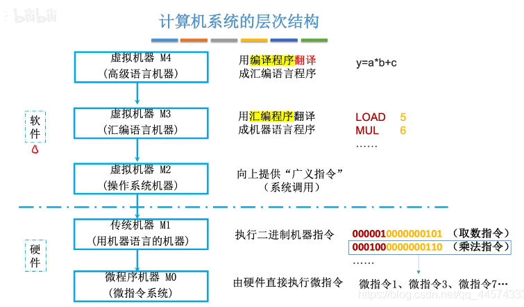
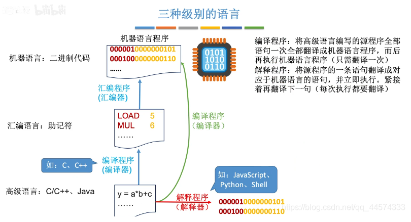
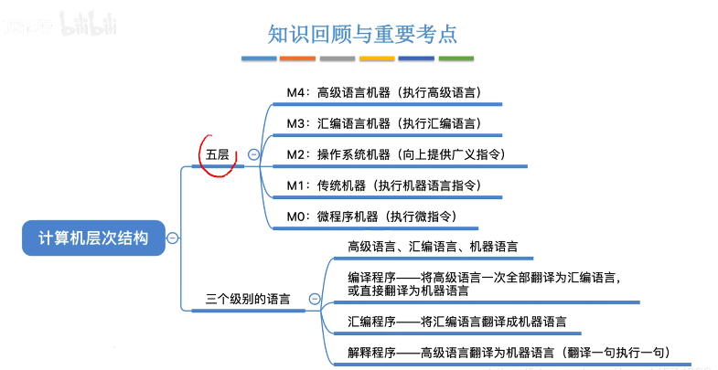

public:: true

- 🔵  计算机的特点：运算速度快、计算精度高、能记忆、会判断、高度自动化、存储能力强
- 🔵 计算机的发展趋势：巨型化、微型化、智能化、网络化、多媒体化
- 🔵 计算机的发展阶段:电子管、晶体管、集成电路、超大规模集成电路、极大规模集成电路
- 🔵 计算机系统由硬件和软件组成，具有数据处理、数据存储、数据传送三种基本功能。
- 🔵 计算机系统是一个层次结构系统，计算机解决应用问题的过程就是不同抽象层进行转换的过程。
- 第一台通用计算机ENIAC诞生于1940年
- 🔵 （重点）**冯·诺依曼结构**：
	- 基本思想：存储程序控制
	- （1）采用“存储程序”工作方式
	- （2）计算机由运算器、控制器、存储器、输入设备、输出设备五个基本部件组成
	- （3）存储器不仅能存放数据，也能存放指令，形式上数据和指令没有区别，但计算机能区分它们；控制器能自动执行指令；运算器能进行加减乘除4种基本算数运算，并且能进行逻辑运算；操作人员可通过输入输出设备使用计算机。
	- （4）计算机内部以**二进制**形式表示指令和数据；每条指令由**操作码**和**地址码**两部分组成，操作码指出操作类型，地址码指出操作数的地址；由一串指令组成程序。
- 🔵 现代计算机硬件主要包括：中央处理器（CPU）、存储器、外部设备、各类总线等。
	- 中央处理器（CPU）：是计算机的**核心部件**，主要用于指令的执行。CPU包含两个部分：数据通路和控制器。
	- **数据通路**：是指令执行过程中数据所流经的部件，包括各类运算部件。
	- 最重要的运算部件是**算数逻辑部件（ALU）**，它用来进行基本的算数和逻辑运算。ALU中最基本的部件是**加法器**，所有的算术运算都可以基于加法运算和逻辑运算来实现。
	- **控制器**：用来对指令进行译码，生成相应的控制信号，以控制数据通路进行特定的操作。
	- **存储器**分为：内存和外存
	- **内存**包括：主存（main memory）和高速缓冲存储器（cache）。==内存和主存都是指主存储器。插在主板上的内存条是主存储器的一部分。==
	- **外存**包括：辅助存储器和海量后备存储器
	- **辅助存储器**：简称辅存，是系统运行时直接和主存交换信息的存储器。
	- 海量后备存储器：主要用于信息的备份和脱机存档
	- **外部设备**：简称外设，也称I/O设备，每个外设都需要相应的控制逻辑，通常将控制外部设备工作的控制逻辑称为I/O控制器
	- 外设通过I/O控制器连接到主机上，I/O控制器统称为设备控制器，如（键盘接口、打印机、显卡、网卡）
	- **总线（bus）**：是传输信息的通路，用于在部件之间传输信息。
- 🔵 （重点）**计算机的工作方式**：由存储在其内部的程序控制，是冯诺依曼结构计算机的“存储程序”工作方式的重要特征。
- 🔵 （重点）**计算机硬件的组成**：
	- 计算机硬件：指计算机中的电子线路和物理装置。
- 🔵 **计算机各部件的功能**：
- 🔵 **计算机软件**：
	- 计算机软件：计算机运行所需的程序及相关资料。
	- 发展过程分为三个阶段：第一阶段是1946-1956年，第一台计算机上的第一个机器代码程序出现到实用的高级语言出现；第二阶段是1956-1968年，从实用的高级语言出现到软件工程概念出现以前这段时间；第三阶段是1960末，软件工程出现以后至今。
	- **软件包括**：系统软件和应用软件。
- 🔵 **系统软件**：介于计算机硬件和应用程序之间，系统软件包括：操作系统、语言处理系统（如Visual Studio)和各类实用程序（如磁盘碎片整理程序、备份程序）。
	- **操作系统（OS）**：主要用来管理整个计算机系统的资源，还提供计算机用户和硬件之间的人机交互界面，并提供对应于软件的支持。
	- **语言处理系统**：主要用于提供一个用高级语言编程的环境
- 🔵 **应用软件**：指专门为数据处理、科学计算、事务管理、多媒体处理、工程设计以及过程控制等应用所编写的各类程序。
- 🔵 **操作系统**：
- 🔵 **语言处理程序**：
- 🔵 **硬件与软件之间的关系**：
- 🔵 （重难点）**计算机系统的层次化结构**：
	- **如何理解计算机的层次结构？**
	- 计算机硬件、系统软件和应用软件构成了计算机系统的三个层次结构。 （1）硬件系统是最内层的，它是整个计算机系统的基础和核心。 （2）系统软件在硬件之外，为用户提供一个基本操作界面。 （3）应用软件在最外层，为用户提供解决具体问题的应用系统界面。 通常将硬件系统之外的其余层称为虚拟机。各层次之间关系密切，上层是下层的扩展，下层是上层的基础，各层次的划分不是绝对的。
- 
- 自上而下，计算机系统的层次结构分为：
	- 高级语言机器 M4（软件）
	  用编译程序翻译成汇编语言程序
	  汇编语言机器 M3（软件）
	  用汇编程序翻译成机器语言程序
	  操作系统机器 M2（软件）
	  向上提供“广义指令”（系统调用）
	  用机器语言的机器 M1（硬件）
	  执行二进制机器指令
	  微程序机器 M0（硬件）
	  由硬件直接执行微指令
- 
	- 我们编写的高级语言需要被编译程序或解释程序翻译成汇编语言或机器语言
	  编译程序：一次性将高级语言翻译成机器语言程序，如整体翻译（编译语言：C、C++）
	  解释程序：一句一句将高级语言翻译成机器语言程序，如同声传译（解释语言：JavaScript、Python、Shell）
	- 注：编译、汇编、解释程序，可统称为“翻译程序”；
	- 计算机体系结构——机器语言程序员所见到的计算机系统的属性概念性的结构与功能特性；探讨的是如何设计硬件与软件之间的接口
	    （指令系统、数据类型、寻址技术、I/O机理）
	- 计算机组成原理——实现计算机体系结构所体现的属性，对程序员“透明”（看不见的）；探讨的是如何用硬件实现所定义的接口
	    （具体指令的实现）
	  
	- **计算机的五层层次结构**：
	  机器：微程序机器->机器语言机器->操作系统机器->汇编语言机器->高级语言机器
	  语言：微指令->二进制机器语言->广义指令（系统调用）->汇编语言->高级语言
	- 和三个级别的语言：
	  高级语言——汇编语言——机器语言
	    编译程序和解释程序完成从高级语言到机器语言的翻译
	- **机器语言**：是用二进制进行编码的机器指令，每条机器指令都是一个0/1序列。
	- **语言处理系统**：对程序进行编译、转换并链接的软件系统。
	- 在软件和硬件之间的界面是**指令体系结构（ISA）**，简称指令系统，ISA定义了一台计算机可以执行的所有指令的集合。
- 🔵 **各类计算机用户在计算机系统中所处的位置**：
	- 按照在计算机上完成任务的不同，可以把使用计算机的用户分为四类：最终用户、系统管理员、应用程序员、系统程序员。
	- **最终用户**：使用应用程序完成特定任务的计算机用户
	- **系统管理员**：指利用操作系统等软件提供的功能对系统进行配置、管理和维护，以建立高校合理的系统环境供计算机用户使用的操作人员。
	- **应用程序员**：是指使用高级编程语言编制应用软件的程序员。
	- **系统程序员**：指设计和开发系统软件的程序员
	- 系统程序员工作在ISA层次，系统管理员工作在操作系统层，应用程序员工作在语言处理系统层，最终用户工作在最上面的应用层。
	- **计算机系统分为5个层次：硬件层、操作系统层、语言处理层、应用程序层和用户层。
- 🔵 **计算机组成原理这门课程在计算机系统中所处的位置**：
- 🔵 **应用程序**：因为编写程序并让其在计算机上执行，是为了解决最终用户的应用问题的，所以程序有时被称为应用程序或用户程序。
- 🔵 **文本文件**：是指用ASCII码字符或汉字字符表示的文件，源程序文件都是文本文件，是可显示可读的。
- 🔵 **源程序文件**：指未编译的按照一定的程序设计语言规范书写的文本文件，是一系列人类可读的计算机语言指令
- 🔵 **可执行（目标）文件**：是目标代码文件通过链接器处理后生成的最终文件，它包含计算机可以直接执行的指令和数据。可执行文件通常以特定的文件扩展名（如.exe、.app等）保存，并且可以在特定的操作系统和硬件平台上运行。
- 🔵 **指令**：是指示计算机执行某种操作的命令，是计算机运行的 最小功能单位 。 一台计算机的所有指令的集合构成该机的 指令系统 ，也称为 指令集 。
- 🔵 **指令包含**：操作码字段和地址码字段
	- 操作码字段:指出指令的操作类型
	- 地址码字段：指出指令处理的操作数所在的存储地址
- 🔵 **取数指令**：从存储单元中取出一个数据存放到CPU内的通用寄存器中
- 🔵 **存数指令**：将CPU中通用寄存器的内容写入一个存储单元
- 🔵 **ALU指令**：将两个通用寄存器内容进行某种算数或逻辑运算后再送入一个通用寄存器中。
- 🔵 **指令的执行过程**：第一步，根据PC取指令到IR；第二步，指令译码并送出控制信号；第三步，取操作数；第四步，指令执行；第五步，回写结果。
- 🔵 **指令周期**：取一条指令并执行的时间
- 🔵 **时钟周期**：一个时钟脉冲所需要的时间。
- 🔵 **程序计数器（PC）**：用来存放将要执行的下一条指令的地址
- 🔵 **通用寄存器（GPR）**：一般是指处理器最常使用的整数通用寄存器，可用于保存整数数据、地址等。
- 🔵 **通用寄存器组（GPRs）**：由若干个通用寄存器组成，每个通用寄存器有一个编号，用于存放操作数或操作数的地址。
- 🔵 **算术逻辑部件（ALU）**：用于进行算术运算和逻辑运算
- 🔵 **标志寄存器**：用来存放ALU运算得到的一些标志信息
- 🔵 **指令寄存器（IR）**：用于存放从主存储器读出的指令
- 🔵 **控制器**：
- 🔵 **主存储器**：用来存储指令和操作数。
- 🔵 **存储器地址寄存器（MAR）**：用于存放将要送到主存储器的主存地址,MAR中的地址信息被直接送到地址线上。
- 🔵 **存储器数据寄存器（MDR）**：用于存放CPU与主存储器交换的数据
- 🔵 **总线**：
- 🔵 **控制信号**：
- 🔵 **时钟信号**：用于对控制信号进行定时的同步信号，其宽度为一个时钟周期
- 🔵 **程序开发和执行的过程**：用某种程序设计语言编制源程序；用语言处理程序将源程序翻译成机器语言目标程序；将目标程序中的指令和数据装入内存，然后从第一条指令开始执行，直到程序所含指令全部执行完。每条指令的执行包括取指令、指令译码、取操作数、运算、送结果等操作。
- 🔵 **各种语言处理程序（解释程序、编译程序、汇编程序）的功能**：
	- **汇编程序**：也称汇编器，用来将汇编语言源程序翻译成机器语言目标程序
	- **解释程序**：也称解释器，用来将源程序中的语句按其执行顺序逐条用子程序进行解释，并最终转换成机器指令执行
	- **编译程序**：也称编译器，用来将高级语言源程序翻译成汇编语言或机器语言目标程序。
- 🔵 **程序和指令的关系**：
	- 程序是指挥计算机如何操作的一个指令序列
	- 程序由指令组成
	- 指令是计算机硬件能直接理解并执行的基本操作
	- 数据（data）是指令的操作对象
- 🔵 **高级语言与低级语言之间的关系**：
- 🔵 **汇编语言与机器语言之间的关系**：
- 🔵 **影响计算机性能的因素**：CPU的性能、CPU的执行时间、吞吐率、响应时间
	- 计算机系统性能批评主要考虑的是CPU的性能
	- 吞吐率和响应时间是考量计算机系统性能的两个基本指标。
	- 🔵 **吞吐率**：也称带宽，表示在单位时间内所完成的工作量
	- 🔵 **响应时间**：也称执行时间或等待时间，指从作业提交开始到作业完成所用的时间
- 🔵 **计算机系统的性能指标简单的运算**：
	- CPU时间：指CPU用于程序执行的时间，包括：用户CPU时间和系统CPU时间
		- 用户CPU时间：指真正用于运行用户程序代码的时间
		- 系统CPU时间：指为了执行用户程序而需要CPU运行操作系统程序的时间
		- 对CPU性能的测量一般通过测量用户CPU时间来进行。
	- 在对用户CPU时间进行计算时需要用到以下几个重要的概念和指标：
		- 1.时钟周期
		- 2.时钟频率：CPU的主频就是CPU时钟信号的时钟频率，是CPU时钟周期的倒数。
			- 主频为1MHz，时钟周期为10^-6s
			- 主频为1GHz，时钟周期为10^-9s
		- 3.CPI：表示执行一条指令所需的时钟周期数
			- CPU执行时间=程序所含时钟周期数÷时钟频率
				- =程序所含时钟周期数×时钟周期
			- 如果已知程序总的指令条数和综合CPI，则：
			- 程序**总**时钟周期数=程序所含指令条数×CPI
			- 若已知程序综合CPI和指令条数，则
			- CPU执行时间=CPI×程序总指令条数×时钟周期
			-
		-
-
- 主机：是计算机硬件的主体部分，由CPU和主存储器MM合成为主机。
- CPU：中央处理器，是计算机硬件的核心部件，由运算器和控制器组成；
- 主存：计算机中存放正在运行的程序和数据的存储器，为计算机的主要工作存储器，可随机存取；由存储体、各种逻辑部件及控制电路组成。
- 存储单元：可存放一个机器字并具有特定存储地址的存储单位。
- 存储元件：存储一位二进制信息的物理元件，是存储器中最小的存储单位，又叫存储基元或存储元，不能单独存取。
- 存储字：一个存储单元所存二进制代码的逻辑单位。
- 存储字长：一个存储单元所存储的二进制代码的总位数。
- 存储容量：存储器中可存二进制代码的总量；（通常主、辅存容量分开描述）。
- 机器字长：指CPU一次能处理的二进制数据的位数，通常与CPU的寄存器位数有关。
- 指令字长：机器指令中二进制代码的总位数。
- CPU：Central Processing Unit，中央处理机（器），是计算机硬件的核心部件，主要由运算器和控制器组成。
- PC：Program Counter，程序计数器，其功能是存放当前欲执行指令的地址，并可自动计数形成下一条指令地址。
- IR：Instruction Register，指令寄存器，其功能是存放当前正在执行的指令。
- CU：Control Unit，控制单元（部件），为控制器的核心部件，其功能是产生微操作命令序列。
- ALU：Arithmetic Logic Unit，算术逻辑运算单元，为运算器的核心部件，其功能是进行算术、逻辑运算。
- ACC：Accumulator，累加器，是运算器中既能存放运算前的操作数，又能存放运算结果的寄存器。
- MQ：Multiplier-Quotient Register，乘商寄存器，乘法运算时存放乘数、除法时存放商的寄存器。
- X：此字母没有专指的缩写含义，可以用作任一部件名，在此表示操作数寄存器，即运算器中工作寄存器之一，用来存放操作数；
- MAR：Memory Address Register，存储器地址寄存器，在主存中用来存放欲访问的存储单元的地址。
- MDR：Memory Data Register，存储器数据缓冲寄存器，在主存中用来存放从某单元读出、或要写入某存储单元的数据。
- I/O：Input/Output equipment，输入/输出设备，为输入设备和输出设备的总称，用于计算机内部和外界信息的转换与传送。
- MIPS：Million Instruction Per Second，每秒执行百万条指令数，为计算机运算速度指标的一种计量单位。
- **指令和数据都存于存储器中，计算机如何区分它们？**
- 通过不同的时间段来区分指令和数据，即在取指令阶段（或取指微程序）取出的为指令，在执行指令阶段（或相应微程序）取出的即为数据。
- 通过地址来源区分，由PC提供存储单元地址的取出的是指令，由指令地址码部分提供存储单元地址的取出的是操作数。