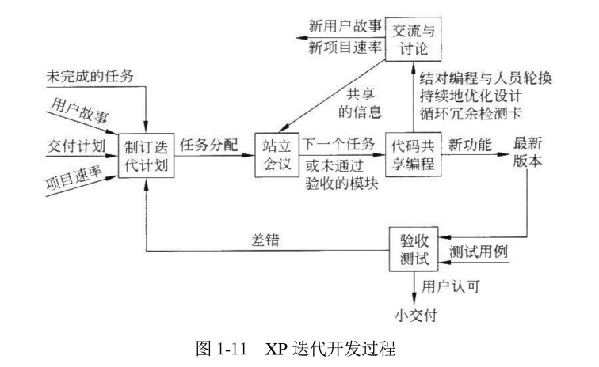

public:: false

- **第一章  软件工程学概述**
- 一、软件危机的介绍
- 1.软件危机：指在计算机软件的开发和维护过程中所遇到的一系列严重问题。
- 2.软件危机包含两方面的问题：
	- ①如何开发软件，以满足对软件日益增长的需求
	- ②如何维护数量不断膨胀的已有软件
- 3.软件危机的典型表现：
	- 1.对软件开发成本和进度的估计不准确
	- 2.用户对“已完成的”软件系统不满意的现象经常发生
	- 3.软件产品的质量往往靠不住
	- 4.软件常常是不可维护的
	- 5.软件通常没有适当的文档资料
	- 6.软件成本在计算机系统总成本中所占的比例逐年上升
	- 7.软件开发跟不上计算机应用迅速普及及深入的趋势
- 4.产生软件危机的原因
	- （1）客观原因：
		- ①软件是计算机系统中的逻辑部件而不是物理部件
		- ②软件规模庞大，而且程序复杂性将随着程序规模的增加而呈指数上升
	- （2）主观原因
		- ①对软件开发和维护有不少糊涂概念，采用了错误的方法和技术
		- ②存在与软件开发和维护有关的许多错误认识和做法
		- ③对用户要求没有完整准确的认识就匆忙着手编写程序
		- ④一个软件从定义、开发、使用和维护，直到最终被废弃，要经历一个漫长的时期
		- ⑤一个软件产品必须由一个完整的配置组成，主要包括程序、文档和数据等成分
		- ⑥在软件开发的不同阶段进行修改需要付出的代价是很不相同的
		- ⑦轻视维护是一个最大的错误
- 5.消除软件危机的途径：
	- ①应对计算机软件有正确的认识
	- ②应充分认识到软件开发是一种组织良好、管理严密、各类人员协同配合、共同完成的工程项目
	- ③应推广使用在实践中总结出来的开发软件的成功的技术和方法，并研究探索更好更有效的技术和方法，尽快消除在计算机系统早期发展阶段形成的一些错误概念和做法
	- ④应开发和使用更好的软件工具
	-
- 二、软件工程的介绍
- 1.软件工程是从管理和技术两方面研究如何更好地开发和维护计算机软件的一门新兴学科。采用工程的概念、原理、技术和方法来开发与维护软件，把经过时间考验而证明正确的管理技术和当前能够得到的最好的技术方法结合起来，以经济地开发出高质量的软件并有效的维护它，这就是软件工程。
- 2.产生：为了更有效地开发与维护软件，通过研究消除软件危机逐渐形成的一门新兴工程学科
- 3.本质特性：
	- ①软件工程关注于大型程序的构造
	- ②软件工程的中心课题是控制复杂性
	- ③软件经常变化
	- ④开发软件的效率非常重要
	- ⑤和谐的合作是开发软件的关键
	- ⑥软件必须有效的支持它的用户
	- ⑦软件工程领域由具有一种文化背景的人替具有另一种文化背景的人创造产品
- 4.软件工程的基本原理：
	- （1）七条基本原理
		- ①用分阶段的生命周期计划严格管理
		- ②坚持进行阶段评审
		- ③实行严格的产品控制
		- ④采用现代程序设计技术
		- ⑤结果应能清楚的审查
		- ⑥开发小组的人员应该少而精
		- ⑦承认不断改进软件工程实践的必要性
	- （2）意义：
		- 这七条原理是确保软件产品质量和开发效率的原理的最小集合
- 5.软件工程方法学
	- 传统方法学：
	- 采用结构化技术来完成软件开发的各项任务，并使用适当的软件工具或软件工程来支持结构化技术的运用。
	- 面向对象方法学：
	- 与传统方法相反，面向对象方法把数据和行为看成是同等重要的，它是一种以数据为主线，把数据和对数据的操作紧密结合起来的方法。
	- （1）概念
	- 软件工程技术和管理两方面的内容，是技术与管理紧密结合形成的工程学科
	- （2）三要素：方法、工具和过程
	- ①方法：是完成软件开发的各项任务的技术方法，回答“怎样做”的问题
	- ②工具：是为运用方法而提供的自动或半动的软件工程支撑环境
	- ③过程：是为了获得高质量的软件所需要完成的一系列任务的框架，它规定了完成各项任务的工作步骤
	- 传统方法学的特点：
		- 把软件生命周期的全过程依次划分为若干个阶段，然后顺序地完成每个阶段的任务。
		- 每个阶段的开始和结束都有严格标准，对于任何两个相邻的阶段而言，前一阶段的结束标准就是后一阶段的开始标准。
		- 采用生命周期方法学可以大大提高软件开发的成功率，软件开发的生产率也能明显提高。
	- 面向对象方法学的四个要点：
		- 1.把对象（object）作为融合了数据及在数据上的操作行为的统一的软件构件
		- 2.把所有对象都划分成类（class）
		- 3.按照父类与子类的关系，把若干个相关类组成一个层次结构的系统
		- 4.对象彼此间仅能通过发送消息互相联系
	- 面向对象方法学的基本原则：
		- 尽量模拟人类习惯的思维方式，使用开发软件的方法与过程尽可能接近人类认识世界、解决问题的方法与过程，从而使描述问题的问题域与实现解法的求解域在结构上尽可能一致。
	- 面向对象方法学的优点：
		- 降低了软件产品的复杂性，提高了软件的可理解性，简化了软件的开发和维护工作。面向对象方法特有的继承性和多态性，进一步提高了面向对象软件的可重用性。
	-
- 三、软件生命周期
- 软件生命周期由软件定义、软件开发和运行维护3个时期组成，每个时期又进一步划分成若干个阶段。
- 1.组成
	- （1）软件定义
	- 软件定义时期通常进一步划分成3个阶段：问题定义、可行性研究和需求分析
	- （2）软件开发
	- 通常由：总体设计、详细设计、编码和单元测试、综合测试，4个阶段组成
	- （3）运行和维护
	- 软件运行和维护的主要任务是使软件持久的满足用户的需要
- 2.软件生命周期各阶段的基本任务
	- ①问题定义
	- ②可行性研究
	- ③需求分析
	- ④总体设计（概要设计）
	- ⑤详细设计（模块设计）
	- ⑥编码和单元测试
	- ⑦综合测试
	- ⑧软件维护
		- 通常有四类维护活动：
		- ①改正性维护②适应性维护③完善性维护④预防性维护
- 四、软件过程
- 1.概念：
	- （1）定义
		- 是为了获得高质量软件所需要完成的一系列任务的框架，它规定了完成各项任务的工作步骤。
	- （2）构成
		- 科学、有效的软件过程应该定义一组适合于所承担的项目特点的任务集合
	- （3）表示
		- 使用生命周期模型简洁的描述软件过程。生命周期（过程模型）规定了把生命周期划分成哪些阶段及各个阶段的执行顺序
- 2.典型软件过程模型
	- （1）瀑布模型
		- 瀑布模型一直是唯一被广泛采用的生命周期模型，现在它仍然是软件工程中应用的最广泛的过程模型。
	- （2）传统瀑布模型开发软件的特点：
		- a.阶段间具有顺序性和依赖性
		- b.推迟现实的观点
		- c.质量保证的观点
	- （3）瀑布模型的优点：
		- ①可强迫开发人员采用规范的方法
		- ②严格规定了每个阶段必须提交的文档
		- ③要求每个阶段交出的所有产品都必须经过质量保证小组的仔细验证
		- 缺点：
		- 造就了瀑布模型过于理想化，缺乏灵活性，主要适用于需求非常明确的应用
		- ①传统的瀑布模型
		- 
		- ②实际的瀑布模型
		- 
	- （2）快速原型模型
		- 是快速建立起来的可以在计算机上运行的程序，它能完成的功能往往是最终产品能完成的功能的一个子集。
		- 优点：软件产品的开发基本上是线性顺序进行的
		- 缺点：快速建立的系统结构加上连续的修改可能导致软件质量低下，原型系统的内部结构可能不好
		- 【实线箭头表示开发过程，虚线表示维护过程】
	- 
	- （3）增量模型
		- 也成为渐增模型、演化模型。第一个增量构件往往实现软件的基本需求，提供最核心的功能。
	- 优点：能在短时间内向用户提交可完成部分工作的产品，逐步增加产品功能
	- 缺点：在把每个新的增量构件集成到现有软件体系结构中时，必须破坏原来已经开发出的产品。软件体系结构必须是开放的。
	- 
	- （4）螺旋模型
		- 使用原型及其他方法来尽量降低风险
		- 优点：对大型软件开发项目具有较好的风险控制
		- 缺点：开发人员需要有风险评估的经验
	- 
	- （5）喷泉模型
		- “喷泉”这个词体现了面向对象软件开发过程迭代和无缝的特性。迭代是软件开发过程中普遍存在的一种内在属性。用面向对象 方法学开发软件时，工作重点应放在生命周期中的分析阶段。
		- 【图中代表不同阶段的圆圈相互重叠，这明确表示两个活动之间存在交迭】
	- 
	- （6）Rational统一过程
		- RUP是由Rational公司推出的一种完整而且完美的软件过程。
		- ①最佳实践
		- RUP总结了经过多年商业化验证的6条最有效的软件开发经验，这些经验被称为“最佳实践”
		- a.迭代式开发
		- b.管理需求
		- c.使用基于构件的体系结构
		- d.可视化建模
		- e.验证软件质量
		- f.控制软件变更
		- ②RUP软件开发生命周期
		- 
		- ③核心工作流
		- a.业务建模
		- b.需求
		- c.分析与设计
		- d.实现
		- e.测试
		- f.部署
		- g.配置与变更管理
		- h.项目管理
		- i.环境
		- ④工作阶段
		- a.初始阶段
		- b.精化阶段
		- c.构建阶段
		- d.移交阶段
		- ⑤RUP迭代式开发
		- RUP强调采用迭代和渐增的方式来开发软件，整个项目开发过程由多个迭代过程组成。
		- 敏捷过程：
			- 为了使软件开发团队具有高效工作和快速响应变化能力
		- 敏捷软件开发宣言由4个简单的价值观声明组成：
			- ①个体和交互胜过过程和工具
			- ②可以工作的软件胜过面面俱到的文档
			- ③客户合作胜过合同谈判
			- ④相应变化胜过遵循计划
		- 极限编程（XP）：
			- 是敏捷过程中最富盛名的一个，广泛应用于需求模糊且经常改变的场合
		- 
		- 
	- 微软过程：
		- （1）微软过程遵循的基本准则
		- a．项目计划应该兼顾未来的不确定因素。
		- b．用有效的风险管理来减少不确定因素的影响。
		- c．经常生成并快速地测试软件的过渡版本，从而提高产品的稳定性和可预测性。
		- d．采用快速循环、递进的开发过程。
		- e．用创造性的工作来平衡产品特性和产品成本。
		- f．项目进度表应该具有较高稳定性和权威性
		- g．使用小型项目组并发地完成开发工作。
		- h．在项目早期把软件配置项基线化，项目后期则冻结产品。
		- i.使用原型验证概念，对项目进行早期论证。
		  j、把零缺陷作为追求的目标。
		  k．里程碑评审会的目的是改进工作，切忌相互指责。
	- （2）微软软件生命周期：
		- 微软过程把软件生命周期划分成五个阶段：规划阶段、设计阶段、开发阶段、稳定阶段、发布阶段
		-
	- 