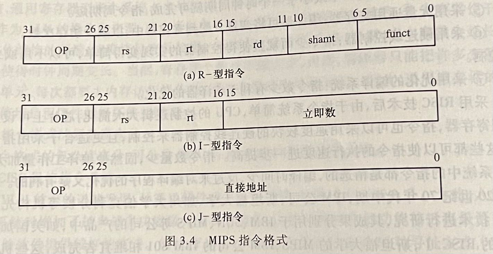

public:: true

- 🔵 （重点）**一地址指令格式**：
	- 一地址指令格式中，指令的格式通常包含一个操作码（Opcode）和一个操作数（Address）。
	  操作数字段包含了操作码所需的地址信息，通常表示操作数的地址或操作数本身。
	  这类指令通常用于简单的运算或操作，例如加法、减法等，操作数通常存储在内存中。
- 🔵 （重点）**二地址指令格式**：
	- 二地址指令格式包含一个操作码和两个操作数地址字段。
	  这类指令格式通常表示两个操作数的地址或操作数本身，同时可能包含其他信息（如指令地址等）。
	  它们用于执行更复杂的运算和操作，例如乘法、除法等。
- 🔵 （重点）**三地址指令格式**：
	- 三地址指令格式包含一个操作码和三个操作数地址字段。
	  这种格式通常表示三个操作数的地址或操作数本身，并可能包含其他的指令地址或者标志位等信息。
	  通常用于执行更加复杂的运算和操作，例如乘法运算中的乘数、被乘数和结果地址等。
- 🔵 **一条指令需包含的基本信息**：
	- 1.操作码
	- 2.源操作数或其地址
	- 3.结果的地址
	- 4.下条指令地址
	- 一条指令由一个操作码和几个地址码构成。
	- 根据指令显示给出的地址个数，指令可分为：三地址指令、二地址指令、单地址指令和零地址指令。
- 🔵 **指令的基本格式及其设计原则**：
	- 设计原则：
		- 1.指令尽量短
		- 2.要有足够的操作码位数
		- 3.操作码的编码必须有唯一的解释
		- 4.指令长度应是字节的整数倍
		- 5.合理选择地址字段的个数
		- 6.指令应尽量规整
- 🔵 **指令中地址字段的个数**：
	- **单地址指令（Single Address Instructions）：** 这种指令格式中，指令只包含一个地址字段，通常表示操作数的地址或是指令的地址。
	- **双地址指令（Double Address Instructions）：** 这类指令包含两个地址字段，通常用于表示操作数的地址或操作数本身，同时还包含指令地址或是下一条指令的地址。
	- **三地址指令（Three Address Instructions）：** 这种指令格式包含三个地址字段，通常用于表示操作数的地址或是操作数本身，并可能包含其他信息，如指令地址或其他操作数地址等。
	- **零地址指令（Zero Address Instructions）：** 在某些架构中，指令可能不包含显式的地址字段，操作数可能隐含在寄存器堆栈中，这种情况下指令通常不涉及地址字段。
- 🔵 （重点）**指令操作码**：
	- 指令操作码（Opcode）是计算机指令中的一个重要部分，它表示指令的操作类型或功能。操作码告诉计算机在执行指令时应该执行何种操作。操作码通常以二进制或十六进制形式表示，每个操作码对应于特定的指令，用于控制CPU对数据的处理或对其他部件的操作。
	- 操作码的具体内容和编码方式取决于计算机的指令集架构。不同的架构会有不同的指令集和操作码集合。例如，在一个简单的指令集架构中，操作码可能只有几位，并且每个操作码对应于一条具体的指令，如加法、减法、移位等。
	- 操作码的编码方式可以通过不同的组合来表示不同的操作类型或功能。常见的操作码会被CPU硬件解释和执行，以便完成相应的操作，比如从内存中读取数据、将数据加载到寄存器、执行算术运算、控制程序流程等。
	- 总之，操作码是指令的一部分，它对应于指令集中的不同操作类型或功能，并且决定了CPU在执行指令时应该做什么样的操作。
- 🔵 （重点）**指令中的操作数**：
	- 1.指针或地址（指针或存储单元地址通常用无符号整数表示）
	- 2.数值数据（数值数据主要是带符号整数和浮点数）
	- 3.位、位串、字符和字符串（位和位串数据一般表示一些标志、控制和状态等信息）（字符和字符串数据用来表示文本、流式文件基本信息等）
	- 4.逻辑（布尔）数据（表示逻辑值）
- 🔵 （重点）**寻址方式（立即、直接、间接、寄存器、寄存器间接、变址、相对、基址）**：
	- **有效地址**：指令中给出的操作数所在存储单元的地址
	- **寻址方式**：指令给出操作数或操作数地址的方式
	- **常用的寻址方式**：
		- 1.**立即寻址**：
			- 在指令中直接给出操作数本身，这种操作数称为立即数
		- 2.**直接寻址**：
			- 指令中给出的地址码是操作数的有效地址，这种地址称为直接地址或绝对地址
		- 3.**间接寻址**：
			- 指令中给出的地址码是存放操作数有效地址的存储单元地址
		- 4.**寄存器直接寻址**：
			- 指令中给出的操作数所在的寄存器编号，操作数在寄存器中
		- 5.**寄存器间接寻址**；
			- 指令中给出的地址码是一个寄存器编号，该寄存器中存放的是操作数的有效地址
		- 6.**变址寻址**：
			- 主要用于对线性表之类的数组元素进行方便的访问。
			- 假设指令中给出的变址寄存器为I，形式地址为A，则先变地址后间址时，操作数的有效地址为EA=((I)+A),称为**前变址**；先间址后变址时，EA=(I)+(A),称为**后变址**。
		- 7.**相对寻址**：
			- 如果某指令的操作数的有效地址或转移目标地址位于该指令所在位置的前、后某个固定位置上，则可用相对寻址方式获得操作数有效地址或转移目标地址。
			- 指令中的地址码字段A给出一个偏移量，基准地址隐含由PC给出，操作数有效地址或转移目标地址EA=(PC)+A。这里的偏移量A是形式地址。
		- 8.**基址寻址**：
			- 指令中的地址码字段A给出一个偏移量，基准地址可以明显或隐含地由基址寄存器B给出。
			- 操作数有效地址EA=（B）+ A
- 🔵 **指令的操作类型**：
	- 1.算术逻辑运算指令
	- 2.移位指令
	- 3.传送指令
	- 4.串指令
	- 5.顺序控制指令
	- 6.CPU控制指令
	- 7.输入输出指令
- 🔵 **传送指令**：
	- 传送指令用于将数据从一个地方传送到另一个地方，包括将数据加载到寄存器、从寄存器存储到内存等操作。
- 🔵 **算术逻辑运算指令**：
	- 这类指令执行各种算术和逻辑运算，例如加法、减法、乘法、除法、与、或、非等。它们用于执行数据的数学运算和逻辑判断。
- 🔵 **移位指令**：
	- 移位指令用于对数据进行移位操作，包括左移、右移、循环移位等。这些指令对数据的位进行移动，可以实现乘除以2的幂的操作、数据排列等功能。
- 🔵 **串指令**：
	- 串指令用于对数据块或字符串执行操作，例如复制、比较、连接、查找等操作。这些指令通常用于处理连续存储的数据。
- 🔵 **顺序控制指令：** 这类指令用于控制程序的执行顺序，包括无条件转移、条件转移、子程序调用与返回等，控制程序的流程和执行路径。
- 🔵 **CPU控制指令：** CPU控制指令用于对CPU内部功能和状态进行控制，例如暂停执行、复位CPU、修改标志位等操作。
- 🔵 **输入输出指令：** 输入输出指令用于与外部设备进行数据交换和通信，包括从外部设备读取数据、向外部设备发送数据等操作，实现与外设的连接和控制。
- 🔵 **条件转移指令（分支）**：
	- 条件转移指令用于在程序执行过程中根据特定条件改变程序的执行路径。它根据条件是否满足来决定是否转移到另一个指定的位置继续执行。
- 🔵 **跳转指令**：
	- 是一种无条件转移指令，它会直接将程序的执行控制转移到指定的位置，不考虑任何条件。
- 🔵 **调用指令**：
	- 用于调用子程序或函数。它将程序执行控制转移到指定的子程序位置，并且通常会保存返回地址以便子程序执行完成后返回调用位置。
- 🔵 **返回指令**：
	- 用于从子程序返回到调用位置，它执行完子程序后将程序控制返回到调用指令的下一条指令。
- 🔵 **程序计数器（指令指针）**：
	- 是CPU中的一个寄存器，用于存储当前正在执行的指令的地址。它指示了下一条将要执行的指令的位置。
- 🔵 **累加器型指令系统**：
	- 这种类型的指令系统中，指令操作的数据通常存储在一个专门的累加器寄存器中。大多数操作都是通过累加器来完成的，执行的结果也是送到累加器中。
- 🔵 **栈型指令系统**：
	- **栈**是一种采用后进先出（LIFO）或先进后出（FILO）存取方式的特定的存储区。
	- 栈型指令系统的指令集架构中，操作数通常存储在栈中，而不是在寄存器中。指令操作栈中的数据，执行操作后将结果存回栈中。
	- 栈型指令系统中，规定指令的操作数总是来自栈顶。栈型指令系统中的指令都是零地址或一地址，因此，指令字很短。
- 🔵 **通用寄存器型指令系统**：
	- 拥有多个通用寄存器，这些寄存器可以用于存储操作数和中间结果，并在指令执行中使用。（使用通用寄存器存放临时数据而不是累加器）
	- 目前，通用寄存器型指令系统占主导地位。
- 🔵 **Load/Store型指令系统**：
	- 大多数操作数的加载和存储都需要通过专门的Load和Store指令来完成。这种架构下，大多数指令只能操作寄存器中的数据。（使用通用寄存器存放临时数据而不是累加器）
- 🔵 **精简指令集RISC**：
	- RISC架构的设计理念是简化指令集，减少指令的种类和复杂度，使得每条指令的执行时间尽可能短。这意味着每条指令执行的工作量较小，指令的执行时间相对较短。
- 🔵 **复杂指令集CISC**：
	- CISC架构的设计理念是提供更丰富和复杂的指令集，这些指令可以执行更复杂的操作，甚至包括高级的操作和内存访问。因此，CISC架构的指令通常更复杂，执行时间相对较长。
- 🔵 （重难点）**CISC和RISC的区别和各自的特点**：
	- **区别**：
		- **指令集复杂度：** RISC架构的指令集相对简化，而CISC架构的指令集更加复杂和丰富。
		- **执行速度：** RISC架构的指令执行时间通常更短，但CISC架构的指令可以完成更复杂的操作。
		- **硬件复杂度：** RISC架构通常具有更简单的硬件实现，而CISC架构的处理器需要更复杂的微程序控制单元。
		- 总体来说，RISC架构着重于简化指令集、提高执行效率和硬件效率，而CISC架构则更多地关注于指令的多样性和功能丰富性。
	- **特点**：
		- CISC的特点：
			- ①指令系统复杂
			- ②指令周期长
			- ③指令周期差距大
			- ④采用微程序控制
			- ⑤难以进行编译优化
		- RISC的特点：
			- ①指令数目少
			- ②指令格式规整
			- ③采用Load/Store型指令设计风格
			- ④采用流水线方式执行指令
			- ⑤采用大量通用寄存器
			- ⑥采用硬连线控制器
			- ⑦采用优化的编译系统
- 🔵 **定长指令字指令格式**：
	- 在定长指令字指令格式中，每条指令的长度是固定的，每个字段的位置和长度都是固定的，便于解析和执行。
- 🔵 **变长指令字格式**：
	- 变长指令字格式允许指令的长度可以变化，不同的指令可能有不同的长度，这种格式可以节省存储空间，并允许更多灵活性的指令设计。
- 🔵 **定长操作码指令格式**：
	- 在这种格式中，指令的操作码字段是固定长度的，使得CPU能够更快地解码和执行指令。
- 🔵 **扩展操作码指令格式**：
	- 这种格式中，操作码字段可能具有更大的范围或更多的位数，使得可以定义更多的操作类型或功能。
- 🔵 **指令执行顺序的控制**：
	- 指令执行顺序的控制是指CPU如何按照指令序列来执行程序。这可能涉及条件跳转、无条件跳转、函数调用、返回等操作，以及处理分支和循环等控制结构。
- 🔵 （重点）**有效地址的概念**：
	- 有效地址是指令中操作数的真实地址或者可用于计算操作数真实地址的信息。在指令执行过程中，CPU需要能够获取操作数的真实地址以执行指令，有效地址就是能够正确指向操作数的地址或指示如何计算该地址的信息。
- 🔵 （难点）**MIPS指令集体系结构中指令格式**：
	- MIPS是典型的RISC结构，按字节编址，采用32位定长指令字，操作码字段也是固定长度，采用三地址指令格式，其指令格式主要包括三种类型：R型指令、I型指令和J型指令。
	  1. **R型指令（Register Type）：**
		- R型指令主要用于寄存器之间的操作。它们包含了操作码（6位）、源寄存器1（5位）、源寄存器2（5位）、目的寄存器（5位）、位移量（5位）和功能码（6位）。
		- 示例：`add $t0, $t1, $t2`，该指令将`t1`和`t2`中的值相加，并将结果存储到`t0`中。
		  
		  2. **I型指令（Immediate Type）：**
		- I型指令用于执行寄存器和立即数之间的操作。它们包含了操作码（6位）、源寄存器（5位）、目标寄存器（5位）、立即数或偏移量（16位）。
		- 示例：`addi $t0, $t1, 10`，该指令将寄存器`t1`的值与立即数10相加，并将结果存储到`t0`中。
		  
		  3. **J型指令（Jump Type）：**
		- J型指令用于实现跳转操作，通常用于实现程序的分支。它们包含了操作码（6位）和目标地址（26位）。
		- 示例：`j 0x0040000C`，该指令将程序的控制权跳转到地址0x0040000C处。
	- 
	-
- 🔵 **指令类型**：
	- 在计算机体系结构中，指令通常按照其功能和操作类型进行分类。常见的指令类型包括以下几种：
	- 1. **算术逻辑运算指令：** 这类指令用于执行基本的算术和逻辑运算，例如加法、减法、乘法、除法、位运算（与、或、非、异或等）等。
	- 2. **数据传送指令：** 数据传送指令用于在寄存器和内存之间传输数据，包括加载（Load）和存储（Store）指令。
	- 3. **控制转移指令：** 这类指令用于控制程序的执行流程，包括条件跳转、无条件跳转、子程序调用、返回等。
	- 4. **浮点运算指令：** 这类指令用于执行浮点数的运算操作，例如浮点加减乘除、开方、取整等。
	- 5. **串操作指令：** 串操作指令用于处理连续存储的数据，包括复制、比较、查找、连接等。
	- 6. **协处理器指令：** 这类指令用于与协处理器（如浮点数处理器）交互，执行特定的协处理器操作。
	- 7. **特权指令：** 这些指令通常用于特权级别的操作，例如修改特权状态、访问受保护的资源等。
	- 8. **向量和多媒体指令：** 这类指令用于执行向量运算或者多媒体数据处理，如SIMD指令。
- 🔵 **通用寄存器组织**：
	- 通用寄存器是计算机体系结构中的一种寄存器类型，用于存储处理器在执行程序时使用的临时数据、地址和中间结果。通用寄存器组织通常指的是这些通用寄存器的结构和组织方式。
	- 在通用寄存器的组织中，一些常见的结构方式包括：
	- 1. **寄存器数量：** 这是通用寄存器组织中最基本的方面。寄存器的数量可以因体系结构而异，通常用于存储各种数据。例如，一个体系结构可能有16个、32个或更多的通用寄存器。
	- 2. **寄存器的位宽：** 每个通用寄存器的位宽度（即寄存器可以存储的二进制位数）是另一个重要方面。常见的位宽包括32位、64位等，决定了寄存器能够存储的数据范围。
	- 3. **寄存器文件（Register File）：** 通用寄存器通常被组织成寄存器文件的形式，其中每个寄存器都有一个唯一的编号或地址。CPU可以通过这些编号或地址来访问特定的寄存器。
	- 4. **寄存器堆栈（Register Stack）：** 在某些体系结构中，通用寄存器可以被组织成一个堆栈结构。这种方式允许寄存器的快速分配和释放，以支持函数调用和中断等操作。
	- 5. **寄存器的命名规则：** 每个寄存器通常都有一个特定的名称或标识符，例如在一些体系结构中，寄存器可以用类似于`$t0`、`$s0`、`$a0`等的符号来表示，这些名称可能对应于特定的用途或约定。
- 🔵 **汇编表示**：
- 🔵 （重难点）**汇编语言程序和机器语言程序之间的对应关系**：
	- 汇编语言程序和机器语言程序之间有一一对应的关系，可以通过汇编过程将汇编语言程序转换成对应的机器语言程序。这个过程涉及到汇编器（Assembler）的使用。
	- 1. **汇编语言程序：** 汇编语言是一种人类可读的低级语言，它使用助记符（Mnemonic）来表示机器指令，同时也包含了符号和标签，更易于人理解和书写。例如，对于指令ADD（加法）在汇编语言中可能表示为`ADD R1, R2, R3`，其中R1、R2和R3分别是寄存器。
	- 2. **机器语言程序：** 机器语言是计算机可以直接执行的二进制指令序列。每个指令都由一串二进制位表示，代表特定的操作和操作数。例如，ADD指令的机器码可能是一个固定的二进制序列，用于执行加法操作。
	- 转换过程通常通过汇编器完成，汇编器接收汇编语言程序作为输入，并将其转换成等效的机器语言程序，即一一对应地将每个汇编指令转换成对应的二进制机器码。这个机器码可以被计算机硬件直接识别和执行。
	- 这种对应关系是一种一对一的映射关系，汇编语言程序中的每个指令都有对应的机器语言表示。机器语言程序是计算机可以直接执行的形式，而汇编语言程序则更易于人们理解和编写。
- 🔵 （重难点）**高级语言源程序和机器语言程序之间的对应关系**：
	- 高级语言源程序和机器语言程序之间的对应关系是通过编译器或解释器实现的。这个过程被称为编译或解释。
	  1. **高级语言源程序：** 高级语言源程序是用高级编程语言（如C、Python、Java等）编写的程序，它使用易于理解和编写的语法和结构。高级语言程序员可以使用高级语言编写程序，而不需要考虑底层的硬件细节。例如，一个C语言程序可能包含语句`int x = 10;`用于声明一个整数变量x并赋值为10。
	  2. **机器语言程序：** 机器语言程序是计算机可以直接执行的二进制指令序列，它由一串二进制位组成，代表特定的操作和操作数。例如，ADD指令的机器码可能是一个固定的二进制序列，用于执行加法操作。
	  对应关系通过编译器（对于编译型语言）或解释器（对于解释型语言）实现：
	- **编译过程（Compilation）：** 编译器接收高级语言源代码作为输入，并将其转换为等效的机器语言程序。这个过程包括词法分析、语法分析、中间代码生成、优化和目标代码生成等步骤。生成的目标代码通常是机器语言或类似机器语言的形式。
	- **解释过程（Interpretation）：** 解释器逐行或逐段地解释高级语言源代码，并将其实时转换为机器语言或直接执行。解释器不会生成独立的机器语言程序，而是在执行过程中直接转换为机器语言。
	  无论是编译还是解释，最终目的是将高级语言源程序转换为机器语言程序，以便计算机硬件能够直接理解和执行。
- 🔵 **解释说明**：
	- 指令：
		- 是指示计算机执行某种操作的命令，是计算机运行的最小功能单位 。
	- 操作码：
		- 是指令中表示操作类型的一部分，它指定了要执行的操作或操作的类型。操作码通常以二进制形式表示。
	- 地址码：
		- 指的是指令中用于指示操作数地址或位置的部分。它可以表示数据存储的位置或者要执行操作的地址。不同的寻址方式会影响地址码的解释。
	- 程序计数器PC：
		- 用来存放将要执行的下一条指令的地址
	- 寻址方式：
		- 寻址方式是指CPU用于定位和访问操作数（数据）的方式。
	- 有效地址：
		- 是指寻址方式计算出的最终操作数的真实地址，它是在指令执行过程中计算出的地址。
	- 立即寻址：
		- 是一种寻址方式，操作数本身就是指令中给出的固定数值或常数。
	- 直接寻址：
		- 使用指令中给出的地址来访问操作数。
	- 间接寻址：
		- 使用指令中给出的地址所指向的地址来访问操作数。
	- 寄存器直接/间接寻址：
		- 是一种寻址方式，其中操作数存储在寄存器中，通过寄存器的直接或间接方式来访问操作数。
	- 变址寻址：
		- 使用一个变址寄存器，该寄存器的内容被加到指令中给出的地址上来访问操作数。
	- 变址寄存器：
		- 是用于变址寻址的特殊寄存器，它的值被加到地址上以确定最终的操作数地址。
	- 相对寻址：
		- 使用指令中给出的相对于当前指令地址的偏移量来访问操作数。
	- 基址寻址：
		- 类似于变址寻址，但使用一个基址寄存器存储基址，操作数的地址由基址和偏移量计算而来。
	- 基址寄存器：
		- 是用于基址寻址的特殊寄存器，存储着基址。
	- 通用寄存器：
		- 是CPU中可用于多种目的的寄存器，用于存储临时数据和地址。
	- CISC：
		- 是一种计算机体系结构，它具有复杂的指令集，每条指令可以执行多种操作。
	- RISC：
		- 是一种计算机体系结构，它具有精简的指令集，倾向于简单且执行速度更快的指令集。