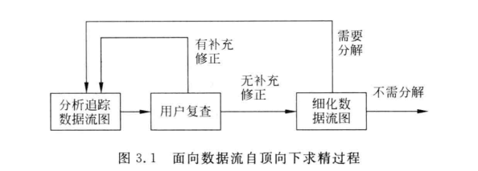

public:: false

- 3.1 **需求分析的任务**
- 为了开发出真正满足用户需求的软件产品,首先必须知道用户的需求。对软件需求的深入理解是软件开发工作获得成功的前提条件,不论人们把设计和编码工作做得如何出色,不能真正满足用户需求的程序只会令用户失望,给开发者带来烦恼。
  需求分析是软件定义时期的最后一个阶段,它的基本任务是准确地回答“系统必须做什么”这个问题。
- 尽管目前有许多不同的用于需求分析的结构化分析方法,但是,所有这些分析方法都遵守下述准则。
	- （1）必须理解并描述问题的信息域,根据这条准则应该建立数据模型。
	- （2）必须定义软件应完成的功能,这条准则要求建立功能模型。
	- （3）必须描述作为外部事件结果的软件行为,这条准则要求建立行为模型。
	- （4）必须对描述信息﹑功能和行为的模型进行分解,用层次的方式展示细节。
- 3.1.1 **确定对系统的综合要求**
- 虽然功能需求是对软件系统的一项基本需求,但却并不是唯一的需求。通常对软件系统有下述几方面的综合要求。
	- 1．功能需求
	- 2.性能需求
	- 3.可靠性和可用性需求
	- 4.出错处理需求
	- 5.接口需求
	- 6.约束
	- 7.逆向需求
	- 8.将来可能提出的要求
- 3.1.2 **分析系统的数据要求**
- 任何一个软件系统本质上都是信息处理系统,系统必须处理的信息和系统应该产生的信息在很大程度上决定了系统的面貌,对软件设计有深远影响,因此,必须分析系统的数据要求,这是软件需求分析的一个重要任务。
  复杂的数据由许多基本的数据元素组成﹐数据结构表示数据元素之间的逻辑关系。利用数据字典可以全面准确地定义数据﹐但是数据字典的缺点是不够形象直观。为了提高可理解性,常常利用图形工具辅助描绘数据结构。常用的图形工具有层次方框图和Warnier图。
- 3.2.1 **访谈**
- 访谈是最早开始使用的获取用户需求的技术,也是迄今为止仍然广泛使用的需求分析技术。
  访谈有两种基本形式,分别是正式的和非正式的访谈。
	- 正式访谈时,系统分析员将提出一些事先准备好的具体问题,例如,询问客户公司销售的商品种类、雇用的销售人员数目以及信息反馈时间应该多快等。
	- 在非正式访谈中,分析员将提出一些用户可以自由回答的开放性问题,以鼓励被访问人员说出自己的想法,例如,询问用户对目前正在使用的系统有哪些不满意的地方。
- 在访问用户的过程中使用情景分析技术往往非常有效。所谓情景分析就是对用户将来使用目标系统解决某个具体问题的方法和结果进行分析。
- 3.2.2 **面向数据流自顶向下求精**
- 结构化分析方法就是面向数据流自顶向下逐步求精进行需求分析的方法。通过可行性研究已经得出了目标系统的高层数据流图,需求分析的目标之一就是把数据流和数据存储定义到元素级。
- 为了达到这个目标,通常从数据流图的输出端着手分析,这是因为系统的基本功能是产生这些输出,输出数据决定了系统必须具有的最基本的组成元素。
	- 
- 3.2.3 ** 简易的应用规格说明技术**
- 简易的应用规格说明技术是为了解决使用传统的访谈或面向数据流自顶向下求精方法定义需求时，用户处于被动地位且往往有意无意的与开发者区分“彼此”。
- 简易的应用规格说明技术分析需求的典型过程：
	- ①进行初步的访谈
	- ②开发者和用户分别写出“产品需求”
	- ③开会讨论，各自展示需求列表
	- ④得出了意见一致，为需求列表制定小型规格说明
	- ⑤根据会议结果，起草完整的软件需求规格说明
- 3.2.4 **快速建立软件原型**
- 为了快速地构建和修改原型,通常使用下述3种方法和工具。
	- ①第四代技术
	- ②可重用的软件构件
	- ③形式化规格说明和原型环境
- 快速原型就是快速建立起来的旨在演示目标系统主要功能的可运行的程序，快速原型应具备的特性：
	- ①快速
	- ②容易修改
- 3.3 **分析建模与规格说明**
- 3.3.1 **分析建模**
- 模型：就是为了理解事物而对事物作出的一种抽象，是对事物的一种无歧义的书面描述。
- 为了开发复杂的系统，应从不同角度（模型）抽象出目标系统的特性（数据模型、功能模型、行为模型）
- 实体联系图，描绘数据对象以及数据对象之间的关系，是用于建立数据模型的图形
- 数据流图是建立功能模型的基础
- 状态转换图描绘了系统的各种行为模式和在不同状态间转换的方式。
- 3.3.2 **软件需求规格说明**
- 软件需求规格说明是需求分析阶段得出的最主要的文档。
- 通常用自然语言完整、准确、具体地描述系统的数据要求、功能需求﹑性能需求,可靠性和可用性要求,出错处理需求,接口需求,约束、逆向需求以及将来可能提出的要求。
- 3.4 **实体联系图**
- 数据模型中包含3种相互关联的信息:数据对象﹑数据对象的属性及数据对象彼此间相互连接的关系。
  3.4.1 **数据对象**
- 数据对象是对软件必须理解的复合信息的抽象。
- 数据对象可以是外部实体(例如产生或使用信息的任何事物)事物(例如报表)行为(例如打电话)事件(例如响警报)、角色(例如教师、学生)、单位(例如会计科),地点(例如仓库)或结构(例如文件)等。总之,可以由一组属性来定义的实体都可以被认为是数据对象。
- 3.4.2 **属性**
- 属性定义了数据对象的性质。必须把一个或多个属性定义为“标识符”,也就是说,当人们希望找到数据对象的一个实例时,用标识符属性作为“关键字”(通常简称为“键”)。
  3.4.3 **联系**
- 客观世界中的事物彼此间往往是有联系的。例如,教师与课程间存在“教”这种联系，而学生与课程间则存在“学”这种联系。
- 数据对象彼此之间相互连接的方式称为联系,也称为关系。联系可分为以下3种类型。
	- ①一对一联系（1：1）
	- ②一对多联系（1：N）
	- ③多对多联系（M：N）
- 
- 3.5 **数据规范化**
- 软件系统经常使用各种长期保存的信息,这些信息通常以一定方式组织并存储在数据库或文件中,为减少数据冗余,避免出现插入异常或删除异常,简化修改数据的过程,通常需要把数据结构规范化。
- 通常用“范式(normal forms)”定义消除数据冗余的程度。
- 通常按照属性间的依赖情况区分规范化的程度。属性间依赖情况满足不同程度要求的为不同范式,满足最低要求的是第一范式,在第一范式中再进一步满足一些要求的为第二范式,其余依此类推。下面给出第一、第二和第三范式的定义。
	- （1）第一范式︰每个属性值都必须是原子值,即仅仅是一个简单值而不含内部结构。
	- （2）第二范式﹐满足第一范式条件,而且每个非关键字属性都由整个关键字决定(而不是由关键字的一部分来决定)。
	- （3）第三范式﹐符合第二范式的条件,每个非关键字属性都仅由关键字决定,而且一个非关键字属性不能仅仅是对另一个非关键字属性的进一步描述(即一个非关键字属性值不依赖于另一个非关键字属性值)。
- 3.6 **状态转换图**
- 状态转换图(简称为状态图)通过描绘系统的状态及引起系统状态转换的事件,来表示系统的行为。此外,状态图还指明了作为特定事件的结果系统将做哪些动作。
- **状态**：
	- 状态是任何可以被观察到的系统行为模式，一个状态代表系统的一种行为模式。状态规定了系统对事件的响应方式。
- 在状态图中定义的状态主要有:初态(即初始状态)、终态(即最终状态)和中间状态。在一张状态图中只能有一个初态,而终态则可以有0至多个。
- 状态图既可以表示系统循环运行过程,也可以表示系统单程生命期。
- **事件**：
- 事件是在某个特定时刻发生的事情,它是对引起系统做动作或(和)从一个状态转换到另一个状态的外界事件的抽象。简而言之,事件就是引起系统做动作或(和)转换状态的控制信息。
  **符号**：
	- 在状态图中,初态用实心圆表示,终态用一对同心圆(内圆为实心圆)表示。
	  中间状态用圆角矩形表示,可以用两条水平横线把它分成上、中、下3个部分。上面部分为状态的名称,这部分是必须有的;中间部分为状态变量的名字和值,这部分是可选的;下面部分是活动表,这部分也是可选的。
- 活动表的语法格式如下:
	- 事件名(参数表)/动作表达式
	  其中,“事件名”可以是任何事件的名称。在活动表中经常使用下述3种标准事件:entry，exit和 do。entry事件指定进入该状态的动作,exit事件指定退出该状态的动作,而do事件则指定在该状态下的动作。需要时可以为事件指定参数表。活动表中的动作表达式描述应做的具体动作。
	- 状态图中两个状态之间带箭头的连线称为状态转换,箭头指明了转换方向。状态变迁通常是由事件触发的,在这种情况下应在表示状态转换的箭头线上标出触发转换的事件表达式;如果在箭头线上未标明事件,则表示在源状态的内部活动执行完之后自动触发转换。
- 事件表达式的语法如下:
	- 事件说明[守卫条件]/动作表达式
	- 其中,事件说明的语法为:事件名(参数表)。
	  守卫条件是一个布尔表达式。如果同时使用事件说明和守卫条件,则当且仅当事件发生且布尔表达式为真时,状态转换才发生。如果只有守卫条件没有事件说明,则只要守卫条件为真,状态转换就发生。
	  动作表达式是一个过程表达式,当状态转换开始时执行该表达式。
	- 
- 3.7 **其它图形工具**
- 描述复杂的事物时,图形远比文字叙述优越得多,它形象直观容易理解。前面已经介绍了用于建立功能模型的数据流图,用于建立数据模型的实体-联系图和用于建立行为模型的状态图,本节再简要地介绍在需求分析阶段可能用到的另外3种图形工具。
- 3.7.1 **层次方框图**
- 层次方框图用树形结构的一系列多层次的矩形框描绘数据的层次结构。树形结构的顶层是一个单独的矩形框,它代表完整的数据结构，下面的各层矩形框代表这个数据的子集,最底层的各个框代表组成这个数据的实际数据元素(不能再分割的元素)。
	- 
- 3.7.2 **Warnier图**
- 用Warnier图可以表明信息的逻辑组织﹐也就是说,它可以指出一类信息或一个信息元素是重复出现的,也可以表示特定信息在某一类信息中是有条件地出现的。因为重复和条件约束是说明软件处理过程的基础,所以很容易把 Warnier图转变成软件设计的工具。
	- 
- 3.7.3 **IPO图**
- IPO图是输人,处理、输出图的简称,它是由美国IBM公司发展完善起来的一种图形工具,能够方便地描绘输入数据﹑对数据的处理和输出数据之间的关系。
  IPO图使用的基本符号既少又简单,因此很容易学会使用这种图形工具。它的基本形式是在左边的框中列出有关的输人数据,在中间的框内列出主要的处理,在右边的框内列出产生的输出数据。处理框中列出处理的次序暗示了执行的顺序,但是用这些基本符号还不足以精确描述执行处理的详细情况。在IPO图中还用类似向量符号的粗大箭头清楚地指出数据通信的情况。
	- 
- 3.8 **验证软件需求**
- 3.8.1 **从哪些方面验证软件需求的正确性**
  需求分析阶段的工作结果是开发软件系统的重要基础,大量统计数字表明,软件系统中15%的错误起源于错误的需求。为了提高软件质量,确保软件开发成功,降低软件开发成本，一旦对目标系统提出一组要求之后,必须严格验证这些需求的正确性。一般说来,应该从下述4个方面进行验证。
	- （1）一致性﹑所有需求必须是一致的,任何一条需求不能和其他需求互相矛盾。
	- （2）完整性﹑需求必须是完整的,规格说明书应该包括用户需要的每一个功能或性能。
	- （3）现实性﹐指定的需求应该是用现有的硬件技术和软件技术基本上可以实现的。对硬件技术的进步可以做些预测,对软件技术的进步则很难做出预测,只能从现有技术水平出发判断需求的现实性
	- （4）有效性﹑必须证明需求是正确有效的,确实能解决用户面对的问题。
-