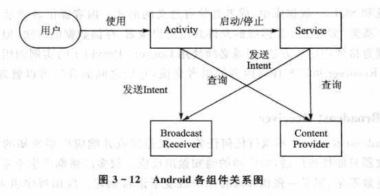

public:: true

- 🔵 1.从技术角度讲，Linux是一个什么样的操作系统？你认为它有哪些不足？如何改进？
	- Linux是一个**类Unix操作系统**，它完全是一个**自由**的操作系统，它是一个**单一内核**的操作系统，这是由于Linus Torvalds以代码执行效率为自己操作系统的第一要务，比起结构的清晰他们更加注重功能的强大和高效率，他们花大量的经历在优化代码上，而这样以损失结构精炼作为代价，导致Linux中的每个部件都不能被轻易拆出，否则破坏效率。虽然Linux是单一结构但是他和UNIX操作系统不一样Unix操作系统所有代码是静态编译的，而在Linux中代码可以**动态装入和卸载内核**中的部分代码。Linux**不支持用户态线程，**Linux中通过另一种方法解释并实现LWP的机制。Linux高效而稳定，以**独占的方式**执行最底层的任务，保证其他程序的正常运行。
	- 缺陷：只有抢占式的操作系统才可以成为“实时”操作系统。要对Linux的中断处理、进进程调度和进程抢占这3个方面进行改进。
	-
- 🔵 2.GPL协议主要内容是什么？你了解自由软件的开发模式并愿意让大家共享你的软件吗？为什么？
	- GPL(General
	  public license)通用公共许可证，GPL保证任何人有共享和修改自由软件的自由，任何人有权取得、修改和重新发布自由软件的源代码，并且规定在不增加费用的条件下得到源代码（基本的发布费除外）。
	- 开发模式是“巴扎模式”，一大批广泛分布于世界各地的软件爱好者
	  ，以互联网为纽带，通过BBS、新闻组及电子邮件等现代通信方式，同时参与一个软件开发项目。以个初步工作的软件雏形首先发布出来，然后大家同时开始工作，分别结合自己的实际经验和需要，寻找软件中的漏洞，提出修改意见，发布在互联网上，然后其他人也发现了漏洞，接着提出改进方案，给出补丁，这个软件像滚雪球一样不断完善。
- 🔵 3.程序和进程有什么区别？什么是进程间的互斥和同步？
	- 可执行文件由指令和数据组成。进程就是在计算机上运行的可执行文件针对特定的输入数据的一个实例，同一个可执行程序文件如果操作不同的输入数据就是两个不同的进程。
	- 互斥：是指某一资源同时只允许一个访问者对其进行访问，具有唯一性和排它性。但互斥无法限制访问者对资源的访问顺序，即访问是无序的。
	- 同步：是指在互斥的基础上（大多数情况），通过其它机制实现访问者对资源的有序访问。在大多数情况下，同步已经实现了互斥，特别是所有写入资源的情况必定是互斥的。少数情况是指可以允许多个访问者同时访问资源
	-
- 🔵 4.进程调度的功能是什么？Linux的进程调度发生在什么情况下？Linux系统的实时调度与普通调度有何区别？
	- 高级、中级和低级调度作业从提交开始直到完成，往往要经历下述三级调度：
	- 高级调度：(High-Level Scheduling)又称为作业调度，它决定把后备作业调入内存运行；
	- 低级调度：(Low-Level Scheduling)又称为进程调度，它决定把就绪队列的某进程获得CPU；中级调度：(Intermediate-Level Scheduling)又称为在虚拟存储器中引入，在内、外存对换区进行进程对换。**　**
	- **调度发生的情况**：
	- (1)正在执行的进程执行完毕。这时如果不选择新的就绪进程执行，将浪费处理机资源。
	- (2)执行中进程自己调用阻塞原语将白己阻塞起来进入睡眠等状态。
	- (3)执行中进程调用了P原语操作，从而因资源不足而被阻塞；或调用了v原语操作激活了等待资源的进程队列。
	- (4)执行中进程提出I/O请求后被阻塞。
	- (5)在分时系统中时间片已经用完。
	- (6)在执行完系统调用等系统程序后返回用户进程时，这时可看作系统进程执行完毕，从而可调度选择一新的用户进程执行。
	- (7)就绪队列中的某进程的优先级变得高于当前执行进程的优先级，从而也将引发进程调度。
	- **区别**：Linux 根据政策从整体上区分实时进程和普通进程，因为实时进程和普通进程度调度是不同的，它们两者之间，实时进程应该先于普通进程而运行，然后，对于同一类型的不同进程，采用不同的标准来选择进程：对于普通进程，Linux采用动态优先调度， Linux中某个进程的调度策略(policy)、优先级(priority)等可以作为参数由用户自己决定，具有相当的灵活性。
	- 对于实时进程，Linux采用了两种调度策略，即FIFO(先来先服务调度)和RR（时间片轮转调度）。因为实时进程具有一定程度的紧迫性，所以衡量一个实时进程是否应该运行，Linux采用了一个比较固定的标准。有两个优先级，实时优先级就是用来衡量实时进程是否值得运行的。
	-
- 🔵 5.Linux中从用户态进入内核态的唯一途径是什么？
	- 从用户态转换为核心态的唯一途径是中断。CPU处于用户态时，所运行的程序只能执行非特权指令，如果用户程序在用户态下执行特权指令，将发生中断，由操作系统获得控制。操作系统在核心态下运行。从核心态到用户态可以通过修改程序状态字来实现，这将伴随这由操作系统程序到用户程序的转换。
	-
- 🔵 6.在Linux系统中，为什么我们可以像使用文件一样操作一个设备？
	- 设备文件是Linux系统很重要的一个特色。Linux系统把每一个I/O设备都看成一个文件，与普通文件一样处理，这样可以使文件与设备的操作尽可能统一。从用户的角度来看，对I/O设备的使用和一般文件的使用一样，不必了解I/O设备的细节。设备文件可以细分为块设备文件和字符设备文件。前者的存取是以一个个字符块为单位的，后者则是以单个字符为单位的。
	-
- 🔵 7.什么是设备驱动程序？Linux系统中，用户怎么使用设备驱动程序？
	- 设备驱动程序在Linux内核中扮演着特殊的角色。他们是一个个独立的“黑盒子”，是某个特定的硬件相应一个定义良好的内部编程接口，这些接口完全隐藏了设备的工作细节。用户的操作通过一组标准化的调用执行，而这些调用独立于特定的驱动程序。将这些调用映射到作用于实际硬件的设备特有操作上，则是设备驱动程序的任务。这个编程接口能使得驱动程序独立于内核的其他部分而建立，必要的情况下可在运行时“插入”内核。
	-
- 🔵 8.Linux文件有哪些类型？
	- Linux文件类型常见的有：普通文件、目录、字符设备文件、块设备文件、套接口文件、符号链接文件
	  普通文件：我们用 ls
	  -lh 来查看某个文件的属性，可以看到有类似 -rw-r--r-- ，值得注意的是第一个符号是 - ，这样的文件在Linux中就是普通文件。这些文件一般是用一些相关的应用程序创建。
	- 目录：看到有类似
	  drwxr-xr-x ，这样的文件就是目录，目录在Linux是一个比较特殊的文件。注意它的第一个字符是d，创建目录的命令可以用 mkdir 命令，或cp命令。
	- 字符设备文件：文件的属性，注意前面第一个字符是 c ，这表示字符设备文件。比如猫等串口设备
	- 块设备文件：文件的属性，注意前面的第一个字符是b，这表示块设备，比如硬盘，光驱等设备
	- 套接口文件：注意这个文件的属性的第一个字符是 s。
	- 符号链接文件：我们查看文件属性时，注意第一个字符是l，这类文件是链接文件
	-
- 🔵 9.主流Linux操作系统有哪几种？
	- 国外封装的Linux以Red Hat(又称为“红帽Linux”)、OpenLinux、SuSE(SuSE是欧洲最流行的Linux发行版)、TurboLinux(TurboLinux是日本制作的Linux发行版，其最大特色便是以日文版、中文简/繁体版、英文版三种形式发行)等最为成功。国内Linux发行版做的相对比较成功是红旗和中软两个版本。
	-
- 🔵 10.Android系统架构分几层，各层的功能是什么？
	- 从上到下分别是：应用程序层、应用框架层、系统库和Android运行时环境、HAL硬件抽象层、Linux内核层
		- **应用程序层**：是普通用户接触到的层，直接决定了设备的使用体验。Android的应用程序层由两部分组成：核心应用程序包和SDK。
		- **应用框架层**：是Android应用开发的基础
		- **系统库**：使应用程序框架的支撑，是应用程序框架层与Linux内核层之间的重要纽带。系统库的来源有两种：一种是系统原生类库，另一种是第三方类库。
		- **Android运行环境**：每一个Android应用都运行在一个Dalvik虚拟机实例里。每一个Dalvik虚拟机都是一个独立的进程空间。
		- **硬件抽象层HAL**：是对Linux内核驱动程序的封装，向上提供接口，屏蔽低层的实现细节。
		- **Linux内核层**：Android基于Linux 2.6内核开发，使Android得到了很好的可移植性
- 🔵 11.Android的4大基本组件分别是什么，各实现什么功能？
	- 🔵 **Android的4大基本组件**：Activity、Server（服务）、Content Provider（内容提供者）、BroadcastReceiver（广播接收器）
	- 
	- 🔵 **Activity**：是一个为用户操作而展示的可视化用户界面
	- 🔵 **Server（服务）**：没有用户界面，但它会在后台一直运行
	- 🔵 **Content Provider（内容提供者）**：提供了一套特殊的可供其他应用使用的数据
	- 🔵 **BroadcastReceiver（广播接收器）**：不执行任何任务，仅仅是接收并响应广播通知的一类组件
	-