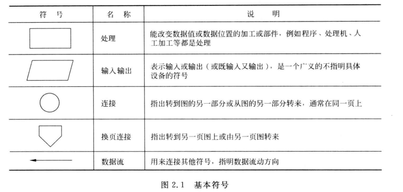
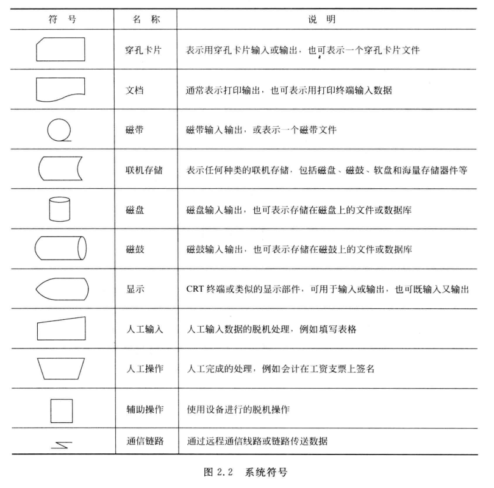
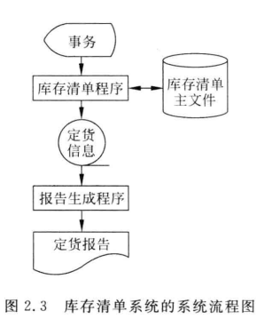
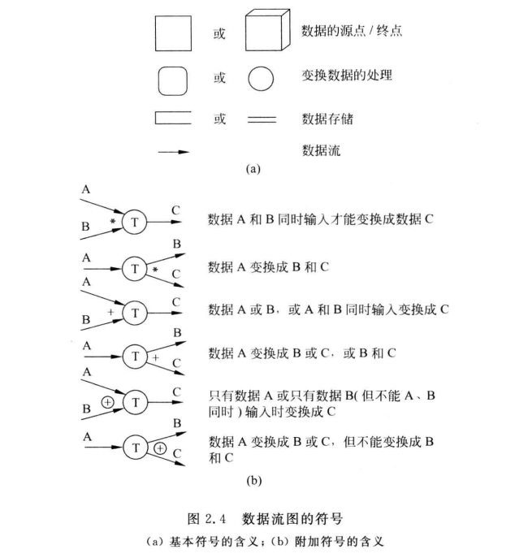
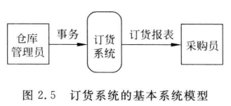
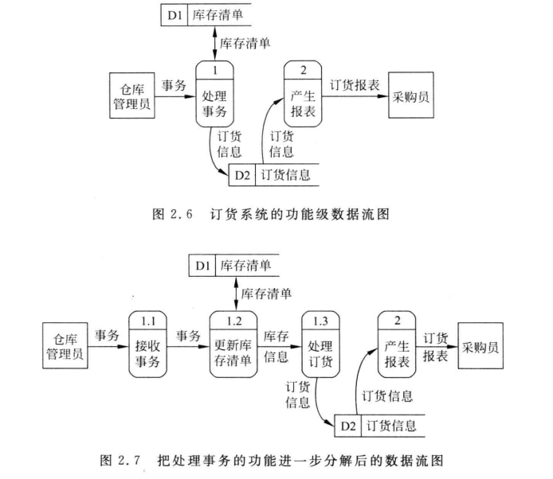

public:: false

- 第二章  可行性研究
- 2.1 **可行性研究的任务**
- 1.并非任何问题都有简单明显的解决方法
- 可行性研究的目的：不是解决问题，而是确定问题是否值得去解决
- 2.2 **可行性研究过程**
- 可行性研究分析过程：
	- 首先，进一步分析和澄清问题定义
	- 然后，分析员应该导出系统的逻辑模型
	- 最后，探索若干种可供选择的主要解法
- 至少从下述三个方面研究每种解决方案的可行性
	- ①技术可行性：使用现有的技术能否实现这个系统
	- ②经济可行性：这个系统的经济效益能否超过它的开发成本
	- ③操作可行性：这个系统的操作方式在该客户组织内是否行得通
- 怎样进行可行性研究呢？典型的可行性研究过程有下述8个步骤。
	- 1.复查系统规模和目标
	- 2.研究目前正在使用的系统
	- 3.导出新系统的高层逻辑模型
	- 4.进一步定义问题
	- 5.导出和评价供解决的解法
	- 6.推荐行动方针
	- 7.草拟开发计划
	- 8.书写文档提交审查
- 2.3**系统流程图**
	- 定义：系统流程图是概括的描绘物理系统的传统工具
	- 基本思想：用图形符号以黑盒子形式描绘组成系统的每个部件（程序、文档、数据库、人工过程等）
	- 系统流程图表达的是数据在系统各部件之间流动的情况，而不是对数据进行加工处理的控制过程，因此，尽管系统流程图的某些符号和程序流程图的符号形式相同，但是它却是物理数据流图而不是程序流程图。
- 符号：
	- 利用符号可以把一个广义的输入输出操作具体化为读写存储在特殊设备上的文件（或数据库），把抽象处理具体化为特定的程序或手工操作等。
	- 
	- 
	- 
	- 分层：面对复杂的系统时，一个比较好的方法是分层次的描绘这个系统
	- 2.4 **数据流图（DFD）**：
		- 是一种图形化技术，它描绘信息流和数据从输入移动到输出的过程中所经受的变换。
	- 符号：
		- 
- 
- 
- 命名：
	- 数据流程图中每个成分的命名是否恰当，直接影响数据流图的可理解性。
- 数据流命名时应注意的问题：
	- ①名字代表整个数据流的内容，而不仅仅反映它的某些成分
	- ②不要使用空洞的、缺乏具体含义的名字
	- ③在为某个数据流起名字时遇到了困难，很可能是因为对数据流图分解不恰当造成的，应该试试重新分解
- 处理命名：
	- （1）通常先为数据流命名,然后再为与之相关联的处理命名。这样命名比较容易,而且体现了人类习惯的“由表及里”的思考过程。
	- （2）名字应该反映整个处理的功能,而不是它的一部分功能。
	- （3）名字最好由一个具体的及物动词加上一个具体的宾语组成。应该尽量避免使用“加工”“处理”等空洞笼统的动词作名字。
	- （4）通常名字中仅包括一个动词,如果必须用两个动词才能描述整个处理的功能,则把这个处理再分解成两个处理可能更恰当些。
	- （5）如果在为某个处理命名时遇到困难,则很可能是发现了分解不当的迹象,应考虑重新分解。
- 用途：
	- ①画数据流图的基本目的是利用它作为交流信息的工具
	- ②作为分析和设计的工具
	- ③数据流图辅助物理系统的设计时，以图中不同处理的定时要求为指南，能够在数据流图上画出许多组自动化边界，每组自动化边界可能意味着一个不同的物理系统。
- 2.5 **数据字典**
- 一般说来,数据字典应该由对下列4类元素的定义组成。
	- （1）数据流;
	- （2）数据流分量(即数据元素)﹔
	- （3）数据存储;
	- （4）处理。
- 数据元素的别名就是该元素的其他等价的名字,出现别名主要有下述3个原因:
	- （1）对于同样的数据,不同的用户使用了不同的名字。
	- （2）一个分析员在不同时期对同一个数据使用了不同的名字
	- （3）两个分析员分别分析同一个数据流时,使用了不同的名字。虽然应该尽量减少出现别名,但是不可能完全消除别名。
- 由数据元素组成数据的方式只有下述3种基本类型:
	- （1）顺序即以确定次序连接两个或多个分量。
	- （2）选择即从两个或多个可能的元素中选取一个。
	- （3）重复即把指定的分量重复零次或多次。
	- （4）可选即一个分量是可有可无的(重复零次或一次)。
- 虽然可以使用自然语言描述由数据元素组成数据的关系,但是为了更加清晰简洁,建议采用下列符号:
	- =意思是等价于(或定义为)﹔
	- ＋意思是和(即连接两个分量);
	- [ ]意思是或(即从方括弧内列出的若干个分量中选择一个),通常用“|”号隔开供选择的分量;
	- { }意思是重复(即重复花括弧内的分量)﹔
	- ( )意思是可选(即圆括弧里的分量可有可无)。
- 数据字典的用途
	- 数据字典最重要的用途是作为分析阶段的工具。
	- 数据字典中包含的每个数据元素的控制信息是很有价值的。
	- 数据字典是开发数据库的第一步，而且是很有价值的一步。
- 数据字典的实现
	- 目前,数据字典几乎总是作为CASE“结构化分析与设计工具”的一部分实现的。在开发大型软件系统的过程中,数据字典的规模和复杂程度迅速增加,人工维护数据字典几乎是不可能的。
- 2.6 **成本/效益分析**
- 成本估计：
	- 软件开发成本主要表现为人力消耗(乘以平均工资则得到开发费用)。成本估计不是精确的科学,因此应该使用几种不同的估计技术以便相互校验。下面简单介绍3种估算技术。
	  1.代码行技术
	  2.任务分解技术
	- 3.自动估计成本技术
- 成本/效益分析方法：
	- 1.货币的时间价值
	- 2.投资回收期
	- 3.纯收入
	- 4.投资回收率
-