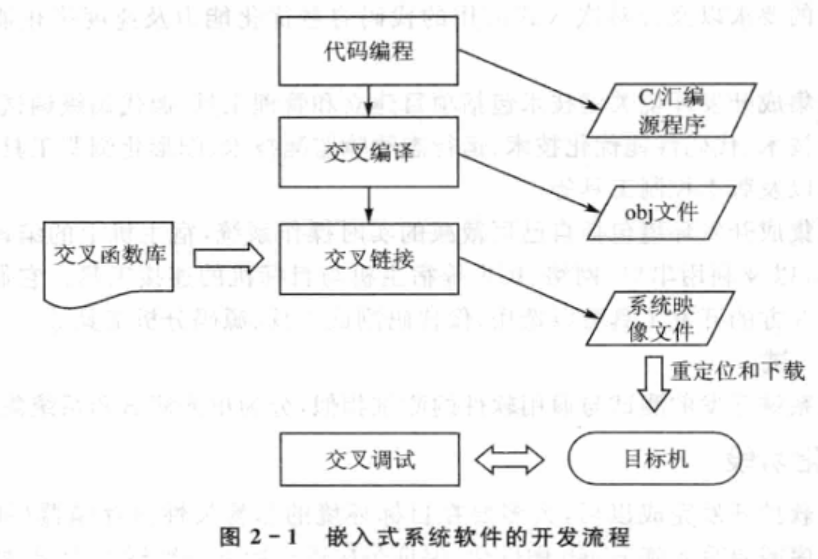

public:: true

- 🔵 1.嵌入式系统开发过程分为哪几个阶段？每个阶段的特点是什么？
	- ①需求分析阶段：采用成熟、易于二次开发的系统易于节省时间，从而以最短时间面世。
	- ②设计阶段：DARTS的设计方法-是结构化设计的扩展，划分出任务，并提供定义任务间的接口机制，适合设计多个并发执行的任务。
	- ③生成代码阶段：一般采用的方法是现在通用PC机上编程，然后通过交叉编译、链接，将程序做成目标平台上可以运行的二进制代码格式，最后将程序下载到目标平台上的特定位置，在目标板上启动这段二进制代码。
	- ④固化阶段：程序需要写入到Flash中固化，保证每次运行后下一次运行无误，所以嵌入式开发相比增加了软件的固化阶段。
	-
- 🔵 2.简述嵌入式软件开发流程。
	-
	- 
- 🔵 3.划分任务的基本原则有哪些？
-
- 🔵 4.任务间的通信方式有哪几种？各有何特点？
	- 共享数据结构和消息机制
	- 特点：共享数据结构是实现任务间的通信的最简单的方法。
- 🔵 5.嵌入式系统有哪几种调试方式？现在最流行的是哪种，使用什么接口？
	- ①源程序模拟器方式
	- ②监控器方式
	- ③仿真器方式（最流行，使用JTAG接口）
- 🔵 6.什么是板级支持包？它一般应完成哪些工作？
	- （1）板级支持包(Board
	  Support Package)是操作系统与目标应用硬件环境的中间接口，它是软件包中具有平台依赖性的那一部分。
	- （2）主要完成工作:
		- ①在系统启动时,对硬件进行初始化。②为驱动程序提供访问硬件的手段。
	- (3)主要作用:消除硬件差异。