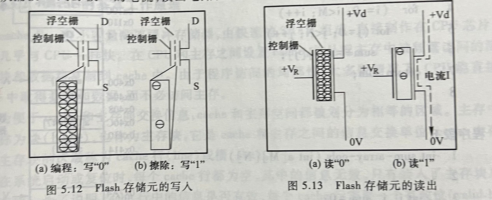

public:: false

- 🔵 **存储器的各种分类方式**：
	- 1.按存储元件分类
	- 2.按存取方式分类（随机存取存储器RAM、顺序存取存储器SAM、直接存取存储器DAM）
	- 3.按信息的可更改性分类（读写存储器和只读存储器ROM）
	- 4.按断电后信息的可保存性分类（非易失性存储器和易失性存储器）
- 🔵 **主存储器的基本结构**：
	- **存储单元（Cell）：** 存储单元是主存储器的基本单元，通常存储一个位（0或1）。
	- **字（Word）：** 存储器中能一次性读写的位数，通常由多个存储单元组成。
	- **地址线和数据线：** 用于存储器与CPU之间的数据传输。地址线用于指定存储单元的位置，数据线用于传输存储单元中的数据。
- 🔵 **存储容量的概念**：
	- 是指它能存放的二进制位数或字（字节）数。
- 🔵 **存储周期的概念**：
	- 是指存储器进行一次读写操作所需要的全部时间，也就是存储器进行连续读写操作所允许的最短间隔时间。
- 🔵 **存储器的层次化结构**：
	- 通常，它分为以下几个层次：
		- **高速缓存（Cache）：** 高速缓存是位于处理器内部或紧邻处理器的存储器，用于暂时存储最近使用的数据和指令。由于接近处理器，访问速度非常快，但容量较小且更昂贵。
		- **主存储器（主存）：** 主存储器是计算机中的主要内存储器，存放当前正在执行的程序和数据。主存速度较快但比高速缓存慢，容量比高速缓存大，成本相对较低。
		- **辅助存储器（外部存储器）：** 辅助存储器是指相对于主存和高速缓存而言速度较慢、容量较大的存储设备，例如硬盘驱动器、固态硬盘（SSD）、磁带等。它们用于长期存储数据和程序，但访问速度相对较慢。
	- 这种层次结构利用了存储器的特性，通过在不同层次间平衡速度、容量和成本来优化整个系统的性能。处理器会首先尝试从高速缓存中获取数据，如果缓存中没有，就会访问主存。如果数据也不在主存中，就需要从辅助存储器中加载数据到主存，然后再传输到高速缓存和处理器。这样的层次化结构有助于提高系统的整体性能和效率。
	- 
- 🔵 **存储元（cell的概念）**：
	- 存储元是存储器中存储位（0或1）的基本单元，可以是一个触发器、一个晶体管等。在DRAM中，存储元通常由一个电容器和一个晶体管构成。
- 🔵 **半导体随机存取存储器**：
	- 半导体RAM具有体积小、存取速度快等优点，适合作为内部存储器使用，分为：**静态RAM（SRAM）**和**动态RAM（DRAM）**。
- 🔵 **（静态随机存取存储器）SRAM的特点**：
	- **稳定性：** SRAM存储单元可以持续保持数据，不需要周期性地刷新。
	- **速度快：** 存取速度较快，相对于DRAM来说速度更快。
- 🔵 **（动态随机存取存储器）DRAM的特点**：
	- **刷新：** 存储单元中的电容器会逐渐失去电荷，需要定期刷新以保持数据的有效性。
	- **密度高：** 相比SRAM，DRAM可以在相同面积内存储更多数据。
- 🔵 **刷新的概念**：
	- 在DRAM中，由于存储元的电容器会逐渐失去电荷，需要周期性地进行刷新操作，重新写入电荷以保持数据的有效性。
- 🔵 （难点）**SDRAM芯片的读写过程**：
	- **读取过程：**
	- 通过地址线发送读取请求到SDRAM芯片，然后芯片根据地址找到对应的存储单元，并将数据通过数据线传输给CPU。
	  **写入过程：**
	- 类似于读取过程，CPU发送写入请求并提供数据，SDRAM芯片将数据写入到指定的存储单元。
- 🔵 （难点）**突发传输（burst）的概念**：
	- SDRAM支持突发传输，可以在单个请求中连续传输多个数据字。这种方式可以提高数据传输的效率。
- 🔵 （难点）**行缓存（row buffer）的概念**：
	- 行缓存是SDRAM中用于暂存被读取或写入的行数据的缓存区域。当读取某一行数据时，SDRAM会将整行数据加载到行缓存中，以便快速响应后续的读取请求。
- 🔵 **DDR SDRAM芯片技术**：
	- 是对标准SDRAM的改进设计
	- 这种内存芯片使用双倍数据传输率，相较于传统SDRAM有更高的传输速率。
- 🔵 **DDR2 SDRAM芯片技术**：
	- 采用与DDR类似的技术，利用芯片内部的I/O缓冲可以进行4位预取。
	- 是DDR SDRAM的进化版本，提供更高的频率和更低的功耗。
	- 例如，PC2-3200( DDR2-400) DDR2 SDRAM存储芯片内部Clk时钟的频率为200MHz,意味着存储器总线上的时钟频率应为400MHz,利用存储芯片内部的4位预取技术，使得一个时钟内有4个数据被取到I/0缓冲中，存储器总线在每个时钟内传送两次数据，若每次传送64位，则存储器总线的最大数据传输率(即带宽)为200MHzx4x 64/8=400 MHzx2x64/8=6.4 GB/s。
	- 
- 🔵 **DDR3 SDRAM芯片技术**：
	- 是DDR2的升级版本，采用更高频率、更低电压和更高的带宽。
	- DDR3 SDRAM芯片内部1/0缓冲可以进行8位预取。如果存储芯片内部CIk时钟的频率为200MHz,意味着存储器总线时钟频率为800MHz,总线在每个时钟内可传送两次数据，若每次传送64位，则存储器总线最大数据传输率(即带宽)为200MHzx8x64/8= 800 MHzx2x64/8= 12.8 GB/s。
- 🔵 （重点）**CPU和主存之间的连接**：
	- 主存和CPU之间的连接通过存储器总线实现。这是一条用于数据传输的电路，连接CPU和主存储器，允许CPU读取或写入主存储器中的数据。
	- {:height 234, :width 567}
- 🔵 （重点）**内存条插槽和存储器总线的关系**：
	- 内存条插槽是安装内存条的物理接口。存储器总线则是连接内存条插槽和主板上的内存控制器（Memory Controller）之间的电路。
	- 
- 🔵 （重点）**存储器芯片的扩展方式**：
	- 存储器芯片可以通过增加存储单元数量或者提高每个存储单元的容量来进行扩展，例如增加更多的芯片或者提高每个芯片的容量。
- 🔵 （重点）**内存条的组织方式**：
	- 内存条通常由多个存储芯片组成，这些芯片通过存储器总线连接到主板上的内存控制器。
- 🔵 （重点）**内存条中DRAM芯片内存储单元的编址方式**：
	- DRAM芯片内的存储单元通过地址线进行编址，这些地址线传输指定位置的地址信息，以便CPU能够读取或写入相应的存储单元。内存控制器通过地址线和数据线控制DRAM芯片中存储单元的访问。
	-
- 简单应用：对于内存条的容量、芯片个数、芯片的数据引脚数和地址引脚数、地址字段的划分等的计算或分析
- 🔵 **各种只读存储器的特点**：
	- 只读存储器（Read-Only Memory，ROM）是一种在制造时被预先编程并且在通常情况下不能被修改的存储器类型。不同类型的只读存储器有着不同的特点和用途：
		- 1. **ROM（只读存储器）：**
		- **特点：** ROM的内容在生产时被写入，并且通常无法被修改。它保留的数据在断电时也能保持。
		- **用途：** 用于存储固定的程序代码和固定数据，比如BIOS中的固件程序。
		  
		  2. **PROM（可编程只读存储器）：**
		- **特点：** 可以被用户一次性编程，但一旦编程后，数据将保持不变。
		- **用途：** 用于需要在生产后能被修改一次的情况，比如存储特定配置信息。
		  
		  3. **EPROM（可擦除可编程只读存储器）：**
		- **特点：** 允许多次擦除和编程。需要特殊设备来擦除芯片，比如紫外线擦除。
		- **用途：** 用于存储需要周期性修改的数据，比如早期的固件升级。
		  
		  4. **EEPROM（电可擦除可编程只读存储器）：**
		- **特点：** 可以通过电信号进行擦除和编程，而无需特殊设备。可多次写入和擦除。
		- **用途：** 用于存储需要频繁修改的数据，比如计算机的BIOS设置和小容量的存储器。
		  5.**MROM（掩膜只读存储器）
		- **特点：**存储内容固定、可靠性高
		- **用途：**适合定型批量生产。
		- 6. **Flash存储器：**
		- **特点：** 与EEPROM类似，可通过电信号擦除和编程，但擦除和编程的速度更快，功耗低、集成度高，不需要后备电源。
		- **用途：** 用于大容量存储，如固态硬盘、USB存储设备、闪存卡等。
- 🔵 **Flash存储器的基本读写原理**：
	- Flash存储器也称闪存，是一种非易失性存储器，其读写原理基于两个关键过程：擦除和编程。这些过程使用了特定的物理效应来改变存储单元的状态，从而实现数据的存储和读取。
	- 基本读写原理：
		- 1. **擦除（Erase）：**
		- **擦除整块：** Flash存储器的最小擦除单位是一个块（通常以扇区或页的形式存在），在擦除之前需要将整个块设置为1。
		- **原理：** 通过高电压作用于存储单元，使得存储单元中的电荷被移除，将其重置为1。
		  
		  2. **编程（Program）：**
		- **写入位：** 可以将存储单元的状态从1改变为0，但不能直接从0改变为1。因此，写入前需要先擦除整个块。
		- **原理：** 通过施加高压（比正常工作电压高）将电荷注入到存储单元中，改变其状态为0。
		  
		  3. **读取（Read）：**
		- **原理：** 读取时，根据存储单元内的电荷状态，探测存储单元的电压变化。通常，电荷的有无表示存储单元的状态（0或1）。
		  
		  4. **工作原理：**
		- Flash存储器使用晶体管的浮栅效应来存储数据。在擦除和编程过程中，电荷的移动改变了晶体管中的浮栅电荷，进而改变了存储单元的状态。
		  
		  这些基本原理使得Flash存储器具有非易失性和随机访问的特性，但也有其局限性，例如在擦除和编程过程中的耗时和有限的擦除次数。
		- 
- 🔵 **主存块**：
	- 主存中的区域块称为块，也称主存块。
- 🔵 **cache行**：
	- cache中存放一个主存块的区域称为cache行或槽。
- 🔵 **命中率**：
	- 若CPU访问单元所在的块在cache中，则称cache命中，命中的概率称为命中率。
- 🔵 **缺失率**：
	- 若不在cache中，则为不命中或缺失，其概率称为缺失率，它等于不命中次数与访问总次数之比。
- 🔵 （重点）**程序访问的局部化特性**：
	- **时间局部性**：
		- 指被访问的某个存储单元在一个较短的时间间隔内很可能又被访问。
	- **空间局部性**：
		- 指被访问的某个存储单元的邻近单元在一个较短的时间内很可能也被访问。
- 🔵 （重点）**cache的基本工作原理**：
	- Cache是位于CPU和主存之间的高速缓存，用于存储最常访问的数据和指令。当CPU需要数据时，首先在Cache中查找。如果命中（即所需数据在Cache中），就能快速获取。如果未命中，则需要从主存中获取，并将数据加载到Cache中。
- 🔵 （重难点）**主存块和cache行的映射关系**：
	- 主存块是主存中的存储单位，而Cache行是Cache中的存储单位。
	- 它们之间的映射关系有三种类型：**直接映射**、**组相联映射**和**全相联映射**。这些映射关系决定了数据在Cache中的存放位置。
- 🔵 **替换算法的基本概念**：
	- 替换算法用于决定在Cache中有限的位置上，当新的数据需要被加载时选择哪个位置进行替换。常见的算法有最近最少使用（LRU）、先进先出（FIFO）、随机替换、最不经常用算法（LFU）等。
- 🔵 **写策略的基本概念**：
	- 写策略指定了当CPU对数据进行写操作时，数据是直接写入Cache还是同时写入Cache和主存，以及何时进行写入（立即写入或延迟写入）。常见的写策略有写回（Write Back）和写直通（Write Through）。
	-
- 简单应用：对于cache总容量、命中率、平均访问时间、某个主存块所映射的cache行号等进行简单计算。
- 综合应用：综合使用映射关系、替换算法、写策略等相关知识，对高级语言程序执行过程中的访存过程进行分析，计算出各种情况下的cache命中率。
-
- 🔵 **虚拟地址**：
	- 虚拟地址是由CPU生成的地址，用于访问虚拟地址空间中的内存单元。
- 🔵 **虚拟地址空间**：
	- 虚拟地址空间是进程可用的虚拟内存地址范围。每个进程都有自己的虚拟地址空间。
- 🔵 **物理地址（主存地址）**：
	- 物理地址是真实的内存地址，用于访问实际的主存储器单元。
- 🔵 **虚拟存储器的三种类型**：分页式、分段式、段页式。
	- **分页式虚拟存储器**：将虚拟地址和物理地址划分为固定大小的页，通过页表将虚拟地址映射到物理地址。
	- **分段式虚拟存储器**：将虚拟地址和物理地址划分为不同大小的段，通过段表将段映射到物理地址。
	- **段页式虚拟存储器**：结合了分页和分段的特点，先进行分段再进行分页，将段内的虚拟地址映射到页表中的物理地址。
- 🔵 **页表的功能和页表项的内容**：
	- 页表是用于虚拟地址到物理地址转换的数据结构。
	- 页表项存储着虚拟地址和物理地址的对应关系，包括页框号、有效位、修改位等信息。
- 🔵 **“缺页”异常的发现和处理过程**：
	- 当CPU需要访问的页不在内存中时，会触发缺页异常。操作系统会将该页从磁盘加载到内存，更新页表，然后重新执行产生缺页异常的指令。
- 🔵 **TLB（快表）的结构和实现技术**：
	- TLB是一个高速缓存，存储了部分页表项的副本，加速虚拟地址到物理地址的转换过程。
- 🔵 **CPU访存过程**：
	- 1.**TLB表缺失：**要访问的页面对应的页表项不在TLB中。
	- 2.**cache缺失：**要访问的主存块不在cache中。
	- 3.**缺页：**要访问的页面不在主存中。
- 🔵 **一次性存储访问全过程**：
	- 一次性存储访问（DMA，Direct Memory Access）是一种数据传输方式，允许外设直接访问主存储器，而无需CPU的直接干预。以下是一次性存储访问的典型过程：
		- 1. **初始化DMA控制器：**
		- CPU通过设定DMA控制器的寄存器来配置DMA传输的参数，例如传输方向、内存地址等。
		- 2. **DMA请求：**
		- 外设（例如网卡、硬盘控制器）需要将数据传输到或者从主存储器中，向DMA控制器发出DMA请求。
		- 3. **DMA控制器响应：**
		- DMA控制器接收到外设的请求后，暂停CPU的操作，并获得对内存总线的控制权。
		- 4. **DMA传输：**
		- DMA控制器根据预先设定的参数，直接在外设和内存之间传输数据。它直接访问内存总线，绕过CPU，将数据直接传输到内存中，或者从内存中读取数据发送到外设。
		- 5. **传输完成中断：**
		- 当DMA传输完成时，DMA控制器可能会发送一个中断信号给CPU，以便CPU可以处理传输完成的事件。
		- 6. **CPU处理结果：**
		- CPU收到中断信号后，可以根据需要处理传输完成的数据或者采取其他操作。
- 🔵 （重难点）**虚拟地址向物理地址转换**：
	- 虚拟地址通过页表查询找到对应的物理地址，如果页表不命中则会触发缺页异常，导致从磁盘加载数据到内存。
- 🔵 **存储器中硬件与软件之间的分工协作方式**：
	- 硬件负责地址转换、TLB管理和缓存管理等低层次操作，而操作系统则负责页表的维护、缺页异常处理和虚拟地址管理等高层次操作。
- 简单应用：根据页表或TLB内容进行地址转换
- 综合应用：结合高级语言程序、cache、虚拟存储器等方面的知识，对程序的访存过程进行分析和相应的计算。
-
- 解释说明：
	- 静态RAM（SRAM）：
		- 一种内存类型，由稳定的触发器构成，存储器单元可以保持其状态而无需周期性刷新。它通常比动态RAM更快但也更昂贵。
	- 动态RAM（DRAM）：
		- 另一种内存类型，存储器单元以电荷的形式存储数据，需要周期性刷新以保持其内容，相比SRAM，它通常更便宜但访问速度较慢。
	- 刷新：
		- ** 存储单元中的电容器会逐渐失去电荷，需要定期刷新以保持数据的有效性。
	- 易失性存储器：
		- 存储在其中的数据在断电时会丢失的存储器类型。例如，DRAM是一种易失性存储器。
	- 相联存储器：
		- 一种存储器，其中的每个存储单元与一个地址相关联，与直接映射存储器相对，后者将每个地址映射到唯一的存储单元。
	- 存取时间：
		- 存储器从收到访问请求到数据准备就绪所需的时间。
	- 存储周期：
		- 存储器单元完成一次读或写操作所需的时间。
	- 存储器带宽：
		- 存储器传输数据的速率，通常以每秒传输的数据量来衡量。
	- Flash存储器：
		- 一种非易失性存储器，通常用于闪存驱动器和存储卡等设备。
	- 时间局部性：
		- 指被访问的某个存储单元在一个较短的时间间隔内很可能又被访问。
	- 空间局部性：
		- 指被访问的某个存储单元的邻近单元在一个较短的时间内很可能也被访问。
	- 命中率：
		- 若CPU访问单元所在的块在cache中，则称cache命中，命中的概率称为命中率。
	- 命中时间：
		- 命中时，CPU在cache中直接存取信息，所用的时间开销
	- 缺失率：
		- 若不在cache中，则为不命中或缺失，其概率称为缺失率，它等于不命中次数与访问总次数之比。
	- 缺失损失：
		- 从主存读入一个主存块到cache的时间。
	- 虚拟地址空间：
		- 虚拟地址空间是进程可用的虚拟内存地址范围。每个进程都有自己的虚拟地址空间。
	- 虚拟地址：
		- 虚拟地址是由CPU生成的地址，用于访问虚拟地址空间中的内存单元。
	- 虚拟页号：
		- 是虚拟地址中用于定位页表项的部分。它指示在页表中哪个条目对应于该虚拟地址。
	- 物理地址：
		- 物理地址是真实的内存地址，用于访问实际的主存储器单元。
	- 页框（页帧）：
		- 是物理内存中的固定大小的区域。每个页框的大小与页的大小相同。
	- 页表：
		- 页表是用于虚拟地址到物理地址转换的数据结构。
	- 页表基址寄存器：
		- 存储了页表的起始地址，用于虚拟地址到物理地址的转换。
	- 有效位（装入位）：
		- 是页表项中的一位，用于表示对应的虚拟页是否在物理内存中。如果有效位为1，则表示虚拟页已经被加载到物理内存中。
	- 修改位：
		- 是页表项中的一位，用于指示一个页面是否被修改过。如果页面被修改，则该位为1，表示需要在页面被换出内存之前将其写回磁盘。
	- 缺页（page miss）：
		- 是指访问某个虚拟页面，而该页面当前未在物理内存中。这种情况需要从磁盘加载页面到内存，通常会触发缺页异常，并由操作系统处理。
	- FIFO：
		- 先进先出策略
	- LRU:
		- 最近最少使用策略
	- 快表（TLB）：
		- 存储虚拟页号和物理页框号的高速缓存，用于加速虚拟地址到物理地址的转换。