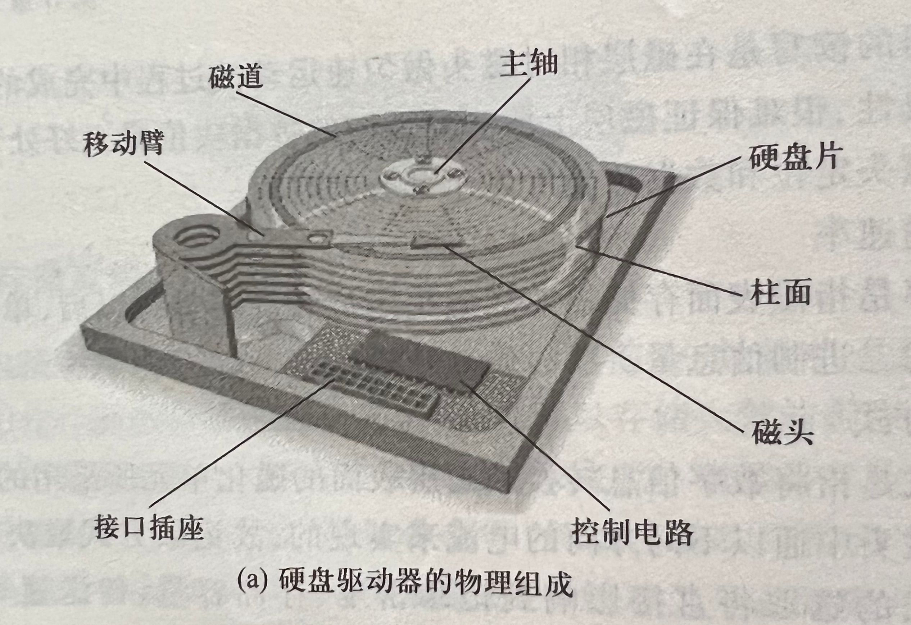
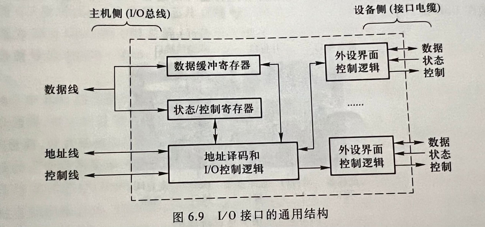
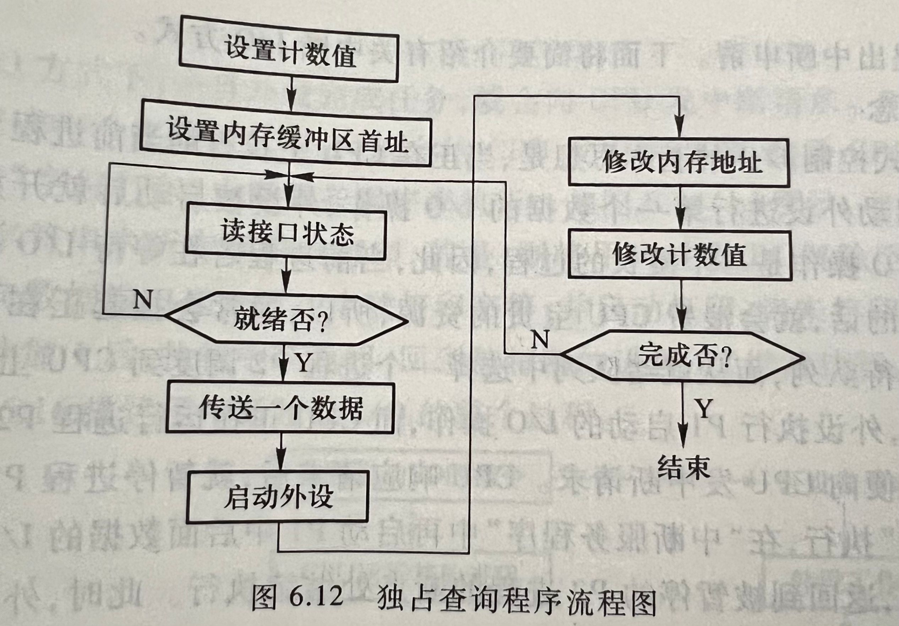
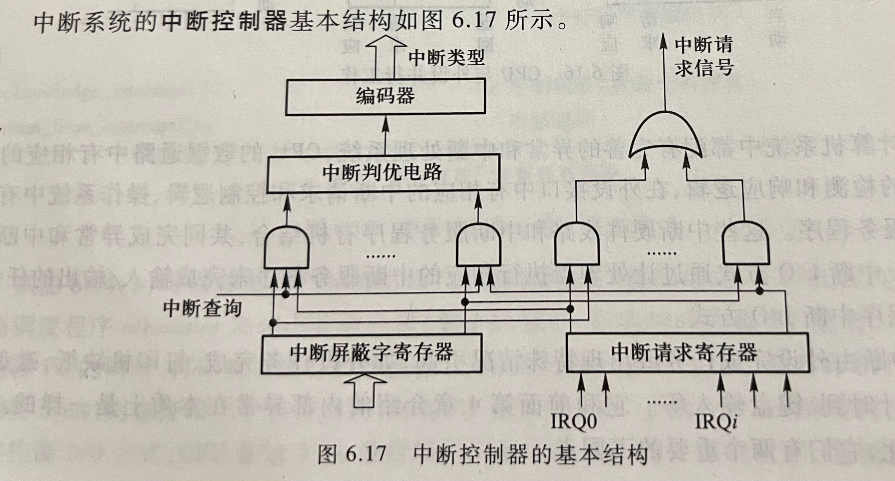

public:: false

- 🔵 输入输出设备（又称外围设备或外部设备）：是计算机系统与人或其他机器之间进行信息交换的装置。
	- 输入设备的功能：把数据、命令、字符、图形、图像、声音或电流、电压等信息，以计算机可以接收和识别的二进制代码形式输入到计算机中，供计算机进行处理。
	- 输出设备的功能：把计算机处理的结果，变成人最终可以识别的数字、文字、图形、图像或声音等信息，然后播放、打印或显示输出。
- 🔵 **键盘的基本工作原理**：
	- 键盘是计算机必不可少的输入设备，工作原理是键盘通过检测按键状态、生成扫描码并将其转换为可识别的字符编码，实现了将用户输入转化为计算机可理解的数据形式。
	- 键盘按键分为：触点式和非触点式
	- 键盘和主机相连的接口：AT接口（早期）、PS/2接口、USB接口、无线接口
- 🔵 **鼠标器的基本工作原理**：
	- 鼠标是一种相对定位设备
	- 主要功能：①进行光标定位 ②用来完成某种特定的输入
	- 工作原理：通过感知表面的移动（光学或机械方式），将这些移动转换成数字信号，然后将这些信号传输给计算机，使用户能够在屏幕上移动光标并进行点击或滚动等操作。
	- 根据采用的传感器技术的不同，鼠标可分为：机械式和光电式
		- 机械式：简单方便，易磨损、精度差
		- 光电式：速度快、精度高没有任何机械磨损、使用寿命长，只需在平面上就能操作
	- 主要技术指标：分辨率，单位dpi，分辨率越高越好
	- 鼠标和主机相连的接口：USB接口、PS/2接口、无线接口
- 🔵 **打印机的基本工作原理**：
	- 打印机是计算机系统中最基本的输出设备
	- 工作原理：接收数据、处理数据、生成图像并将其输出到纸张上，完成用户要求的打印任务。
	- 按照工作原理，打印机分为：**击打式和非击打式**两大类；
	- 按照工作方式，打印机分为：**点阵打印机、针式打印机、喷墨打印机、激光打印机等**。
- 🔵 **显示器的基本工作原理**：
	- 显示器是用来显示数字、字符、图形和图像的设备，是计算机系统中最常用的输出设备之一。
	- 显示器分为：阴极射线管（CRT）显示器和LCD液晶显示器
	- 显示存储器：VRAM
	- 显示控制器：CRTC
	- 显示器有两种工作模式：字符模式和图形模式
	- 颜色深度：彩色或单色多级灰度图像显示时，每一个像素需要使用多个二进制位来表示，每个像素对应的二进制位数称为颜色深度
	- 水平扫描周期的倒数称为**行频**，垂直扫描周期的倒数称为**刷新频率**
	- 显卡的核心是**绘图处理器GPU**
	- 显示器的屏幕尺寸，一般用对角线的长度表示，单位：英寸
	- 显示器的颜色指标：RGB
	- 显示器的工作原理可以简洁概括为以下几个步骤：
	- 1. **信息输入：** 计算机生成图像或文字信息，将其转换为视频信号。
	- 2. **信号传输：** 这些视频信号通过连接线（例如HDMI、DisplayPort）传输到显示器。
	- 3. **信号解码：** 显示器接收到视频信号后，对其进行解码，将信号转换成可显示的图像或文字信息。
	- 4. **像素点排列：** 显示器由成千上万个像素点组成，这些像素点按照特定排列在屏幕上。每个像素点能够发光或者调整颜色，从而形成整个图像。
	- 5. **光栅扫描：** 显示器使用不同的技术（例如液晶显示器、LED等）来激活像素点。在液晶显示器中，液晶通过电流控制光的透过程度，LED显示器则通过发光二极管控制像素点的亮度和颜色。
	- 6. **显示图像：** 按照接收到的视频信号，显示器激活相应的像素点，使其发光或显示相应的颜色，从而在屏幕上呈现出完整的图像或文字。
	- 这些步骤一起构成了显示器的工作原理，使其能够将计算机生成的信息以可视化的形式展示给用户。
- 🔵 **输入输出设备工作原理的共同点**：
	- 1. **数据传输：** 输入输出设备都涉及数据的传输。输入设备将外部信息转换成计算机可识别的数据格式，而输出设备则将计算机处理后的数据转换成可理解的形式输出到外部世界。
	- 2. **接口转换：** 这些设备在工作过程中需要进行接口转换。输入设备负责将外部信号（例如键盘按键、鼠标移动）转换为计算机能够理解的数据形式；输出设备则将计算机内部数据转换成外部可识别的形式（例如显示器上的图像、打印机输出的文件）。
	- 3. **通信协议：** 输入输出设备与计算机之间的通信需要遵循特定的协议和规范。这些协议确保了设备与计算机之间的有效沟通和数据传输的正确性。
	- 4. **数据处理和控制：** 输入输出设备不仅仅是传输数据，它们也涉及对数据的处理和控制。例如，鼠标输入不仅告诉计算机有按键按下，还提供了位置信息；显示器不仅仅显示图像，还可以接收命令调整显示设置。
	- 5. **驱动程序和操作系统支持：** 这些设备需要相应的驱动程序来与计算机进行交互，并且操作系统提供了必要的支持和接口，使设备能够被正确地识别、配置和使用。
	- 🔵 **磁表面存储器的性能指标**：
		- 1.记录密度
			- 记录密度可以用道密度和位密度来表示
				- **磁道**：是在磁层运动方向上被磁头扫过的轨迹
				- **道密度**：在沿磁道分布方向上，单位长度内的磁道数目
				- **位密度**：在沿磁道分布方向上，单位长度内存放的二进制信息的数目
					- 常用的位密度单位：BPI（每英寸二进制位数）、BPM（每毫米二进制位数）
		- 2.存储容量
			- 存储容量是指整个存储器所能存放的二进制信息量。它与磁表面大小和记录密度密切相关。
		- 3.平均存取时间
			- 是指从发出存储设备读/写请求到获取数据所需的平均时间。
			- 它是一个衡量存储设备性能的重要指标，尤其是在硬盘或固态硬盘等存储介质中。
			- 平均存取时间T:
				- T=寻道时间+旋转等待时间+数据传输时间
		- 4.数据传输速率
			- 数据传输速率是指磁表面存储器完成磁头定位和旋转等待以后，单位时间内从存储介质上读出或写入的二进制信息量。
		- 
- 🔵 （重点）**磁盘存储器的主要技术指标包括**：
	- 1. **容量：** 容量指磁盘可以存储的数据量，通常以GB或TB来表示。容量越大，存储空间越大。
		- 硬盘的**未格式化容量**是指按道密度和位密度计算出来的容量
		- 未格式化容量计算公式：
			- 磁盘总容量=记录面数×理论柱面数×内圆周长×位密度
		- 格式化容量计算公式：
			- 硬盘实际数据容量=2×盘片数×磁道数/面×扇区数/磁道×512 B/扇区
				- 早期的扇区大小为512字节
	- 2. **传输速度：** 传输速度表示磁盘在读写数据时的数据传输速率。它通常分为读取速度和写入速度，以MB/s或GB/s来衡量。
		- 数据传输率=每秒钟转速÷60×内圆周长×位密度
	- 3. **旋转速度：** 旋转速度是硬盘盘片旋转的速度，通常以每分钟转数（RPM）来表示。高转速通常意味着更快的数据读写速度。
	- 4. **接口类型：** 接口类型是指磁盘与计算机连接的方式，常见的接口包括SATA、SAS、等。不同的接口类型会影响到磁盘的数据传输速度和连接方式。
	- 5. **缓存（Cache）：** 硬盘上的缓存是用于临时存储数据的快速存储区域，能够加快读写速度。它以MB或GB来表示。
	- 6. **寿命和耐用性：** 对于固态硬盘（SSD）而言，寿命指的是其能够写入和擦除数据的次数。硬盘的耐用性也是一个重要指标，它表示硬盘的持久性和可靠性。
	- 7. **响应时间：** 响应时间指的是从请求数据到数据实际被访问所需的时间。对于访问速度要求高的场景（如服务器），响应时间是一个重要指标。
		- 总的响应时间计算公式：
			- 响应时间=排队延迟+控制器时间+寻道时间+旋转等待时间+数据传输时间
- 🔵 （重点）**磁盘存储器的记录格式**：
	- 数据在磁盘上的记录格式分为：定长记录格式和不定长记录格式两种。（目前大多采用定长记录格式）
	- 每个磁道由若干个扇区组成，每个扇区记录一个数据块，由头空、ID域、间隙、数据域和尾空组成。
		- 头空占17个字节，不记录数据，用全1表示
		- 尾空是在数据块的CRC码后的区域，占20字节，也用全1表示
- 🔵 **冗余磁盘阵列（RAID）的基本原理**：
	- 冗余磁盘阵列（RAID）是一种将多个磁盘组合起来以提高数据可靠性和性能的技术。
	- RAID 的基本原理是将数据分散存储在多个磁盘上，并通过不同的策略实现数据冗余和/或性能优化。
	- RAID 的选择取决于对数据可靠性、性能和容量利用率的需求。通过组合多个磁盘，并利用不同的数据存储策略，RAID 实现了数据冗余备份和性能优化，提高了系统的可靠性和性能。
	- RAID技术的3个特性：
		- ①RAID由一组物理磁盘驱动器组成，在操作系统下它们被视为单个逻辑驱动器
		- ②数据分布在一组物理磁盘上，可以连续分布也可以交叉分布
		- ③冗余磁盘用于存储校验信息，保证磁盘万一损坏时能恢复数据
- 🔵 **U盘和固态硬盘（SSD）的基本特点**：
	- U盘（USB闪存驱动器）的基本特点：
		- 1.便携性
		- 2.体积小
		- 3.采用USB接口
		- 4.读写速度慢
		- 5.具有保护功能
		- 6.容量比软盘和光盘大的多
		- 7.采用flash存储器，属于非易失性半导体存储器
		- **用途：** 适合用于临时数据传输、文件备份、文件共享等日常用途，但不太适合长期高频率的大容量数据读写。
	- 固态硬盘（SSD）的基本特点：
		- 1.速度快
		- 2.耐用
		- 3.容量大
		- 4.兼容性好
		- 5.体积小
		- 6.重量轻
		- 7.安全可靠
		- **用途：** 适合用作操作系统安装的驱动器，以及需要更快速度和更高性能的应用，比如游戏、视频编辑等需要大量读写数据的场景。
	- 总体而言，U盘适合用于便携式数据传输和轻量级文件存储，而固态硬盘（SSD）更适合需要高性能和大容量存储的应用场景。
- 🔵 **总线**：
	- 是计算机系统中用于传输数据、地址和控制信号的集合线路。它在计算机内部或外部组件之间传递信息，允许不同部件之间进行通信和数据交换。
- 🔵 **内部总线**：
	- 指芯片内部连接各元件的总线
- 🔵 **系统总线**：
	- 指连接CPU、存储器和各种I/O模块等主要部件的总线
		- 系统总线包括：数据线、地址线、控制线
			- **数据线**：用来承载在源部件和目的部件之间传输的信息
			- **地址线**：用来给出源数据或目的数据所在的主存单元或I/O端口地址
			- **控制线**：用来控制对数据线和地址线的访问和使用
- 🔵 **同步总线**：
	- 同步总线是一种按照时钟信号同步传输数据的方式。
- 🔵 （重点）**同步总线带宽的计算**：
	- 同步总线带宽的计算涉及的关键参数：
		- 1. **总线宽度（Bus Width）：** 指总线上并行传输的位数，通常以位（bits）为单位。例如，一个总线宽度为32位的总线可以同时传输32个位。
		- 2. **时钟速率（Clock Speed）：** 总线的时钟频率，通常以赫兹（Hz）为单位。它表示在单位时间内总线可以传输的数据次数。
		- 同步总线带宽可以通过以下公式计算：
			- \[\text{带宽} = \text{总线宽度} \times \text{时钟速率}\]
	- 例如，假设一个总线宽度为64位（即一次可以传输64个位）的同步总线，其时钟速率为100MHz（即每秒钟时钟振荡100百万次），那么它的带宽可以计算为：
	- \[带宽 = 64 \times 100,000,000 = 6,400,000,000 \text{ bits/s} = 6.4 \text{ Gbps}\]
	- 因此，该同步总线的带宽为6.4 Gbps（Gigabits per second）。
- 🔵 **异步总线**：
	- 是一种不依赖于统一时钟信号进行数据传输的方式。
- 🔵 **总线的性能指标包含**：
	- 1.总线宽度
	- 2.总线的工作频率
	- 3.总线的带宽
	- 4.总线的寻址能力
	- 5.总线的定时方式
	- 6.总线的突发传送
	- 7.总线的负载能力
- 🔵 **主控设备**：
	- 主控设备是负责管理和控制其他设备（称为从设备）的硬件或电子组件。它负责发送指令、接收数据，并协调整个系统的工作。
- 🔵 **从设备**：
	- 从设备是由主控设备控制和管理的外部设备。这些设备与主控设备相连，通过主控设备与计算机系统进行通信。例如，打印机、键盘和鼠标都可以是从设备。
- 🔵 **并行传输方式**：
	- 在并行传输中，多个位（通常是8位或更多）同时通过多根导线进行传输。每个位都有自己的传输线路，因此可以同时传输多个位。传统的并行端口（如并行打印机端口）使用并行传输方式。
- 🔵 **串行传输方式**：
	- 在串行传输中，数据位按顺序一个接一个地通过单条线传输。串行传输可能相对慢一些，但有时可以提供更可靠和长距离的数据传输。例如，USB和SATA接口通常使用串行传输方式。
- 🔵 **总线宽度**：
	- 总线中数据线的条数称为总线宽度
- 🔵 **总线带宽**：
	- 指总线的最大数据传输率
	- 总线带宽的计算公式：
		- B=W（总线宽度，以字节为单位）×F（总线时钟频率）/N（完成一次数据传送所用的时钟周期数）
- 🔵 **总线寻址能力**：
	- 指由地址线位数所确定的可寻址地址空间的大小。
- 🔵 **前端总线（FSB）**：
	- 是连接CPU和主板上其他组件（如内存和输入输出设备）的一种系统总线。它负责传输数据和指令，影响着系统的整体性能。
- 🔵 （重点）**前端总线带宽的计算**：
	- 带宽=FSB频率×每个时钟周期传输的位数×传输通道数量
	- 其中：
	- **FSB频率**：指的是前端总线的时钟频率，通常以赫兹（Hz）为单位表示。
	- **每个时钟周期传输的位数**：表示每个时钟周期传输的位数。在并行传输中，这通常是总线的位宽（例如32位或64位）。
	- **传输通道数量**：对于某些架构，可能存在多个传输通道，这种情况下需要乘以通道数量。
	- 例如，假设一个前端总线的频率为800兆赫兹（MHz），每个时钟周期传输64位（8字节），如果有两个传输通道，那么其带宽计算为：
	- 带宽=800 MHz×64 位×2 通道=102.4 GB/s带宽=800MHz×64位×2通道=102.4GB/s
- 🔵 **存储器总线**：
	- 早期的存储器总线由北桥芯片控制，处理器通过北桥芯片和主存储器、显卡以及南桥芯片进行互连。Core i7以后的处理器芯片中集成了内存控制器，因此，存储器总线直接连接到处理器。
	  id:: 657a945f-56dd-4ea4-814f-f8c43d62878c
- 🔵 **I/O总线**：
	- 用于为系统中的各种I/O设备提供输入/输出通路，在物理上通常是主板上的一些I/O扩展槽。
- 🔵 （重点）**计算机系统互连方式**：
	- 计算机系统中，不同组件之间进行通信和数据传输的方式有多种，其中包括以下常见的互连方式：
		- 1. **总线架构（Bus）：** 总线是一种基本的系统互连方式，连接了 CPU、内存、I/O 设备等各个组件。它允许不同设备之间通过共享的数据通道进行通信和数据传输。
		- 2. **点对点互连（Point-to-Point）：** 这种方式通过直接的点对点连接，将一个设备与另一个设备相连。例如，现代计算机中，处理器和主存之间通常采用点对点连接的方式。
		- 3. **串行连接（Serial Connection）：** 在串行连接中，数据通过单一的传输线逐位传输。它通常用于外部设备，例如串行ATA（SATA）硬盘、USB设备等。
		- 4. **并行连接（Parallel Connection）：** 并行连接允许多个数据位同时传输，通过多个并行的传输线。曾经在计算机内部和某些外部设备中使用，但逐渐被串行连接取代。
		- 5. **网络互连（Network Interconnection）：** 通过网络连接不同计算机或设备之间的通信，典型的例子是局域网（LAN）、广域网（WAN）和互联网（Internet）。
		- 6. **片上互连（On-chip Interconnect）：** 指的是在芯片内部各个功能块之间的互联。在微处理器和芯片级系统中，不同功能模块之间需要高效的内部通信，片上互连是其实现方式之一。
		- 7. **多处理器互连（Multiprocessor Interconnect）：** 在多处理器系统中，处理器之间需要互连来共享数据、协调任务等。这可能包括总线、交叉条（crossbar）、网状拓扑（mesh topology）等。
- 🔵 **内存条规格的含义**：
	- 当谈论内存条的规格时，主要包含以下信息：
		- 1. **容量（Capacity）：** 内存条可以存储的数据量，通常以GB（Gigabytes）为单位，比如4GB、8GB等。这表示内存条能够容纳多少数据。
		- 2. **类型（Type）：** 内存条的类型标识了其内部技术规范，如DDR3、DDR4等。不同类型的内存条有不同的数据传输速度和技术特性。
		- 3. **频率（Frequency）：** 内存条的频率（也称为时钟速度），通常以MHz（兆赫兹）为单位。例如，DDR4-2400表示频率为2400MHz的DDR4内存。
		- 4. **时序（CAS Latency）：** 内存条的延迟时间，以CL值表示，较低的CL值通常意味着更快的内存响应速度。
		- 5. **电压（Voltage）：** 内存条的工作电压，例如DDR3内存通常工作在1.5V，而DDR4则通常是1.2V。
		- 6. **通道数（Channels）：** 内存条的通道数目，如单通道、双通道、四通道等。多通道内存可以提供更高的数据传输速度。
		- 7. **尺寸（Form Factor）：** 内存条的物理尺寸标准，例如DIMM（台式机内存）、SODIMM（笔记本内存）等。
- 🔵 🔵 （重点）简单应用：同步总线带宽的计算、前端总线的带宽计算、QPI总线的带宽计算、存储器总线的带宽计算、PCI-E总线的带宽计算
	- QPI总线是一种基于包传输的串行高速点对点连接协议，采用差分信号与专门的时钟信号进行传输
		- QPI总线的带宽计算公式：
			- 每秒传输次数×每次传输的有效数据×2
			- QPI总线的速度单位通常为，GT/s
	- 存储总线的带宽计算：
		- 每秒钟传输次数×存储器总线宽度的位数/8
		- 例：宽度为64为，每秒钟传输1333M次，总线带宽为1333M×64、8=10.66GB/s
	- PCI-Express 1.0规范支持通路中每个方向的发送或接收速率为2.5Gb/s。
	- PCI-E总线的总带宽计算公式：
		- 2.5Gb/s × 2 × 通路数/10
- 🔵 **I/O接口（I/O控制器）**：
	- 是介于外设和i/ozongxian之间的部分
	- I/O接口的职能：
		- 1.数据缓冲：在I/O接口中引入数据缓冲寄存器，以达到主机和外设工作速度的匹配
		- 2.错误或状态检测：在I/O接口中提供状态寄存器，以保持各种状态信息，供CPU查用
		- 3.控制和定时
		- 4.数据格式转换
- 
- 🔵 **I/O控制器中的内部接口**：
	- 指在主机侧的接口
- 🔵 **I/O控制器中的外部接口**：
	- 指在外设侧的接口
- 🔵 **数据缓冲寄存器**：
	- 用于暂存输入输出数据的寄存器。当数据需要从外部设备（如硬盘、网络接口等）传输到 CPU 或从 CPU 传输到外部设备时，数据缓冲寄存器充当了临时存储数据的中转站。
- 🔵 **状态寄存器**：
	- 用于存储设备状态信息的寄存器。它包含了设备的各种状态标志，比如设备是否准备好接收数据、是否有错误发生等。CPU可以读取这些状态标志，以确定设备是否可以执行输入输出操作。
- 🔵 **控制寄存器（命令寄存器）**：
	- 用于向设备发送控制命令的寄存器。CPU通过向控制寄存器写入特定的命令来控制设备的操作，比如启动数据传输、重置设备等。
- 🔵 **I/O端口**：
	- 是I/O接口中的寄存器
- 🔵 **I/O指令**：
	- 这些指令用于CPU与外部设备进行通信和数据传输。I/O指令允许CPU访问I/O设备的寄存器，执行输入和输出操作。这些指令包括读取设备状态、从设备读取数据、向设备写入数据等操作。
- 🔵 **独立编址方式**：
	- 在独立编址方式中，CPU使用不同的地址空间来访问I/O设备和内存。这意味着I/O设备有专门的地址空间，CPU通过专门的I/O指令访问这些设备。
- 🔵 **统一编址方式（存储器映射方式）**：
	- 在统一编址方式中，CPU使用相同的地址空间来访问内存和I/O设备。I/O设备被映射到内存地址空间中的特定位置。CPU使用与访问内存相同的指令和地址来访问这些设备。
- 🔵 （重难点）**I/O接口的基本功能**：
	- 1. **数据传输：** I/O接口负责在CPU和外部设备之间传输数据。它可以将数据从外部设备传输到CPU（输入操作）或将CPU生成的数据传输到外部设备（输出操作）。
	- 2. **数据缓存：** 接口通常包括数据缓存寄存器，用于临时存储传输的数据。这有助于解决CPU与外部设备速度不匹配的问题，允许数据暂时存储或等待处理。
	- 3. **控制信号：** 接口向外部设备发送控制信号和命令，以控制其操作。这些信号可以包括启动/停止数据传输、设备复位、操作模式选择等。
	- 4. **状态检测：** I/O接口能够检测外部设备的状态，例如设备是否准备好进行数据传输、是否发生错误等。这些状态信息可以通过状态寄存器传递给CPU，以便CPU进行相应的处理。
	- 5. **地址识别：** 接口能够识别和区分不同的外部设备。每个外部设备都有一个特定的地址或标识，使CPU能够准确地与目标设备通信。
	- 6. **协议转换：** 有些接口可能需要进行协议转换，将CPU内部的数据格式或通信协议转换成适合外部设备的格式，以确保数据能够正确地传输和处理。
- 🔵 （重难点）**I/O接口的通用结构**：
	- 请原谅，可能在前面的回答中存在一些混淆。以下是I/O接口的通用结构的更详细描述：
	  
	  1. **接口控制器（Interface Controller）：** 这是连接CPU和外部设备的关键组件。接口控制器负责处理来自CPU的指令和控制信号，并管理与外部设备的通信。它包括了以下几个重要模块：
		- **数据缓冲寄存器（Data Buffer Register）：** 用于临时存储数据，以便在CPU和外部设备之间进行数据传输。
		- **状态寄存器（Status Register）：** 存储外部设备的状态信息，如设备准备好接收数据、是否发生错误等。
		- **控制寄存器（Control Register）：** 用于向外部设备发送控制信号和命令，控制设备的操作。
		  
		  2. **数据总线（Data Bus）：** 数据总线负责在CPU、内存和I/O设备之间传输数据。
		  
		  3. **地址总线（Address Bus）：** 地址总线用于传输地址信息，以便CPU能够选择和识别特定的I/O设备或寄存器。
		  
		  4. **控制总线（Control Bus）：** 控制总线用于传输控制信号和命令，例如读取、写入、中断请求等。
		  
		  5. **电源和地线（Power and Ground Lines）：** 这些线路为接口提供所需的电源和接地，以确保接口正常运行。
- 🔵 **I/O接口在整个系统互连中的位置**：
	- I/O接口在计算机系统中处于关键位置，它连接了计算机系统与外部世界，负责管理输入输出设备（I/O设备）与计算机系统的通信。
	- 通常，I/O接口位于主板上，作为计算机系统的一部分。它可以是集成在主板上的硬件模块，也可以是外部插槽（如PCI插槽）上的扩展卡。I/O接口提供了物理和逻辑连接，让计算机系统能够与各种外部设备进行通信。
	- I/O接口起着桥梁的作用，连接了计算机系统的内部和外部。它包括了各种接口标准和协议，如USB、Ethernet、HDMI、VGA、SATA等，这些接口允许连接不同类型的外部设备，例如键盘、鼠标、显示器、打印机、存储设备等。
	- 通过I/O接口，计算机系统能够与外部设备进行数据传输、信息交换和控制操作，使得计算机能够与用户交互，并与外部设备进行数据交换和通信。因此，I/O接口在整个计算机系统中扮演着重要的角色，促进了计算机系统与外部世界的连接和互动。
- 🔵 **I/O接口和I/O端口的差别**：
	- **IO接口**：主机和外设之间的交接界面，通过接口可以实现主机和外设之间的信息交换。
	- **IO端口**：接口电路中可被CPU直接访问的寄存器。
	- **区别**：
	- I/O接口是用于连接计算机和外部设备的通道，而I/O端口是CPU与特定外部设备之间进行通信和数据传输的逻辑地址。I/O接口是更广义的概念，而I/O端口则是指向特定设备的逻辑通道。
- 🔵 **各种I/O传送控制方式的特点和适用场合**：
	- I/O数据传送主要有三种不同的控制方式：程序直接控制、中断控制和DMA控制
	- **程序直接控制方式**：
		- 直接通过查询程序来控制主机和外设之间的数据交换，通常有两种类型：无条件传送方式（也称同步传送方式）和条件传送方式（也称异步传送方式）
		- **无条件传送方式**：主要用于对一些简单外设在规定时间用相应的I/O指令对接口中的寄存器进行信息的输入或输出。其本质是通过程序来定时，以同步传送数据，社和与各类巡回采样检测或过程控制。
		- **条件传送方式**：对于一些较复杂的I/O接口，往往有多个控制、状态和数据寄存器，对设备的控制必须在一定的状态条件下才能进行。
		- 根据查询被启动的方式不同，条件式程序查询分为两种：定时查询和独占查询
			- **条件式程序查询**是根据特定条件查询设备状态的方式；
			- **定时查询**是按照预定时间间隔查询设备状态；
			- **独占查询**是持续查询设备状态直到特定条件满足的方式。
			- 
	- 1. **程序查询方式（Programmed I/O）：**
		- **特点：** CPU周期性地查询设备状态寄存器，以确定设备是否准备好进行数据传输，然后执行数据传输操作。
		- **适用场合：** 适用于低速设备和对实时性要求不高的场景。例如，键盘、鼠标等低速设备，以及对数据传输速度要求不是特别高的情况。
		  2. **中断控制（Interrupt-driven I/O）**：
		- **特点：** 设备在完成数据传输或需要CPU干预时发送中断请求给CPU，CPU响应中断，暂停当前执行的程序，并执行相应的中断服务程序来处理I/O操作。
		- **适用场合：** 适用于对实时性要求较高、需要快速响应设备状态变化的场景。例如，网络数据包的到达需要即时处理的情况，或是需要高效率响应外部设备状态的情况。
		- 3. **直接存储器访问（DMA）方式：**
		- **特点：** DMA控制器允许外部设备直接访问内存，无需CPU介入，减少了CPU的负担，提高了数据传输效率。
		- **适用场合：** 适用于大量数据传输和对速度要求很高的场景，如高速网络传输、大容量文件传输等。
		  程序查询方式简单易实现，但效率较低；中断驱动方式具有较高的实时性和灵活性；而DMA方式能够大幅提高数据传输效率，但需要专门的DMA控制器支持。根据具体的应用需求和设备特性，选择合适的I/O传输控制方式能够更好地满足系统的要求。
- 🔵 **程序直接控制（查询）方式的特点和工作流程**：
	- 程序直接控制（查询）方式是一种基本的I/O控制方式，其特点和工作流程如下：
	- **特点：**
	  1. **CPU主动查询：** 在程序直接控制方式中，CPU周期性地主动查询设备状态，以确定设备是否准备好进行数据传输。
	  2. **简单直观：** 这种方式简单直观，易于理解和实现。
	  3. **效率较低：** 由于CPU需要不断地查询设备状态，这会占用大量CPU时间，造成效率较低。
	  4. **适用于简单设备：** 适用于速度较慢、操作简单、对实时性要求不高的设备。
	- **工作流程：**
	  1. **CPU发起查询：** CPU向设备的控制寄存器发出查询指令，以获取设备的状态信息。
	  2. **查询设备状态：** 设备在被查询后，将其状态信息写入到状态寄存器中。
	  3. **检查状态：** CPU读取状态寄存器中的设备状态信息，判断设备是否准备好进行数据传输或是否需要进行其他操作。
	  4. **执行数据传输或操作：** 若设备准备好进行数据传输，CPU会向设备发送数据或从设备接收数据；若设备需要其他操作，CPU会发送相应的控制指令。
	  5. **重复查询：** 这个过程是周期性的，CPU会持续地周期性查询设备状态，以确保能够及时地响应设备的变化。
	- 程序直接控制方式下，CPU主动查询设备状态，通过周期性的询问来了解设备是否准备好进行数据传输或需要执行其他操作。尽管简单易懂，但由于其低效率的特点，对于高实时性要求和大数据传输量的场景并不适用。
- 🔵 **程序查询和程序直接控制的区别**：
	- 程序直接控制和程序查询在某种程度上可以混淆，因为它们都涉及CPU周期性地查询设备状态以确定设备是否准备好进行数据传输。然而，在计算机领域中，它们确实有些微妙的区别。
	- **程序查询（Programmed I/O）** 指的是CPU周期性地查询设备状态，以判断设备是否准备好接收或发送数据。在程序查询中，CPU通过不断地轮询（查询）设备的状态寄存器来等待设备的准备就绪。这种方式可能会占用大量的CPU时间，因为CPU不断地检查设备的状态，等待设备准备好。
	- **程序直接控制（Programmed I/O）** 涉及CPU直接控制I/O操作的方式。在程序直接控制中，CPU负责向设备发送命令和控制信息，以及处理设备的状态。这种方式更强调CPU对I/O操作的主动控制，而不仅仅是周期性地查询设备的状态。程序直接控制涉及更多的CPU干预，它直接管理设备的操作，而不仅仅是等待设备的状态。
	- 虽然这两种方式都涉及CPU与设备之间的交互，但程序直接控制更侧重于CPU主动地控制和管理I/O操作，而程序查询更侧重于CPU周期性地检查设备的状态并相应地执行操作。两者都属于I/O传输控制方式的一部分，但在实际应用中，它们的细微差别可能会影响到系统的效率和响应速度。
- 🔵 **中断I/O方式的特点和工作过程**：
	- **特点：**
		- 1. **异步性：** 中断I/O是异步进行的，即外设在完成数据传输或就绪时可以发出中断请求，而不需要等待CPU的指令。
		- 2. **提高CPU利用率：** 在中断I/O中，CPU可以继续执行其他任务，当外设就绪时才会中断当前任务进行I/O操作，从而提高了CPU的利用率。
		- 3. **实时性：** 中断机制允许外设及时响应和通知CPU，对于需要快速响应的事件（如硬件错误、设备就绪等），能够及时处理。
	- **工作过程：**
		- 1. **外设请求中断：** 外设在完成某项操作（例如数据传输结束、设备就绪等）或者需要CPU处理的事件发生时，会向CPU发送中断请求。
		- 2. **中断请求响应：** 当CPU接收到中断请求时，它会中断当前正在执行的程序，暂停当前任务，保存相关状态（如程序计数器、寄存器状态等）以便稍后恢复执行。
		- 3. **中断服务程序（Interrupt Service Routine, ISR）的执行：** CPU根据中断请求选择相应的中断服务程序，这个程序通常是预先定义好的。ISR负责处理特定的中断请求，执行相应的处理操作，比如从外设读取数据或向外设发送数据。
		- 4. **中断处理完成和恢复：** 处理完中断服务程序后，CPU会恢复先前被中断的任务，重新载入之前保存的状态，并继续执行先前被中断的指令。
- 🔵 （重难点）**中断响应和处理的过程**：
	-
- 🔵 （重难点）**中断和异常的区别**：
	-
- 🔵 **外设发生什么事件可以向CPU提出中断请求**：
	-
- 🔵 **CPU查询中断请求的过程**：
	-
- 🔵 **CPU中断响应的3个条件**：
	- ①CPU处于“开中断”状态；
	- ②至少有一个未被屏蔽的中断请求；
	- ③当前指令刚执行完。
- 🔵 **CPU响应中断请求的过程**：
	- 中断过程包括：中断响应和中断处理
		- 中断响应阶段由硬件实现；中断处理阶段由软件实现。
- 🔵 **调出中断服务程序的方法（软件查询或形成向量地址）**：
	-
- 🔵 **中断服务程序的结构框架（即中断处理过程）**：
	-
- 🔵 **断点保护和现场保护的不同**：
	-
- 🔵 **现场保护和恢复的方法**：
	-
- 🔵 **中断允许触发器的作用以及应在何时开/关中断**：
	-
- 🔵 **中断服务程序调用和子程序调用的差别**：
	-
- 🔵 **中断控制器的基本结构**：
	- 
- 🔵 **多重中断和中断屏蔽的概念**：
	-
- 🔵 **DMA方式适用的场合和特点**：
	-
- 🔵 **DMA接口的组成结构**：
	-
- 🔵 **DMA传送的过程**：
	-
- 🔵 （重难点）**DMA控制方式的基本原理**：
	-
- 🔵 **中断方式和DMA方式的差别**：
	-
- 简单应用：程序查询方式下CPU用于I/O的开销、中断方式下CPU用于I/O的开销、DMA方式下CPU用于I/O的开销。
-
- 解释说明：
	- 键盘扫描码：指按下计算机键盘上按键时，键盘发送到计算机的特定编码。这些编码标识出哪个按键被按下或释放。操作系统接收到这些编码后，将其转换成对应的字符或指令。
	- 终端：指用户与计算机系统进行交互的设备或程序。它可以是物理设备，也可以是指模拟终端窗口。
	- 磁道：是在磁层运动方向上被磁头扫过的轨迹
	- 柱面：多个盘片上相同磁道形成一个柱面
	- 扇区：信息存储在磁盘的磁道上，而每个磁道被分成若干个扇区
	- 道密度：在沿磁道分布方向上，单位长度内的磁道数目
	- 位密度：在沿磁道分布方向上，单位长度内存放的二进制信息的数目
	- 平均存取时间：是指从发出存储设备读/写请求到获取数据所需的平均时间
	- 寻道时间：是磁头移动到指定磁道所需时间
	- 旋转等待（查询）时间：指要读写的扇区旋转到磁头下方所需时间。
	- 传输时间：指传输一个扇区的时间
	- 数据传输率：是单位时间内从磁盘盘面上读出或写入的二进制信息量
	- 磁盘控制器：是主机与硬盘驱动器之间的接口。
	- 磁盘驱动器：是存储设备，用于读取、写入和存储数据。
	- 冗余磁盘阵列RAID：是一种将多个磁盘组合起来以提高数据可靠性和性能的技术。
	- 系统总线：指连接CPU、存储器和各种I/O模块等主要部件的总线
	- 内部总线：指芯片内部连接各元件的总线
	- 信号线复用：
	- 同步总线：
	- 主控设备：
	- 中断响应：
		- 是指主机发现中断请求，中止现行程序的执行，到调出中断服务程序这一过程
-