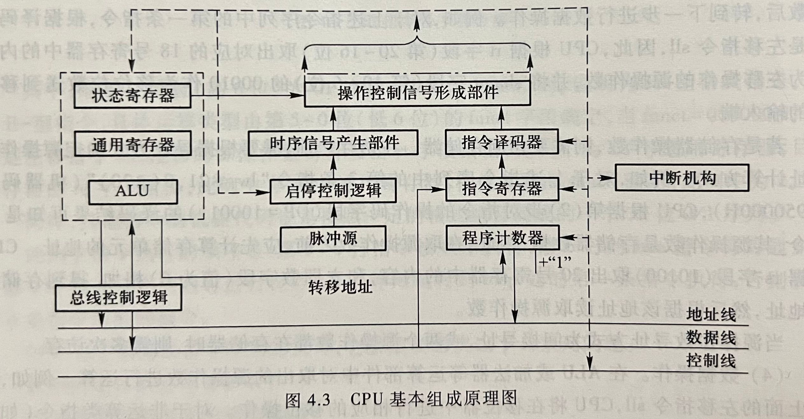

public:: false

- 🔵 **指令周期**：
	- CPU取一条指令并执行的时间，不同指令的指令周期可能不同。
- 🔵 不管CPU多复杂，最基本的部件是**数据通路**和**控制部件**。
- 
- 系统总线包括：地址线、数据线、控制线，这三条线并不属于CPU，主要用来使CPU和CPU外部的部件交换信息，交换的信息包括地址、数据和控制三类。
- 🔵 **数据通路**：
	- 是指令执行过程中数据所流经的部件，包括各类运算部件。
- 🔵 **控制部件**：
	- 根据每条指令功能的不同生成对数据通路的控制信号，并正确控制指令的执行流程。
- 🔵 **指令寄存器**：
	- 指令寄存器（IR）用于存放现行指令。
	- 每条指令总是先从存储器取出后才能在CPU中执行，指令取出后存放在指令寄存器中，以便送指令译码器进行译码。
- 🔵 **程序计数器（指令指针寄存器）**：
	- 程序计数器（PC）又称指令指针寄存器（IP）或指令计数器，用来存放即将执行指令的地址，取指令时，总是先把PC的内容送到地址线。
- 🔵 **指令译码器**：
	- 指令译码器（ID）对指令寄存器中的操作码部分进行分析解释，产生相应的译码信号供给操作控制信号形成部件，以产生控制信号。
- 🔵 **总线接口部件**：
	- 总线接口部件在计算机系统中扮演着重要的角色，它们负责管理和控制计算机内部各个部件之间的数据传输。这些部件通过总线进行通信和数据交换。
	- 主要功能包括：
		- 1. **总线控制器：**
		- 负责协调总线上的数据传输和操作，它控制总线的访问权限，管理数据传输的开始和结束。总线控制器也负责产生或响应总线操作的控制信号。
		- 2. **总线接口：**
		- 这是连接主板或芯片组和外部总线的接口部分。它包括了将内部信号转换成与外部总线相兼容的信号的逻辑电路。
		- 3. **数据缓冲器：**
		- 数据缓冲器用于在数据传输过程中暂存数据，确保数据在不同速度的部件之间能够正确传输。它们可以暂时存储数据，待需要时进行读取或写入。
		- 4. **地址解码器：**
		- 地址解码器用于识别处理器发送的地址信号，并确定哪个设备或组件应该对这个地址做出响应。它将控制信号发送到正确的设备，使其进行相应的操作。
		- 5. **时序电路：**
		- 负责产生时钟信号，协调各个部件的工作节奏，确保数据在正确的时序下传输。
		- 6. **错误检测和纠正电路：**
		- 这些电路负责检测和纠正在数据传输过程中可能出现的错误，例如奇偶校验、CRC（循环冗余校验码）等。
	- 总线接口部件是计算机内部各个组件与外部总线之间的桥梁，它们协调和管理数据的传输，确保数据在各个部件之间能够正确、高效地传递。
- 🔵 **存储器数据寄存器（MDR）**：
	- 存储器数据寄存器（MDR）是一个在计算机系统中用于暂时存储从主存储器中读取的数据或者要写入主存储器的数据的特殊寄存器。
	- MDR扮演着重要的角色，主要功能有：
		- 1. **数据传输：**
		- 当CPU需要读取内存中的数据时，该数据首先会被加载到MDR中。同样地，当CPU需要向内存写入数据时，要写入的数据也会首先存储在MDR中，然后被发送到内存。
		- 2. **暂存器：**
		- MDR作为一个临时存储单元，在数据在内存和CPU寄存器之间传输时起到了缓冲和暂存的作用。
		- 3. **数据位宽：**
		- MDR的宽度取决于计算机系统的架构，通常与CPU的数据总线宽度相匹配。例如，如果CPU的数据总线是32位的，那么MDR通常也是32位宽。
		- 4. **与其他寄存器交互：**
		- MDR通常与CPU内部的其他寄存器（比如指令寄存器、通用寄存器等）进行数据交换，使得在指令执行和数据传输过程中能够顺利地进行。
	- 负责临时存储从内存中读取的数据以及将要写入内存的数据，使得CPU能够有效地读取和写入数据，完成计算和操作。
- 🔵 **存储器地址寄存器（MAR）**：
	- 存储器地址寄存器（MAR）是计算机系统中的一个重要寄存器，其主要功能是存储CPU发出的内存操作指令中的内存地址。
	- MAR有以下主要作用：
		- 1. **地址传递：**
		- 当CPU需要访问主存储器中的数据时，它将要访问的内存地址加载到MAR中。这个地址可以是要读取的数据的地址，也可以是要写入数据的地址。
		- 2. **内存访问：**
		- MAR中存储的地址被用于在主存储器（RAM）中定位特定的数据单元。在读取或写入数据时，CPU通过MAR中存储的地址来选择特定的内存单元。
		- 3. **地址传输：**
		- MAR将存储的地址传送到内存地址总线，使得CPU能够和主存储器进行通信和数据传输。
		- 4. **地址译码：**
		- 在某些情况下，MAR中的地址还可能需要被解码，以确定具体要访问的内存单元。例如，如果内存采用分段或分页管理，MAR中的地址可能需要经过额外的译码过程。
	- 负责存储CPU发出的要访问的内存地址，并将这些地址传递到主存储器，以便CPU可以正确地读取或写入数据。
- 🔵 **脉冲源**：
	- 会产生一定频率的脉冲信号作为整个机器的时钟脉冲，是CPU时序的基准信号。
- 🔵 **时钟脉冲**：
	- 它是由时钟源发出的一系列规则的电信号脉动。这些脉冲以固定频率和间隔振荡，作为计算机各个部件进行操作和数据传输的基准。
	- 时钟脉冲的作用包括但不限于：
		- **同步各个部件：**
		- 时钟脉冲作为计算机系统的节拍，用于同步CPU、存储器、总线、输入输出设备等各个部件的操作。它们在每个时钟周期开始时，按照脉冲的节拍进行工作。
		- **确定指令执行时间：**
		- 计算机中的每条指令需要一定数量的时钟周期来执行。时钟脉冲提供了一个准确的计时单位，用于确定每个指令的执行时间和时序。
		- **控制数据传输速率：**
		- 时钟脉冲的频率决定了数据传输的速率。更高频率的时钟脉冲意味着更快的数据传输速度。
		- **节省功率：** 在许多现代系统中，时钟信号的频率会根据需要进行调整，以节省能源。例如，在CPU空闲或负载较低时降低时钟频率，以减少功耗。
	- 时钟脉冲的频率通常以赫兹（Hz）为单位表示，比如典型的计算机可能有1 GHz（10^9 Hz）或更高的时钟频率。
- 🔵 （重点）**程序与指令之间的关系**：
	- 程序和指令之间有着密切的关联，它们是计算机系统中不同层次的概念：
		- **程序（Program）：**
			- 程序是一系列指令的集合，它描述了完成特定任务或实现特定功能的操作步骤和逻辑。程序由一系列按照特定顺序排列的指令组成，这些指令被计算机系统执行以完成特定的任务。
		- **指令（Instruction）：**
			- 指令是对计算机硬件的指示，用于告诉计算机在执行时需要进行的具体操作。每条指令都包含一个特定的操作码（opcode），用于识别指令的类型，以及可能包含操作数（operand）用于指定操作所需的数据或地址。
		- 程序是由一系列指令构成的，而每条指令都包含了一个操作的具体信息，比如加法、逻辑运算、内存读写等。计算机通过逐条执行程序中的指令来完成整个程序的执行。
		- 程序可以用不同的编程语言编写，例如高级语言（如C、Python等），这些高级语言的代码需要被编译器或解释器转换成特定计算机架构所能理解的机器语言指令。机器语言指令是直接由计算机硬件执行的二进制代码，它们是计算机能够理解和执行的最基本的操作单位。
		- 因此，程序是一系列按照特定逻辑组织的指令集合，而指令则是程序中具体的操作和计算机能够理解的最基本的执行单位。
- 🔵 （重点）**指令执行过程**：
	- CPU执行一条指令的大致过程：
		- 1.**取指令**
			- 即将执行的指令的地址总是在程序计数器（PC）中，因此，取指令的操作就是从PC所指出的存储单元中取出指令送到指令寄存器（IR）。
		- 2.**对指令译码**
			- 不同指令具有不同的功能，因而需要不同的操作控制信号，CPU应根据不同的指令操作码译出不同的控制信号。
		- 3.**计算源操作数地址并取操作数**
			- 若源操作数是寄存器中的数据，则直接从寄存器取数后，转到下一步进行操作。
		- 4.**数据操作**
			- 在ALU或加法器等运算部件中对取出的源操作数进行运算。
			- 对于非运算类指令（如传送指令），则没有这一步。
		- 5.**目的操作数地址计算并存结果**
			- 若运算结果要被存储到存储单元中，则需要一次或多次访问（间接寻址时）；
			- 若结果是被存到寄存器，则在进行数据操作时直接存结果到寄存器。
		- 6.**指令地址计算并将其送PC**
			- 顺序执行时，下条指令地址的计算比较简单，只要将PC加上当前指令长度即可。
- 🔵 **指令执行过程中的异常和中断事件**：
	- 打断程序正常执行的事件分为两大类：**异常**和**中断**。
		- **异常**：是指由CPU内部的异常引起的意外事件。
		- 根据其发生的原因又分为：**硬故障中断**和**程序性异常**。
			- **硬故障中断**：是由于硬连线路出现异常引起的，如电源掉电等。
			- **程序性异常**：是由CPU执行某条指令而引起的发生在CPU内部的异常事件，如溢出、断点、访问超时等。
		- **中断**：
			- 程序执行过程中，若外设完成任务或发生某些特殊事件。
			- 这类事件与执行的指令无关，由CPU外部的I/O硬件发出，所以，称为**外部中断**，需要通过外部中断请求线向CPU请求。
- 🔵 **功能部件（执行部件）**：
	- 通常把数据通路中专门进行数据运算的部件称为执行部件或功能部件。
- 🔵 **指令执行所用到的元件有两类**：
	- 组合逻辑元件（也称操作元件）和时序逻辑元件（也称状态元件或存储元件）。
		- 连接这些元件的方式有两种：总线方式和分散连接方式。
		- 在指令执行过程中，组合逻辑元件负责执行具体的运算和逻辑操作，而时序逻辑元件则用于存储指令、中间结果和控制信息等。
- 🔵 **操作元件**：
	- 组合逻辑元件执行的是组合逻辑功能，其输出仅由当前输入决定，没有存储能力。它们的输出仅依赖于它们的输入状态，没有内部状态或存储。典型的组合逻辑元件包括逻辑门、算术逻辑单元（ALU）等。
	- 在指令执行中，组合逻辑元件负责执行具体的算术运算、逻辑运算等操作，根据指令的操作码和操作数进行计算，但它们不会存储任何信息。
- 🔵 **状态元件**：
	- 时序逻辑元件具有存储能力，能够存储信息或状态。这些元件包括寄存器、触发器、存储单元（如RAM）、程序计数器（PC）等。它们能够存储数据、指令、中间结果和程序计数器等状态信息，并能在需要时输出存储的信息。
- 🔵 **时钟信号**：
	- 整个数据通路中的定时信号就是时钟信号。
- 🔵 **时钟周期**：
	- 指的是计算机中的时钟信号完成一个完整的周期所需要的时间。这个周期通常是一个基本的时间单位，用来同步和驱动整个计算机系统的各个部件和操作。
- 🔵 **节拍**：
	- 一个时钟周期就是一个节拍。
- 🔵 （重点）**数据通路中应包含哪些基本功能部件**：
	- 数据通路（Data Path）是计算机系统中负责执行数据处理和传输的核心部分，它由多个基本功能部件组成，包括但不限于：
		- **寄存器：**
		- 用于临时存储和暂存数据、指令和地址。在数据通路中，寄存器通常用于存储中间结果和操作数。
		- **算术逻辑单元（ALU）：**
		- 负责执行算术运算（加法、减法、乘法、除法）和逻辑运算（与、或、非、异或）等操作。
		- **数据选择器/多路复用器：**
		- 用于选择不同的输入，并将选定的输入传递给输出。
		- **数据存储单元：**
		- 用于存储数据，通常包括寄存器、缓存和主存等。
		- **控制单元（CU）：**
		- 负责指挥数据通路中的各个部件，以确保指令按照正确的顺序和时间执行。它发送控制信号来操纵寄存器、ALU、存储单元等。
		- **时钟（Clock）：**
		- 提供时钟信号以同步数据通路中的各个部件，使它们在正确的时间执行指令和操作。
		- **数据扩展单元：**
		- 用于扩展数据的宽度或格式，例如将数据从低位扩展到高位，或将浮点数转换为定点数等。
		- **移位器：**
		- 用于执行数据位的移位操作，包括逻辑左移、逻辑右移、算术右移等。
		- **乘法器和除法器：**
		- 负责执行乘法和除法操作。
		- **校验和处理器：**
		- 用于数据的校验和处理，例如数据校验和纠错码的计算和校验。
- 🔵 （重难点）**数据通路中的功能部件如何互连及定时**：
  id:: 6579c00f-f84a-4ee7-9208-a9ae504ac751
	- **控制信号：**
		- 控制信号是在数据通路中传递和调度操作的信号。控制信号由控制单元生成并传递给各个功能部件，以确保它们在正确的时间执行相应的操作。例如，对于一个算术逻辑运算，控制信号会告诉 ALU 它应该执行什么样的运算。
	- **时钟信号：**
		- 时钟信号是数据通路中的主要同步信号。它以固定频率振荡，将整个系统的操作同步起来。时钟信号通过时钟器件（如晶振）产生，并传递给所有部件，使它们按照同一节拍执行。每个时钟周期对应一个特定的时钟脉冲，指导着各个功能部件在不同阶段进行操作。
	- 在实际执行过程中，各个功能部件根据控制信号和时钟信号的配合，按照指令的要求完成不同的操作。时钟信号会引导各个部件按照特定的时序完成相应的操作，例如，在取指令阶段，时钟信号会促使存储器输出要执行的指令，然后控制信号会传递给控制单元和 ALU 等部件，指导它们执行相应的操作。
	- 这种互连和定时需要确保数据通路中的各个部件在正确的时间执行正确的操作，以避免数据错误或不一致性。
- 🔵 **基本操作元件有哪些**：
	- 最常见的基本操作元件是逻辑门，如与门（AND）、或门（OR）、非门（NOT）等。它们执行逻辑运算，根据输入产生输出。
- 🔵 **基本状态元件有哪些**：
	- 最常见的基本状态元件是触发器（Flip-Flop）。其中，D触发器（D Flip-Flop）是一种常见的触发器类型，它能够存储一个位（0或1）并在时钟信号的边沿进行数据更新。D触发器有时钟输入（Clock）、数据输入（Data）和输出。
- 🔵 **基本状态元件D触发器的定时**：
	- D触发器的定时指的是在时钟信号的作用下，D触发器的数据更新时间。在上升沿或下降沿的时钟信号触发下，D触发器将输入的数据写入内部存储器，并在之后的时钟信号周期内保持该状态，直至下一个时钟信号的到来。D触发器的定时取决于时钟信号的频率和触发器的设计。
- 🔵 **指令和控制信号的关系**：
	- 指令是一条由操作码和操作数组成的命令，用于指示计算机执行特定的操作。每条指令都对应着一系列控制信号。操作码部分确定了所需操作的类型，而控制信号则包含了具体的操作和数据通路中各个部件的操作指令。
	- 指令定义了要执行的操作类型，而控制信号则负责在数据通路中控制各个部件执行这些操作，确保计算机能够正确执行指令并完成所需的任务。
- 🔵 **控制信号与数据通路的关系**：
	- 控制信号是用于控制数据通路中各个部件的信号。数据通路包括了寄存器、ALU、存储器等部件。控制信号决定了这些部件在特定时刻应该执行的操作，例如读取、写入、运算、传输等。它们通过控制信号来确保数据在正确的时间和顺序下进行传输和处理。
- 🔵 **CPU如何控制存储器操作**：
	- CPU通过指令集中的特定指令来控制存储器的操作。这些指令告诉CPU执行何种存储器操作，比如读取数据、写入数据或者执行其他与存储器相关的操作。
	- 一般来说，CPU控制存储器操作的过程如下：
		- 1. **指令解码：**
		- CPU首先从内存中取出一条指令，这个指令包含了执行的操作类型（如读、写、执行等）和操作数（地址或数据）。
		- 2. **生成地址：**
		- 如果指令需要访问特定地址的数据，CPU会根据指令中的地址字段生成要访问的存储器地址。这个地址会发送到存储器地址总线。
		- 3. **发起存储器操作：**
		- CPU通过控制信号（包括读、写控制信号等）将指令中的操作传达给存储器控制器，发起相应的存储器操作。
		- 4. **存储器数据交换：**
		- 如果是读操作，存储器会将请求的数据通过数据总线发送回CPU；如果是写操作，CPU会将要写入的数据通过数据总线发送到存储器。
		- 5. **执行操作：**
		- CPU接收到来自存储器的数据后，根据指令要求执行相应的操作，比如将数据加载到寄存器中、执行算术运算等。
	- 这个过程中，CPU通过控制信号和地址、数据总线与存储器进行通信。CPU内部的控制单元会根据指令的操作类型生成相应的控制信号，以确保存储器能够正确响应并执行相应的操作。存储器和CPU之间的交互是通过地址总线和数据总线进行的，控制信号则用于控制读写等操作的时机和方式。
- 🔵 **单总线数据通路的基本结构和基本工作原理**：
	- 单总线数据通路是一种简单的计算机内部数据传输结构，其中所有内部组件（如CPU、存储器、I/O设备）共享一个单一的数据总线。这种架构被用于较为简单的计算机系统。
	  基本结构：
		- **CPU（中央处理器）：** 执行指令、进行运算和控制计算机的工作。
		- **存储器（内存）：** 用于存储程序、数据和指令。
		- **I/O设备（输入/输出设备）：** 与计算机系统进行输入输出交互的外部设备。
	- 基本工作原理：
		- 1. **数据传输：**
		- 在单总线数据通路中，数据传输通过共享的单一数据总线完成。CPU、存储器和I/O设备之间的数据传输都通过这条总线进行。当一个设备想要向另一个设备发送数据时，数据会被放置在总线上，其他设备需要等待数据传输完成。
		  2. **控制信号：**
		- 除了数据，还需要控制信号来确保数据传输和操作的正确性。这些控制信号告知各个设备何时读取数据、何时将数据发送到总线上以及何时从总线中读取数据。
		  3. **串行传输：**
		- 在单总线数据通路中，数据通常是以串行的形式进行传输的，即一次只能传输一个比特位。因此，对于多字节数据的传输，需要多次传输来完成。
		- 虽然单总线数据通路简单易懂，但它也有一些限制，比如数据传输速度慢、设备间的并行操作受限等。在更高性能的计算机系统中，通常会采用更复杂的多总线结构或其他更先进的数据传输方式来提高效率和性能。
	- 
- 🔵 **单周期数据通路的基本结构和基本工作原理**：
	- 单周期数据通路是一种计算机内部数据传输结构，其中每条指令的执行都分为固定的若干个时钟周期，每个指令在一个时钟周期内完成。这种结构虽然简单，但不够高效，因为不同指令的执行时间可能不同，导致一些时钟周期没有被充分利用。
	  基本结构：
		- **指令存储器（Instruction Memory）：** 存储指令集合。
		- **数据存储器（Data Memory）：** 存储数据。
		- **ALU（算术逻辑单元）：** 执行算术和逻辑运算。
		- **控制单元（Control Unit）：** 控制指令的执行。
		- **寄存器组（Registers）：** 存储临时数据和指令执行过程中的中间结果。
	- 基本工作原理：
		- 1. **指令抓取（Fetch）：** 控制单元从指令存储器中读取指令。
		- 2. **指令译码（Decode）：** 控制单元解码指令，确定执行该指令所需的操作和数据。
		- 3. **执行（Execute）：** 根据指令的要求，进行相应的操作，如算术运算、逻辑运算等。
		- 4. **访存（Memory Access）：** 如果指令需要读取或写入内存，进行相应的数据访问操作。
		- 5. **写回（Write Back）：** 将执行结果写回寄存器组或内存中。
	- 在单周期数据通路中，每个阶段都对应一个时钟周期，所有指令都按照这个流程依次执行。这种结构简单易懂，但由于每条指令都需要相同数量的时钟周期来完成，因此某些指令可能会导致部分时钟周期未被充分利用，降低了整体效率。
	- 对于复杂的指令和较长的数据访问，单周期数据通路的性能表现不佳。因此，在更先进的计算机系统中，通常会采用多周期数据通路或流水线数据通路等更高效的结构来提高性能。
	- 
- 🔵 （重难点）**指令流水线**：
	- 指令流水线是一种提高计算机处理器效率的技术，它将指令执行过程分解为多个步骤，并允许多个指令同时在不同阶段执行，类似于工厂中的流水线，每个阶段都在并行地处理不同的指令。
		- 基本原理：
			- 1. **指令分阶段执行：**
			- 指令执行过程被划分为多个阶段，如一个5段指令流水线包括：
			- 取指令、指令译码、取操作数、执行、写回。
			- 
			- 2. **流水线各阶段并行处理：** 不同指令的不同阶段同时在流水线的不同阶段执行。当一个指令完成一个阶段时，下一个指令就可以进入该阶段。
			- 3. **重叠执行：** 在流水线上同时存在多条指令，各自处于不同的阶段，从而在同一时刻有多个指令在不同的阶段执行，提高了整体效率。
		- 优点：
			- **提高了处理器的吞吐量：** 允许多条指令同时在流水线上执行，因此可以在同一时刻处理多个指令，提高了处理器的吞吐量和性能。
			- **充分利用硬件资源：** 流水线可以充分利用硬件资源，提高处理器的工作效率。
		- 缺点：
		- **数据相关性：** 若指令之间存在数据相关性（如数据依赖、控制相关、结构相关等），可能导致流水线停顿（流水线停顿指的是某些阶段空闲等待数据准备），影响流水线的效率。
		- **分支预测错误：** 分支指令的预测错误会导致流水线中的指令需要被清空，浪费了之前阶段的计算资源。
	- 因此，虽然指令流水线提高了处理器的性能，但它需要面对数据相关性和分支预测错误等挑战。现代处理器通常采用更复杂的技术（如超标量、乱序执行等）来进一步提高性能和处理器的效率。
- 🔵 **流水段（功能段）**：
	- 指令执行过程可以划分为多个流水段（也称为功能段），每个流水段代表了指令执行过程中的一个特定阶段或功能。
	- 常见的流水段包括：
		- **取指（Fetch）：** 从内存中取出指令。
		- **译码（Decode）：** 解码指令，确定执行该指令所需的操作和数据。
		- **执行（Execute）：** 执行指令，可能包括算术逻辑运算、地址计算等。
		- **访存（Memory Access）：** 如果指令需要读取或写入内存，进行相应的数据访问操作。
		- **写回（Write Back）：** 将执行结果写回寄存器组或内存中。
- 🔵 **流水线数据通路**：
	- 流水线数据通路则是连接各个流水段的路径，使得每个流水段能够传递指令和数据。
- 🔵 **流水段寄存器**：
	- 流水段寄存器则用于在各个流水段之间传递和存储数据。
- 🔵 **如何将指令执行过程划分为流水段**：
	- 将指令执行过程划分为流水段需要考虑指令执行的各个阶段，通常可以按照指令执行的基本步骤来划分：
		- 1. **取指阶段：**
		- 从存储器（如指令缓存或内存）中获取下一条指令。在这个阶段，需要确定下一条要执行的指令的地址，并将其取到指令寄存器中。
		- 2. **译码阶段：**
		- 对取到的指令进行解码，确定指令的类型以及所需操作的寄存器或内存地址。在这个阶段，还可以进行条件检查等操作。
		- 3. **执行阶段：**
		- 根据译码阶段得到的指令信息执行相应的操作，可能包括算术逻辑运算、地址计算、逻辑判断等。这个阶段的具体操作取决于指令的类型。
		- 4. **访存阶段：**
		- 如果指令需要访问内存（如读取或写入数据），在这个阶段进行相应的内存访问操作。
		- 5. **写回阶段：**
		- 将执行结果写回寄存器文件或内存，更新寄存器状态或内存中的数据。
	- 每个流水段处理指令的不同部分，允许多条指令在不同阶段同时进行处理，从而提高了处理器的效率和吞吐量。具体的划分和细分流水段的方式可能会因处理器架构和设计的不同而有所差异。
- 🔵 **为什么理想流水线处理器的CPI为1**：
	- 在理想情况下，每个流水段都能在一个时钟周期内完成。因此，每个指令在完整的流水线上执行所需的时钟周期数（Cycles Per Instruction，CPI）为1，即每个指令都能在一个时钟周期内完成执行。
- 🔵 **为何流水线方式下程序执行比单周期方式快**：
	- 流水线方式能够并行处理多个指令的不同阶段，因此在相同的时钟周期内能够执行更多的指令。即使每个流水段所需的时间总和可能比单周期方式长，但整体执行时间会更短，因为多条指令能够同时在不同阶段执行。
- 🔵 **为何RISC风格的指令集更适合于流水线方式**：
	- RISC（精简指令集计算机）指令集具有简单且固定长度的指令格式，这使得指令执行更加规范和可预测。RISC指令通常较为简单、执行时间相对较短，有利于流水线的并行执行。指令的规范性和简单性有助于减少流水线中的数据相关性，提高流水线效率。
	-
- 简单应用：对于具体情况能够进行指令流水段的合理划分、能够计算流水线方式下的指令吞吐率
-
- 🔵 **控制器**：
	- 是整个CPU的指挥控制中心，也称控制部件、控制逻辑单元，负责管理和控制整个系统的操作。
	- 其作用是对指令进行译码，将译码结果和状态/标志信号、时序信号等进行组合，产生指令执行过程中所需的控制信号。
	- 根据不同的控制器描述方式，可分为：**硬连线控制器**和**微程序控制器**两种实现方式。
- 🔵 （重难点）**控制器的功能和设计过程**：
	- 功能包括但不限于：
		- 1. **指令解码和执行控制：**
			- 控制器解码指令，确定指令的类型和所需的操作，然后生成相应的控制信号来控制各个功能部件的操作。这包括指令的取指、译码、执行、访存和写回等阶段的控制。
		- 2. **时序和时钟控制：**
			- 控制器管理和生成时钟信号，确保各个部件在正确的时间进行操作。它管理流水线各阶段的时序，以保证指令按照正确的顺序和时序执行。
		- 3. **硬件资源分配和调度：**
			- 管理硬件资源的分配和调度，确保不同部件之间的协调和合作，以最大程度地提高系统的性能和效率。
		- 4. **异常处理和中断控制：**
			- 监控系统状态，处理异常情况（如错误指令、内存访问错误等）和中断请求，确保系统的稳定性和可靠性。
		- 5. **总线控制和数据传输：**
			- 控制器管理数据在内部总线上的传输，确保数据在各个部件之间正确地传递和交换。
		- 6. **状态管理和状态机控制：**
			- 控制器维护系统的各种状态信息，并根据状态机的控制逻辑执行相应的操作，以使系统按照预期的状态进行工作。
		- 7. **功耗和节能控制：**
			- 管理和优化系统的能源利用，以达到降低功耗、提高效率的目的。
	- 设计过程的主要步骤：
		- 1.根据每条指令的功能，确定每条指令的执行步骤，画出指令执行的流程图。
		- 2.给出每条指令在每个步骤中各个控制信号的取值，并在表中列出。
		- 3.根据指令和控制信号的关系，写出每个控制信号的逻辑表达式。
		- 4.根据逻辑表达式，画出控制器的逻辑电路。
- 🔵 **控制信号**：
	- 是指用来控制计算机系统中各个部件操作的信号。控制信号通常是由数字信号表示的，用于指示特定的动作或操作。每个信号都代表了一个特定的控制动作，比如读取数据、写入数据、启动时钟、打开/关闭某个部件等。
	- 一些常见的控制信号包括但不限于：
		- **时钟信号（Clock）：** 用于同步整个系统的时钟信号。
		- **选择信号（Select）：** 用于选择特定的硬件部件或路径。
		- **复位信号（Reset）：** 将系统或特定部件恢复到初始状态的信号。
		- **中断信号（Interrupt）：** 用于通知CPU发生了某个事件需要处理。
- 🔵 **硬连线控制器**：
	- 基本实现思路是，将指令执行过程中每个时钟周期所包含的控制信号取值看成一个状态。
	- 实现时，用一个组合逻辑电路（一般为PLA电路）来生成控制信号，用一个状态寄存器记录状态之间的转换，因此控制器实际上就是一个有限状态机。
- 🔵 **微程序控制器**：
	- 基本实现思路是，仿照程序设计方法，将每条指令的执行过程用一个微程序来表示，将指令执行过程中每个时钟周期所包含的控制信号取值看成是由多个微命令组成的一条微指令。
	- 微程序控制器的实现有：**计数器法**和**断定法**。
- 🔵 **微程序**：
	- 是由一系列微指令组成的程序，用于控制计算机的操作。微程序包含了对指令执行过程的详细步骤，每个步骤都对应一个微指令。
- 🔵 **微指令**：
	- 是微程序中的最小单元，代表了对计算机硬件中的控制信号的一次操作。每个微指令执行一个基本的控制操作，如将寄存器置位、选择数据通路等。
- 🔵 **微命令**：
	- 通常和微指令是同义词，在某些系统中可能用于表示微指令的单个操作或控制信号。
- 🔵 **硬连线控制器的设计过程和基本特点**：
	- 设计过程：
		- 1. **指令集分析：**
			- 首先对计算机将要支持的指令集进行分析，确定每条指令的操作类型、寄存器的读写等基本操作。
		- 2. **指令执行步骤划分：**
			- 将每条指令的执行过程细化为一系列步骤，例如取指、译码、执行、访存、写回等。
		- 3. **控制信号确定：**
			- 对于每个执行步骤，确定所需的控制信号。这些控制信号可能包括读使能、写使能、地址选择、寄存器选择、时钟信号等。
		- 4. **编写控制逻辑：**
			- 根据指令集和控制信号的确定，编写控制逻辑电路。这些电路会根据当前指令的类型和阶段，产生相应的控制信号来控制硬件执行。
		- 5. **逻辑电路设计和布线：**
			- 将控制逻辑设计成逻辑电路，并进行布线设计，以便于将控制信号传送到对应的硬件部件。
		- 基本特点：
			- 1. **固定控制逻辑：**
				- 硬连线控制器的控制逻辑是固定的，它根据指令集和指令执行过程预先设计好，无法在运行时修改或调整。
			- 2. **硬件实现：**
				- 控制逻辑被实现为硬件电路，通常是逻辑门电路的组合。这些电路用于产生并发送控制信号到各个硬件组件。
			- 3. **效率高：**
				- 由于控制逻辑是直接嵌入到硬件中的，因此执行效率较高，指令执行的延迟较低。
			- 4. **可靠性强：**
				- 由于是硬件实现，硬连线控制器的可靠性较高，不容易出现软件或固件级别的问题。
		- 尽管硬连线控制器具有高效和可靠的特点，但其刚性和静态性也导致了一些限制，比如不够灵活、难以扩展和修改等问题。
- 🔵 **微程序控制器的基本原理和基本特点**：
	- 基本原理：
		- 1. **微程序：**
			- 将指令的执行过程细化为一组微操作或微指令的序列。每个指令都由一组微指令构成，这些微指令表示了对硬件控制信号的具体操作。
		- 2. **控制存储器：**
			- 存储了微指令序列的控制存储器（也称微程序存储器）。这个存储器包含了微指令的集合，每个微指令对应着一条指令的执行步骤或控制操作。
		- 3. **微指令的执行：**
			- 控制器通过指令寄存器获取当前执行的指令，并根据指令所需的微操作去控制存储器中读取相应的微指令。微指令中的控制信号用来控制各个硬件部件的操作，例如对寄存器、ALU、存储器等的控制。
	- 基本特点：
		- 1. **灵活性：**
			- 微程序控制器具有很高的灵活性，因为微程序可以被修改和调整，这使得它们能够适应不同的指令集和执行要求。
		- 2. **易于设计和维护：**
			- 由于微程序将指令的控制细化为一系列微操作，这种分解能够使控制器的设计和维护更加容易。
		- 3. **硬件实现：**
			- 微程序控制器是一种硬件实现方式，微程序存储器中存储的微指令通过硬件电路直接控制计算机的各个部件。
		- 4. **相对低的执行速度：**
			- 与硬连线控制相比，微程序控制器的执行速度可能较低，因为在执行指令时需要额外的微指令读取和控制信号生成操作。
		- 5. **可扩展性：**
			- 由于微指令的灵活性，微程序控制器相对容易进行扩展和修改，以适应新的指令集或功能需求。
	- 微程序控制器在过去常用于一些小型和中型计算机系统中，但随着技术的发展，更灵活、更高效的控制方式如超标量、乱序执行等被广泛采用，微程序控制器在某些现代系统中的应用已经减少。
- 🔵 **流水线停顿（阻塞）**：
	- 当一条指令的执行依赖于前一条指令的结果时，可能会导致流水线中某个阶段的停顿。这种情况下，后续指令需要等待前一条指令完成后才能继续执行，导致流水线暂时停顿。
- 🔵 （难点）**流水线冒险**：
	- 指在流水线处理中由于指令之间的依赖关系而产生的暂停或延迟。这包括结构冒险、数据冒险和控制冒险。
- 🔵 **结构冒险（硬件资源冲突）**：
	- 多条指令同时需要使用同一硬件资源（比如同一个功能单元或总线），导致无法同时执行。例如，同时执行乘法和除法指令。
	- 引起结构冒险的原因在于：同一个部件同时被不同指令所用，也就是说它是由硬件资源竞争造成的。
- 🔵 **数据冒险**：
	- 发生在指令需要使用未准备好的数据的情况下。包括读后写数据相关、Load-use数据相关等。如果指令依赖于前一条指令的结果，而前一条指令的结果还未被计算或写回，则会出现数据冒险。
	- 引起数据冒险的原因在于：后面指令需要读取前面指令的运算结果时，前面指令的结果还没有写入寄存器中。
- 🔵 **转发（旁路）**：
	- 在数据冒险情况下，使用最新计算出的数据代替尚未写回的数据，以避免流水线暂停。这种方式可以减少或避免由于数据相关而产生的停顿。
- 🔵 **Load-use数据冒险**：
	- 发生在一个指令加载了数据但后续指令需要使用这个数据的情况下。如果后续指令依赖于加载数据指令的结果，可能导致数据冒险。
- 🔵 **控制冒险**：
	- 发生在流水线中的分支指令（如条件跳转）还未决定执行路径时，后续指令已经进入流水线，导致指令流向错误路径。这需要在分支指令的结果确定前，暂停后续指令的执行。
	- 各类转移指令（包括条件转移、无条件转移、调用、返回指令等）以及异常和中断等事件都会改变指令执行顺序，都有可能会引发控制冒险。
- 🔵 **分支冒险**：
	- 由于分支指令而引起的控制冒险。
	- 对于分支冒险，可采用和前面解决数据冒险一样的硬件阻塞方式（插入气泡）或软件阻塞方式（插入空操作指令）。
- 🔵 **指令级并行（ILP）**：
	- 高流水线技术充分利用指令集并行来提高流水线性能。
	- 有两种增加指令集并行的策略：
		- ①**超流水线技术**
			- 通过增加流水线级数来使更多的指令同时在流水线中重叠执行
		- ②**多发射流水线技术**
			- 通过同时启动多条指令（如整数运算、浮点运算、存储器访问等）独立运行来提高指令并行性。
		- 要实现多发射流水线，其前提是数据通路中有多个执行部件，如定点、浮点、乘除、取数/存数部件等。
		- 实现多发射流水线必须完成两个任务：**指令打包**和**冒险处理**
- 🔵 **超流水线**：
	- 通过增加流水线级数来使更多的指令同时在流水线中重叠执行。
- 🔵 **IPC**：
	- 指每个时钟周期内完成的指令条数。
- 🔵 根据推测打包任务主要由编译器静态完成还是由处理器动态执行，可将多发射技术分为两类：静态多发射和动态多发射。
- 🔵 **静态多发射**：
	- 主要通过编译器静态推测来辅助完成“指令打包”和“冒险处理”。
- 🔵 **动态多发射**：
	- 由处理器硬件动态进行流水线调度来完成“指令打包”和“冒险处理”。
- 🔵 **VLIW处理器**：
	- 一种指令集架构，其特点是每条指令中包含多个操作，这些操作可以并行执行，由编译器来负责指令的并行化。
	- 静态多发射指令最初被称为“超长指令字（VLIW）”，采用这种技术的处理器被称为VLIW处理器。
- 🔵 **超标量**：
	- 指的是一种处理器架构，能够同时执行多条指令。超标量处理器具有多个功能单元（比如多个算术逻辑单元、浮点单元等），能够在同一时钟周期内并行执行多条指令，提高指令执行的效率。
- 🔵 **动态流水线调度**：
	- 是超标量处理器中常用的技术之一。它指的是在执行阶段根据实际情况动态地调整流水线中的指令顺序，以充分利用可用的硬件资源，提高指令的执行效率。
- 🔵 **乱序执行**：
	- 指的是处理器在执行指令时，不必按照程序指定的顺序执行，而是根据指令之间的依赖关系和可用性，动态地调整指令的执行顺序，以最大程度地提高指令的并行度和执行效率。
- 🔵 （重点）**异常和中断的基本概念**：
	- **异常**：是指由CPU内部的异常引起的意外事件。
	- 根据其发生的原因又分为：**硬故障中断**和**程序性异常**。
		- **硬故障中断**：是由于硬连线路出现异常引起的，如电源掉电等。
		- **程序性异常**：是由CPU执行某条指令而引起的发生在CPU内部的异常事件，如溢出、断点、访问超时等。
	- **中断**：
		- 程序执行过程中，若外设完成任务或发生某些特殊事件。
		- 这类事件与执行的指令无关，由CPU外部的I/O硬件发出，所以，称为**外部中断**，需要通过外部中断请求线向CPU请求。
	- 
- 🔵 **内部异常**：
	- 是指在程序运行过程中由处理器或程序内部出现的异常，比如除以零、内存访问越界等。
	- Intel将内部异常分为三类：故障、陷阱和终止。
- 🔵 **外部中断**：
	- 来自处理器外部的中断信号，例如IO设备的中断、定时器中断等。当处理器接收到外部中断信号时，会暂停当前执行的程序，并跳转到中断处理程序来处理这个中断事件。
	- 
- 🔵 **异常处理程序**：
	- 处理异常事件的程序。
- 🔵 **中断服务程序**：
	- 处理中断事件的程序。
- 🔵 **内部异常的分类**：
	- 故障、陷阱、终止
		- **故障**：
			- 是在引起故障的指令被启动后但未执行结束时CPU检测到的一类与指令执行相关的意外事件。
			- 这种意外事件有些可以恢复，有些不可以。
		- **陷阱**：
			- 与“故障”等其他异常事件不同，是预先安排的一种“异常”事件，就像预先设定的“陷阱”一样。
		- **终止**：
			- 终止是指在程序执行过程中遇到严重错误或不可恢复的异常情况，导致程序无法继续执行而被迫中止。这种情况下，系统可能会进行一些清理工作然后停止程序的执行。
			- 
- 🔵 **陷阱指令**：
	- 陷阱指令是一种特殊的机器指令，用于在程序执行过程中引发陷阱。它会使处理器从当前的执行流程中转移到一个事先定义好的异常处理例程，以处理相关的异常情况。
	- 
- 🔵 **外部中断的分类**：
	- **IO中断：**
		- 来自于外部设备（如键盘、鼠标、磁盘）的中断，指示有新的数据可用。
	- **时钟中断：**
		- 定时器或时钟发出的中断信号，用于操作系统的时间管理和调度。
	- **硬件错误中断：**
		- 例如内存错误、总线错误或其他硬件故障导致的中断。
- 🔵 **内部异常和外部中断的相同点和不同点**：
	- **相同点：**
		- 两者都是在程序执行过程中出现的异常情况。
		- 都需要处理器执行特定的处理程序来响应异常。
	- **不同点：**
		- **来源不同：** 内部异常由程序执行过程中的错误或特定条件触发，而外部中断来自处理器外部的信号或设备。
		- **性质不同：** 内部异常通常是程序错误或需要操作系统响应的特定情况，而外部中断是来自外部设备或系统定时器等外部因素的通知或请求。
- 🔵 **发现异常后硬件的响应过程**：
	- **中断/异常识别：**
		- 处理器在执行过程中识别到发生的异常或中断。
	- **保存上下文：**
		- 将当前正在执行的指令位置等状态信息保存到特定的寄存器或内存中，以备后续恢复执行时使用。
	- **跳转至异常处理程序：**
		- 跳转至操作系统内核中预定义的相应异常或中断处理程序的入口地址。
	- **处理异常/中断：**
		- 在处理程序中执行相关的处理逻辑，可能包括错误处理、数据恢复、设备响应等。
	- **恢复现场：**
		- 根据需要恢复之前保存的执行现场，使得程序能够在异常处理之后继续执行。
- 🔵 （难点）**高级流水线基本原理**：
	- 高级流水线是通过在流水线中实现超标量、乱序执行等技术，以增加指令的并行度和执行效率。这包括多发射、乱序执行、数据转发等机制，允许同时处理多条指令并在必要时以任意顺序执行它们，以最大化硬件资源利用率和指令执行效率。
- 解释说明：
	- 指令周期：
		- CPU取一条指令并执行的时间
	- 数据通路：
		- 是指令执行过程中数据所流经的部件，包括各类运算部件。
	- 控制部件：
		- 负责控制指令执行的流程，它包括从内存中取指、译码、执行指令和管理数据流的各个部分。
	- 执行部件：
		- 通常把数据通路中专门进行数据运算的部件称为执行部件或功能部件。
	- 程序计数器PC：
		- 用来存放将要执行的下一条指令的地址。
	- 指令寄存器IR：
		- 用于存放现行指令。
	- 指令译码器ID：
		- 对指令寄存器中的操作码部分进行分析解释，产生相应的译码信号供给操作控制信号形成部件，以产生控制信号。
	- 控制信号：
		- 是指用来控制计算机系统中各个部件操作的信号。
	- 操作元件：
		- 也称为组合逻辑元件，用于执行特定的算术逻辑操作，比如算术运算、逻辑运算等。
	- 状态元件：
		- 也称为状态存储元件或状态寄存器，用于存储控制单元中的状态信息，例如指令计数器、程序状态字等。
	- 硬连线控制器：
		- 采用硬线路来实现控制逻辑的控制单元。其控制逻辑是直接构建在硬件电路中，适用于固定且不太复杂的控制逻辑。
	- 微程序控制器：
		- 使用存储器中的微程序来实现控制逻辑的控制单元。微程序存储了一系列微操作，根据指令执行过程中的控制信号序列来控制指令的执行。
	- 微程序：
		- 是由一系列微指令组成的程序，用于控制计算机的操作。微程序包含了对指令执行过程的详细步骤，每个步骤都对应一个微指令。
		  id:: 657bce1d-7918-49a1-a368-f01f6fbeb0a3
	- 控制存储器CS：
		- 微程序控制器中存储微指令的地方，存储了控制指令执行所需的微操作序列。
	- 微指令：
		- 是微程序中的最小单元，代表了对计算机硬件中的控制信号的一次操作。每个微指令执行一个基本的控制操作，如将寄存器置位、选择数据通路等。
	- 指令流水线：
		- 一种处理器设计方式，通过将指令执行过程分为多个阶段，使得多条指令可以同时处于不同阶段并行执行，以提高指令执行效率。
	- 指令吞吐率：
		- 指在一段时间内处理器能够完成的指令数量。高吞吐率代表处理器能够更快地完成指令执行。
	- 流水段寄存器：
		- 用于在流水线的不同阶段存储指令执行过程中的中间结果，以便于在不同阶段之间传递数据。
	- 流水线冒险：
		- 指在流水线处理中由于指令之间的依赖关系而产生的暂停或延迟。这包括结构冒险、数据冒险和控制冒险。
	- 结构冒险：
		- 多条指令同时需要使用同一硬件资源（比如同一个功能单元或总线），导致无法同时执行。
	- 数据冒险：
		- 发生在指令需要使用未准备好的数据的情况下。
	- 控制冒险：
		- 发生在流水线中的分支指令（如条件跳转）还未决定执行路径时，后续指令已经进入流水线，导致指令流向错误路径。
	- 流水线阻塞：
		- 当一条指令的执行依赖于前一条指令的结果时，可能会导致流水线中某个阶段的停顿。
	- 转发（旁路）：
		- 在数据冒险情况下，使用最新计算出的数据代替尚未写回的数据，以避免流水线暂停。这种方式可以减少或避免由于数据相关而产生的停顿。
	- 延迟时间损失片：
		- 在流水线处理器中，由于某些指令执行需要等待数据或其他条件满足而导致的空闲周期。
	- 静态多发射：
		- 主要通过编译器静态推测来辅助完成“指令打包”和“冒险处理”。
	- 动态多发射：
		- 由处理器硬件动态进行流水线调度来完成“指令打包”和“冒险处理”。
	- 超流水线：
		- 通过增加流水线级数来使更多的指令同时在流水线中重叠执行。
	- 超长指令字VLIW：
		- 一种指令集架构，其特点是每条指令中包含多个操作，这些操作可以并行执行，由编译器来负责指令的并行化。
	- 超标量流水线：
		- 一种处理器设计，能够在同一时钟周期内同时发射和执行多条指令，通过多个功能单元并行执行多条指令来提高执行效率。
	- 动态流水线调度：
		- 是超标量处理器中常用的技术之一。它指的是在执行阶段根据实际情况动态地调整流水线中的指令顺序，以充分利用可用的硬件资源，提高指令的执行效率。
	- 乱序执行：
		- 指的是处理器在执行指令时，不必按照程序指定的顺序执行，而是根据指令之间的依赖关系和可用性，动态地调整指令的执行顺序，以最大程度地提高指令的并行度和执行效率。
	- 内部异常：
		- 是指在程序运行过程中由处理器或程序内部出现的异常，比如除以零、内存访问越界等。
	- 外部中断：
		- 来自处理器外部的中断信号，例如IO设备的中断、定时器中断等。
	- 故障：
		- 是在引起故障的指令被启动后但未执行结束时CPU检测到的一类与指令执行相关的意外事件。
	- 陷阱：
		- 与“故障”等其他异常事件不同，是预先安排的一种“异常”事件，就像预先设定的“陷阱”一样。
	- 陷阱指令：
		- 是一种特殊的机器指令，用于在程序执行过程中引发陷阱。
	- 终止：
		- 是指在程序执行过程中遇到严重错误或不可恢复的异常情况，导致程序无法继续执行而被迫中止。
	- 断点：
		- 在调试过程中设置的特殊点，用于暂停程序的执行，以便观察程序状态、变量值或调试代码。
	- 向量中断：
		- 一种中断处理的方式，当中断发生时，处理器能够通过中断向量来直接识别并执行相应的中断服务程序。这种方式可以加速中断处理。
	- 中断向量：
		- 用于识别特定中断类型的地址或值。它是一个指向中断服务程序起始地址的指针或索引。
	- 中断向量表：
		- 一个特殊的数据结构，存储了不同中断类型对应的中断向量。当中断发生时，处理器根据中断类型号在中断向量表中查找对应的中断向量，以确定中断服务程序的地址。
	- 中断类型号：
		- 指的是区分不同中断类型的编号或标识符。当某个中断发生时，处理器会提供一个类型号，用于在中断向量表中定位相应的中断处理程序。
	- 向量地址：
		- 在中断向量表中，存储中断处理程序地址的位置。