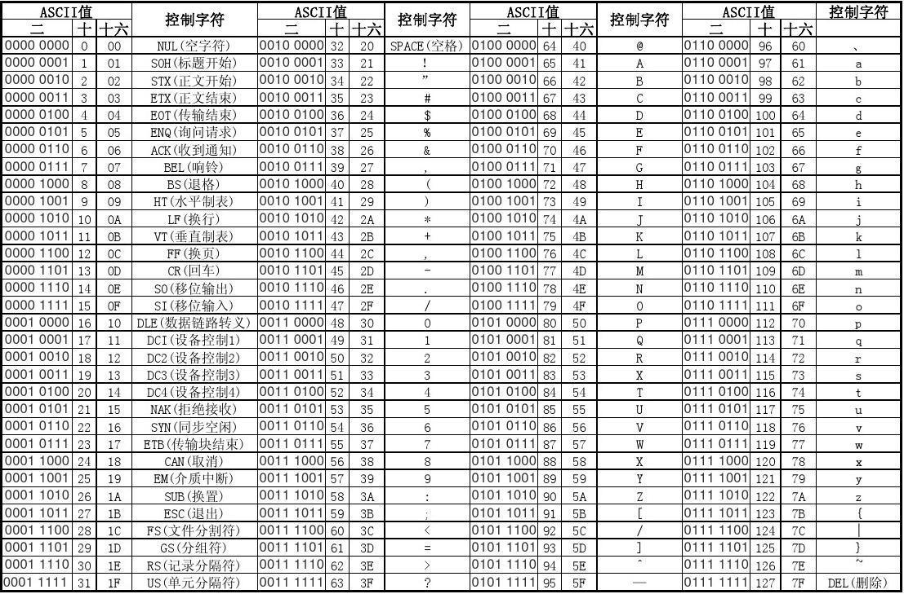

public:: true

- 今天，我们将深入探讨计算机中数据的不同表示方式，包括整数、浮点数和字符。这些概念是计算机世界的基石，让我们一起来揭开它们的神秘面纱。
- 🔵   **数据表示**
	- **整数表示：**
	- 首先，让我们谈谈整数。计算机使用二进制来表示整数，就像我们使用十进制来表示数字一样。举个例子，十进制的9在二进制中表示为1001。这是因为9可以分解为2^3（8）加上2^0（1），所以在二进制中，对应的位被设置为1，其他位为0。
	- 如果你想将一个十进制数转换为二进制，只需反复将它除以2，然后记录下余数（0或1），最后将这些余数倒过来就是二进制表示。例如，将9除以2，得到商4和余数1，再将4除以2，得到商2和余数0，最后将2除以2，得到商1和余数0。将这些余数倒过来，就得到了1001。
	- 要将二进制数转换为十进制，只需将每个二进制位的值乘以2的幂（从右到左依次为0、1、2、3...），然后将这些值相加。例如，二进制的1001对应的十进制值为1x2^3 + 0x2^2 + 0x2^1 + 1x2^0 = 8 + 0 + 0 + 1 = 9。
- 🔵   **浮点数表示：**
	- 接下来，我们来谈谈浮点数，也就是带小数点的数字，比如3.14。计算机使用IEEE 754标准来表示浮点数，这个标准将一个数分成三部分：符号位（表示正负）、指数位（表示小数点的位置）和尾数位（表示小数的值）。
	- 例如，要表示3.14，计算机首先将它转换为二进制，得到11.00100011110101110000...，然后用符号位表示正数，指数位表示小数点的位置，和尾数位表示11.00100011110101110000...。这个过程涉及一些复杂的规则，但计算机会用这种方式精确地存储浮点数。
- 🔵   **字符表示：**
	- 最后，让我们来看看字符是如何在计算机中表示的。字符通常以数字编码的形式存储，最常见的编码是ASCII编码，它将每个字符映射到一个唯一的数字。例如，字母"A"对应的ASCII码是65，字母"a"对应的ASCII码是97。
	- 计算机使用二进制来存储这些数字编码。例如，字符"A"的ASCII码65被表示为二进制的1000001。
	- 当需要在计算机中处理文本时，计算机会将字符的数字编码转换为二进制进行处理，然后再将二进制转换回字符以便显示。
- 🔵  这些概念是计算机编程的基础，希望这篇文章帮助 
           你更好地理解数字和字符在计算机中的神秘变身。 
           如果你有任何问题或需要更多解释，请随时向我提 
           问。🧐
-
- 
- #计算机基础 #数据表示 #ASCII编码 #二进制转换  #计算机原理  #编程入门 #计算机小白入门 #计算机科学 #整数 #浮点数 #字符 #Unicode编码
- ---
-
-