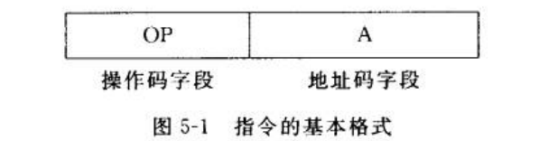
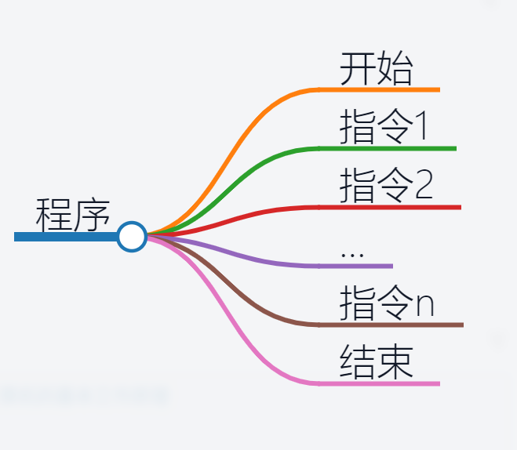

public:: true

- 🔵 **计算机的工作原理：**
	- 计算机的基本工作原理是按照指令序列（程序）执行各种操作。控制器负责指挥其他部件按照程序的要求工作，运算器进行运算，存储器存储数据和程序，而输入设备和输出设备则连接了计算机与外部世界。
- 🔵 **指令：**指能被计算机识别并执行的二进制代码
- 🔵 **指令分类：**
	- ①数据传送指令（内存↔CPU）
	- ②数据处理指令（+ - *  ÷ and or... ）
	- ③程序控制指令（if...）
	- ④输入输出指令（主机↔I/O设备）
	- ⑤其它指令（对计算机的硬件进行管理等）
- 🔵 **指令系统：**指一台计算机的所有指令的集合
- 
- 🔵 **操作码：指令的命令**
- 首先，让我们来了解操作码，它就像一条指令的命令。操作码告诉计算机应该执行什么样的操作。不同的操作码代表不同的操作，如加法、减法、乘法、除法等等。
- 举个例子，假设我们有一条指令：“加上A的值到B中”。在这里，“加上”就是操作码，它告诉计算机要执行加法操作。操作码通常以二进制形式表示，不同的操作有不同的二进制代码。
- 🔵 **地址码：指令的目标位置**
- 现在，让我们来看看地址码，它告诉计算机在哪里执行这个操作。地址码指定了操作的目标位置，可以是内存中的某个位置或寄存器中的某个值。
- 继续上面的例子，如果我们要执行“加上A的值到B中”的指令，地址码将告诉计算机A和B分别存储在哪个内存位置或寄存器中。
- [[程序]]
- 
- **程序：**计算机指令的有序集合，即完成一定功能的指令序列
- **程序的执行过程：**按照程序设定的次序依次执行指令，直到遇到结束指令
- _1696851515426_0.PNG)
- 🔵 希望这篇文章帮助你更好地理解计算机的基本工作原理。无论你是计算机专业的新生还是对计算机感兴趣，这些基本概念都是非常重要的。
- #计算机指令 #计算机原理 #计算机基础 #计算机小课堂 #计算机小白 #工作原理 #计算机硬件 #操作码 #地址码