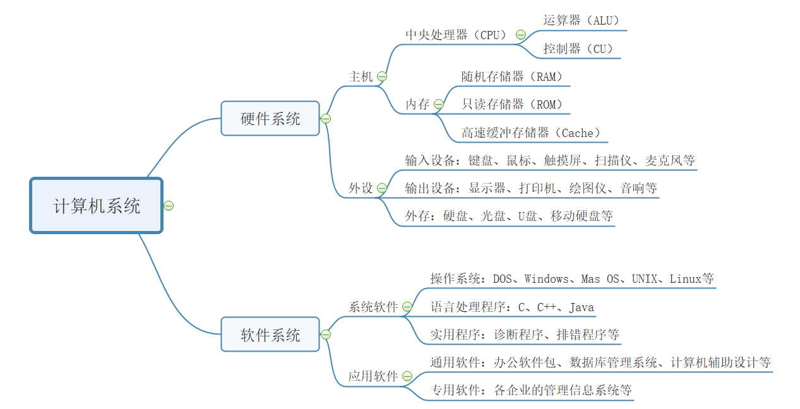
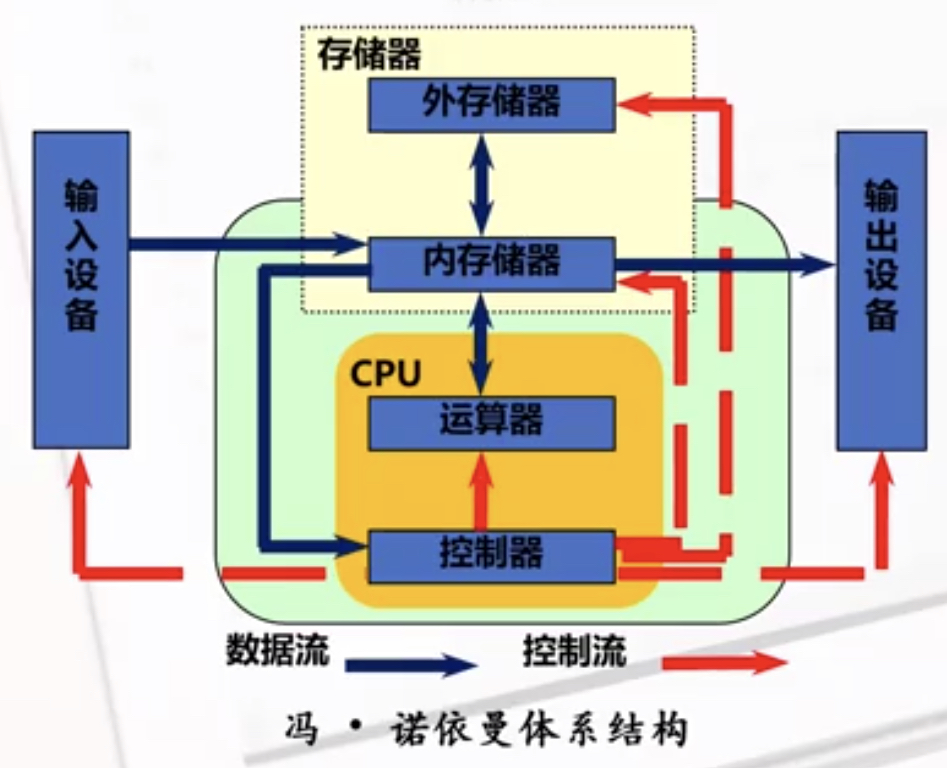

public:: true

- {:height 377, :width 722}
- 🔵 第一台计算机是1946年美国研发的ENIAC,具有现代意义的第一台通用计算机是1951年由冯·诺依曼团队研发并投入使用的EDVAC。
- 
- 🔵 冯·诺依曼体系结构的基本思想：
	- ①计算机由==运算器、控制器、存储器、输入和输出设备==五大部件组成
	- ②程序和数据以==二进制的形式存放==在存储器中
	- ③控制器是计算机的指挥中心，负责协调各个部件的工作，根据存储器中的指令序列（程序）进行操作。它是==计算机的大脑==，确保所有部件按照正确的顺序工作。
	- **五大部件的基本功能：**
	- **控制器：**是计算机的==指挥官==，它负责指挥运算器、存储器、输入设备和输出设备按照程序的要求协调工作。
	- **运算器：**是计算机的==执行者==，它直接执行各种算术和逻辑运算，以完成计算任务。
	- **存储器：**是计算机的记忆部件，用于存储数据和程序。它可以读取和写入二进制信息，是计算机==内部数据交换的场所==。
	- **内存储器：**是==信息的交流中心==，计算机可以直接从内存中读取和存储信息，这是计算机运行时的==临时存储区域==。
	- **外存储器：**用于==长期存储大量信息==，一般==只与内存==进行数据交换。例如，硬盘驱动器就是一种常见的外存储设备。
	- **输入设备：**用于将信息输入计算机，如键盘、鼠标、触摸屏、游戏杆、扫描仪等
	- **输出设备：**将计算机处理后的数据呈现给用户，如显示器、打印机、扬声器等
- 🔵 **主机：**
	- 1. **中央处理单元（CPU）：** 计算机的大脑，执行各种计算和指令。==包括算术逻辑单元（ALU）和控制单元（CU）==。
	- 2. **内存：**包括随机存储器（RAM）、只读存储器(ROM)、高速缓冲存储器。
		- ① **随机存储器（RAM）：**
		- **功能：**RAM是计算机中的主要内存类型之一，用于存储正在运行的程序和临时数据。它是==易失性存储器，在断电后数据会丢失==。RAM的主要功能是提供快速的读写访问，使计算机能够迅速加载和执行应用程序。
		- **种类：** RAM有两种主要类型，分别是静态随机存储器（SRAM）和动态随机存储器（DRAM）。==SRAM速度更快，但成本更高，通常用于高性能应用==，如高端计算机的高速缓存。DRAM则更常见，用于主系统内存。
		- **应用：** RAM用于存储操作系统、应用程序和数据，使计算机可以快速访问和处理信息。
		- ② **只读存储器（ROM）：**
		- **功能：**==ROM是一种非易失性存储器，存储的数据在断电后仍然保持不变==。常用于存储计算机的基本固件和启动程序，如计算机的BIOS（基本输入/输出系统）。
		- **种类：** ROM的一种常见类型是==EPROM（可擦写可编程只读存储器）==，它可以被擦除和重新编程。另一种类型是==EEPROM（电可擦可编程只读存储器）==，它允许逐字节擦除和编程。
		- **应用：** ROM包含了计算机的基本启动指令，确保计算机能够在开机时加载操作系统。它还用于存储固件和系统设置。
		- ③**高速缓冲存储器（Cache Memory）：**
		- **功能：** 高速缓存是位于CPU和主内存之间的临时存储器。它的主要目的是==提供更快速的数据访问，减少CPU等待主内存的时间==。高速缓存存储了最近或最频繁使用的数据，==以便CPU可以快速访问==。
		- **种类：** 高速缓存通常分为多级，包括一级缓存（L1 Cache）和二级缓存（L2 Cache）。L1 Cache位于CPU内部，速度最快但容量较小。L2 Cache位于CPU外部，容量更大但速度略慢。
		- **应用：** 高速缓存存储了常用的指令和数据，加速了计算机的性能，特别是对于频繁访问的应用程序。缓存的工作原理是根据数据的局部性原理，将常用的数据存储在更快的存储层次中。
- 🔵 **外设：**
	- ① **硬盘驱动器（硬盘）：**
	- **功能：** 硬盘驱动器是一种==永久性存储设备==，用于长期存储数据和程序。它具有较大的存储容量和较低的成本，因此广泛用于个人电脑和服务器中。
	- **类型：** 硬盘有两种主要类型，机械硬盘（HDD）和固态硬盘（SSD）。HDD使用旋转磁盘和机械臂读写数据，而SSD使用闪存存储，速度更快且更可靠。
	- **应用：** 硬盘用于存储操作系统、应用程序、文档、照片、音乐和视频等各种数据。
	  ②**光盘：**
	- **功能：** 光盘是一种==可移动存储介质==，可以存储数据、音频和视频文件。它包括了CD（光盘）、DVD（数字视频光盘）和蓝光盘（高清蓝光光盘）等不同类型。
	- **类型：** 光盘分为只读光盘（CD-ROM、DVD-ROM、蓝光光盘）、可写光盘（CD-R、DVD-R）和可擦写光盘（CD-RW、DVD-RW）。只读光盘仅供阅读，而可写和可擦写光盘允许用户录制数据。
	- **应用：** 光盘用于存储音乐、电影、软件安装文件、备份数据等。它们还常用于分发大型媒体内容。
	- ③**U盘（USB闪存驱动器）：**
	- **功能：** U盘是一种==小型便携式存储设备==，具有快速的读写速度和可擦写的闪存存储。它们通常通过USB接口连接到计算机。
	- **容量：** U盘的容量范围从几GB到数TB不等，提供了各种存储选项。
	- **应用：** U盘用于传输和备份文件，以及在不同计算机之间共享数据。它们也是便携式应用程序和操作系统的常见载体。
	- ④**移动硬盘：**
	- **功能：** 移动硬盘是一个==大容量、可移动的存储==解决方案。它结合了硬盘的高存储容量和U盘的便携性。
	- **类型：** 移动硬盘通常包括机械硬盘驱动器（HDD）和固态硬盘驱动器（SSD）两种类型。
	- **应用：** 移动硬盘用于数据备份、文件存储、多媒体内容的传输等任务。它们也常用于创建可移动的工作站和媒体库。
- 🔵 **系统软件：**
  id:: 6523a1c3-4038-4d9e-bec1-31fca8d61750
	- 1.**操作系统：**== 操作系统是计算机的核心软件==，管理硬件资源、文件系统、用户界面等。常见的操作系统有Windows、Linux、macOS等。
	- 2.**语言处理程序：** 编程语言允许开发人员编写应用程序和系统软件，例如Python、Java、C++等。
	- 3.**实用程序：**诊断程序和排错程序
	  id:: 6523a211-0b3b-46a5-954f-4d864be07b13
		- ①诊断程序：是用于检测计算机系统、硬件和软件问题的工具。它们能够识别系统故障、错误消息和异常行为，并提供有关问题的诊断信息。
		- ②排错程序是一类用于解决计算机系统和软件问题的工具，它们通过分析问题的根本原因来提供解决方案。排错程序涉及更深入的问题解决过程，通常需要用户的干预。
- 🔵 **应用软件包括：**
	- 4. **通用软件：** 这是用户使用的程序，如办公套件、游戏、浏览器等。
	- 5. **专用软件：** 包括驱动程序、编程工具、安全软件等，用于维护和管理计算机系统。
- 🔵 **总线：**用来连接外设和接口（外设→总线→接口），根据总线上传输信息不同分为：
	- ①数据总线（传输数据）
	- ②控制总线（传输控制信号）
	- ③地址总线（传输地址）
- 🔵 硬件系统提供了计算和存储的物理能力，而软件系统定义了如何使用这些资源以实现各种功能。计算机系统的这两个关键组成部分共同构建了现代计算机的功能和性能。希望这篇文章帮助你更好地理解计算机的奥秘！
- #计算机系统 #计算机系统组成 #CPU #内存 #存储 #输入设备 #输出设备 #主板 #操作系统 #硬件 #软件 #计算机原理 #计算机基础 #计算机小课堂 #计算机小白入门