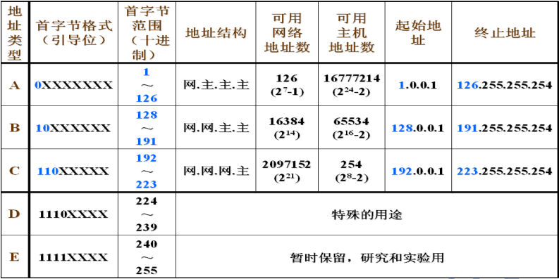

public:: true

- 🔵 **IP 地址**
  1. TCP/IP 网络中，为了实现计算机相互通信，必须为每一台主机分配一个唯一的地址（IP 地址）
  1) 唯一性：一个 IP 地址不会同时分配给多台计算机使用
  2) IP 数据报头部包含有该数据报的发送方和接收方的 IP 地址
  3) 总结： IP 地址是 IP 网络中的计算机地址
  2. 描述格式：
  1) 一组32 位（4 个字节）长的二进制数字——IPV4
  2) ==点分十进制==（常用）
  A. 把== IP 地址分成 4 段，每段 8 位，段与段之间用“.”分隔，==并采用十进制来表示
  B. 每段的取值范围是十进制的== 0～255==
  3. IP 地址的组成：
  1) 地址类型号
  2) 网络号（net-id）：主机所从属的物理网络的编号
  3) 主机号（host-id）：主机在物理网络中的编号
  4. 分类：（详见下页表格）
  1) A 类地址用于拥有大量主机的超大型网络，IP 地址数量最大（0~126）
  2) B 类地址用于主机规模适中的网络(128~191)
  3) C 类地址用于主机规模较小的网络，最多只能连接 254 台主机(192~223)
  5. 合法 IP 地址的分配原则：
  1) ==只有 A、B、C 三类地址可以分配给计算机和网络设备==
  2) 网络地址不能全为 0，也不能全为 255：
  A. 全为 0，没有网络
  B. 全为 255，用作子网掩码
  3) 主机地址不能全为 0，也不能全为 255：
  A. 全为 0，用来表示网络地址
  B. 全为 255，用作广播
  4) 网络地址的第一个数字不能为 127
  A. 127.x.x.x 保留用来测试连接
  5) 不能使用的 IP：
- 0.0.0.0、255.255.255.255、A.0.0.0、A.255.255.255、B.B.0.0、B.B.255.255、C.C.C.0、C.C.C.255
- 
- 6.==IPv6 的长度：128 位==
- 🔵 **子网掩码：** ==子网掩码是一个32位的二进制数字，用于划分IP地址中的网络部分和主机部分==。它帮助确定一个IP地址属于哪个网络。子网掩码通常与IP地址配对使用，例如，255.255.255.0。
- 🔵 **主机号和网络号：** IP地址由网络号和主机号组成，其中网络号标识了网络本身，而主机号标识了该网络中的特定设备。子网掩码帮助我们区分哪些位是网络号，哪些位是主机号。
- 🔵**广播地址：** 广播地址是一个特殊的IP地址，用于向网络中的所有设备发送数据。在IPv4中，广播地址通常是网络号中所有位都为1，而在IPv6中，广播地址则是特定的地址。
- 举个例子，假设我们有一个IP地址为192.168.1.1，子网掩码为255.255.255.0的局域网。在这种情况下，192.168.1部分是网络号，1是主机号。如果要将信息发送到该网络中的所有设备，可以使用192.168.1.255作为广播地址。
-
- 🔵  计算IP地址、子网掩码和主机号的过程涉及一些基本的二进制运算。让我们通过一个示例来详细解释。
  假设有一个IP地址为192.168.1.1，子网掩码为255.255.255.0的局域网。
	- 1. **将IP地址和子网掩码转换为二进制：**
	- IP地址：11000000.10101000.00000001.00000001
	- 子网掩码：11111111.11111111.11111111.00000000
	  
	  2. **确定网络号和主机号：**
	- 在这个例子中，子网掩码中前24位（即前三个八位组）是1，表示网络号部分，而最后8位是0，表示主机号部分。
	  
	  3. **计算网络号：**
	- 将IP地址与子网掩码进行逻辑与运算。
	- ```
	  IP地址： 11000000.10101000.00000001.00000001
	  子网掩码： 11111111.11111111.11111111.00000000
	  按位与运算后： 11000000.10101000.00000001.00000000
	  ```
	- 4. **计算广播地址：**
	- 广播地址是将网络号中主机位全部设置为1。
	- 在这种情况下，广播地址为192.168.1.255。
	  5. **计算可用的主机范围：**
	- 在这个例子中，主机号的范围是从192.168.1.1到192.168.1.254，因为0和255被保留用于网络地址和广播地址。
	- 🔵  再举个例子：IP地址10.10.13.15/24代表该主机所在的网络的网络号为多少？？
	- 在这个题目中，IP地址是10.10.13.15，而“/24”代表了子网掩码的位数。这意味着前24位是网络号，后8位是主机号。要确定该IP地址所在的网络号，我们需要将IP地址转换为二进制，并根据子网掩码位数来确定网络号。
	- 首先，将IP地址转换为二进制形式：
	  10.10.13.15 转换为二进制为 00001010.00001010.00001101.00001111。
	- 接下来，根据子网掩码位数24确定网络号：
	  24位表示前三个八位均为网络号，最后一个八位为主机号。因此，10.10.13.15的网络号为 00001010.00001010.00001101。
	- 将二进制形式转换回十进制形式，我们得到网络号为 10.10.13.0。
- 🔵  了解如何计算IP地址、子网掩码以及网络号和主机号的过程对于网络管理和配置非常重要。希望这个例子能够帮助你更好地理解如何进行这些计算。
- #计算机网络 #IP地址 #子网掩码 #网络号 #主机号#计算机原理 #计算机基础 #计算机小课堂 #计算机小白
-