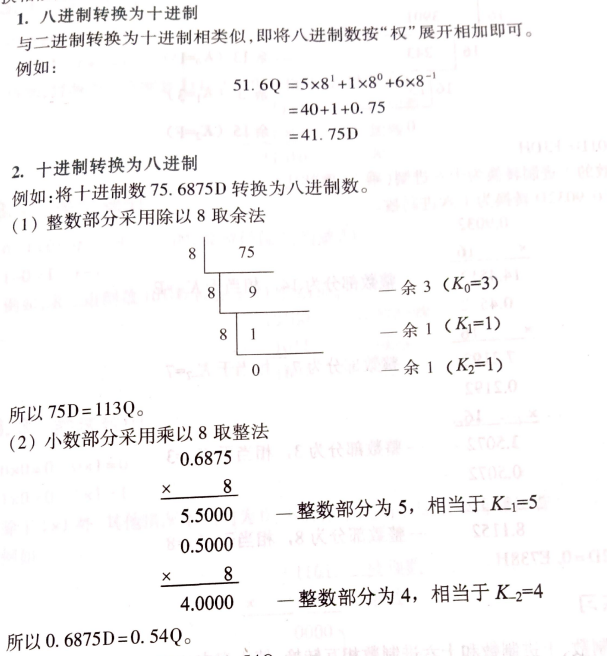

- 🔵 计算机是电子计算机的简称，又称电脑。是一种能够按照指令对各种数据和信息进行自动加工与处理的电子设备。
- 🔵 计算机的特点：运算速度快、计算精度高、能记忆、会判断、高度自动化
- 🔵 计算机的发展：
	- 第一代（1946-1958）电子管计算机，使用机器语言编程，用于军事和科学研究
	- 第二代（1959-1964）晶体管计算机，出现了管理程序和高级编程语言
	- 第三代（1965-1970）集成电路计算机，出现了操作系统和诊断程序、高级语言更加流行
	- 第四代（1971年至今）超大规模集成电路计算机，计算机技术与通信技术相结合，使计算机技术进入了网络时代，多媒体技术的兴起扩大了计算机的应用领域。
- 🔵 计算机的应用领域：科学计算、信息处理、过程控制、计算机辅助设计（CAD）/辅助教学（CAI）、人工智能。
	- 计算机辅助制造（CAM）
- 🔵 计算机的分类：
	- ①按功能和用途分为：通用计算机和专用计算机
	- ②按工作原理分为：数字计算机、模拟计算机和混合计算机
	- ③按性能和规模分为：巨型计算机、大型计算机、中型计算机、小型计算机、微型计算机和单片机六大类。
	- 最常见的是通用数字微型计算机。
- 🔵 计算机的发展趋势：
	- 巨型化、微型化、网络化、智能化、多媒体化
- 🔵 计算机的组成：
	- 一台完整的计算机应包含硬件和软件两部分。
	- 计算机系统包括硬件系统和软件系统。
	- 计算机的硬件是指计算机中的电子线路和物理装置，计算机的硬件系统是计算机的物质基础。
	- 计算机软件是指能在硬件设备上运行的各种程序、数据和有关的技术资料，如操作系统、数据管理系统等。
- 🔵 计算机的硬件系统至少包含5个部分：运算器、控制器、存储器、输入设备和输出设备。
	- 运算器和控制器构成计算机的中央处理器CPU；
	- 中央处理器与内存储器构成计算机的主机；
	- 其他外存储器、输入输出设备统称为外围设备
	- {:height 402, :width 567}
- 🔵 运算器：
	- 又称算术逻辑部件（ALU），用来进行加减乘除等算术运算和“与”、“或”、“非”等逻辑运算。
- 🔵 控制器（CU）：
	- 是计算机的指挥中心，计算机的各部件在它的指挥下协调工作。控制器通过执行程序使计算机完成规定的处理任务。
- 🔵 存储器（Memory）：
	- 是计算机的记忆部件，用来存放数据、程序和计算结果。存储器分为：内存储器和外存储器。
	- 内存储器简称内存，又称主存。内存容量小、速度快，它是计算机运算过程中主要使用的存储器，是计算机主机的一个部分。
	- 内存包括：只读存储器（ROM）和随机存储器（RAM）。ROM中存放计算机运行所必需的程序，关机后不会丢失。RAM提供系统程序和用户程序的运行空间，关机后内容丢失。
	- 外存储器简称外存，也称辅助存储器。外存容量大、价格低、存取速度慢，用于存放暂时不用的程序和数据，作为主存储器的后援存储器。常用的有硬盘和光盘等。
- 🔵 输入设备：
	- 用于向计算机输入程序和数据，将数据从人类习惯的形式转换成计算机内部的二进制代码存放在内存中。常见的输入设备有：键盘、鼠标、扫描仪等。
- 🔵 输出设备：
	- 将计算机处理器结果从内存中输出，将计算机内的二进制代码形式的数据转换成人类习惯的文字、图形和声音等形式。常见的输出设备有：显示器、打印机、绘图仪等。
- 🔵 计算机工作过程的简单描述：原始数据和处理程序通过输入设备输入计算机并存放于存储器中，控制器执行程序指挥运算器从内存中取出数据，进行处理后将结果放入存储器中，然后通过输出设备把存储器中的结果输出。
	- 
- 🔵 计算机软件系统：
	- 计算机软件系统由系统软件和应用软件组成。
	- 
-
- 🔵 软件：是指计算机运行所需的指令及相关文档的集合。
- 🔵 软件系统：是指各种软件的集合。
- 🔵 系统软件：是指构成操作系统的程序及相关程序的集合。
	- 系统软件运行在计算机基本硬件之上，通过对计算机各种资源的控制和管理，为用户提供各种可能的计算机应用手段和应用方式。
- 🔵 应用软件：是指为解决计算机用户的特定问题而编制的软件。
	- 应用软件运行在系统软件之上，运用系统软件提供的手段和方法，完成用户实际要做的工作，例如文字处理、绘图等。
- {:height 186, :width 238}
- 🔵 裸机：指未安装软件的计算机。
- 🔵 计算机的基本功能是对数据进行运算和加工处理。
	- 计算机中的数据有两类：数值型数据和非数值型数据。无论是数值型数据还是非数值型数据，在计算机内部都是用二进制代码表示的。
- 🔵 数制：指计数的方法。在计算机中常用的数制有十进制、二进制、八进制和十六进制。
- 为区分不同进制的数，十进制用D表示，或无后缀；十六进制用H表示；二进制用B表示；八进制用Q表示，因为O与0容易混淆，所以用Q表示。
- 🔵 十进制：
	- 0-9，逢十进一,后缀用D表示，或无后缀。
	- 例如,78.42 这个数，小数点左边的第一位是个位,表示它本身的数值是8:左边的第二位是十位,表示 7x10^1;而小数点右边的第一位4,表示4x10^-1;小数点右边的第二位是2,表示 2x10^-2。因此这个数可以写成:78.42=7x10^1+8x10^0+4x10^-1+2x10^-2
	- 
- 🔵 注意：==不是所有的十进制小数都可以转换为有限位的二进制==。
- 🔵 二进制：
	- 只有0和1两个不同的数码，逢2进1。可通过按权相加法，转换为十进制数。
	- 例如：
		- 1111.11B = 1 x 2^3+1 x 2^2+1 x 2^1+1 x 2^0+1 x 2^-1+1 x 2^-2
		- =8+4+2+1+0.5+0.25
		- =15.75D
- 🔵 八进制：
	- 0-7，逢八进一。
	- 例如：二进制010 100 101.010 111 010
		- 八进制  2       4      5  .  2       7       2
		- 010100101.010111010B=245.272Q
		- 八进制   3     6      7   .  5      0      5
		- 二进制011 110 111.101 000 101
		- 367.505Q=011110111.101000101B
- 🔵 十六进制：
	- 0-9，A-F，逢十六进一。
- 🔵 二进制特点：
	- 抗干扰能力强、运算规则简单、可以节省设备、利用机器结构的简化
- 🔵 **1. ==十进制到其他进制的转换==：**
	- **十进制到二进制：** 使用除2取余的方法。将十进制数不断除以2，直到余数为0。记录下每次的余数，然后从下往上读取余数来得到二进制数。
	  例如，将十进制数43转换为二进制：
	  ```
	  43 ÷ 2 = 21 余 1
	  21 ÷ 2 = 10 余 1
	  10 ÷ 2 = 5  余 0
	  5 ÷ 2 = 2   余 1
	  2 ÷ 2 = 1   余 0
	  1 ÷ 2 = 0   余 1        👆
	  ```
	  
	  然后从下往上读取余数，得到的二进制数是101011
	- 所以（43）D=（101011）B。
	- **十进制到八进制：**整数部分，使用除8取余的方法，类似于十进制到二进制的转换。小数部分，乘8取整。
		- 
	- **十进制到十六进制：** 使用除16取余的方法，同时将余数转换为对应的十六进制字符（0-9和A-F）。
		- 
- 🔵 **2. ==二进制、八进制、十六进制到十进制的转换==：**
	- **二进制到十进制：** 将二进制数从右往左，每位上的数字乘以2的相应次幂，然后将结果相加。例如，二进制数1010转换为十进制：
	  
	  ```
	  1 * 2^3 + 0 * 2^2 + 1 * 2^1 + 0 * 2^0 = 8 + 0 + 2 + 0 = 10
	  ```
	- 即：（1010）B=（10）D
	- **八进制到十进制：** 类似地，将八进制数从右往左，每位上的数字乘以8的相应次幂，然后将结果相加。例如，将八进制数753转换为十进制：
	- ```
	  7 * 8^2 + 5 * 8^1 + 3 * 8^0 = 448 + 40 + 3 = 491
	  ```
	- 即：（753）O=（491）
	- **十六进制到十进制：** 同样，将十六进制数从右往左，每位上的数字或字母对应的十进制值乘以16的相应次幂，然后将结果相加。
- 🔵 **3. ==二进制、八进制、十六进制之间的转换==：**
	- **二进制到八进制或十六进制：** 将二进制数从右到左按照每3位或4位一组分割，不够的前面补0，然后将每组二进制数转换成对应的八进制或十六进制字符。每个二进制数组的转换可以使用一个对照表来完成（对照表放在文章最后了）。
	- 例如，二进制数101101110101可以分为101 101 110 101或1011 0111 0101然后转换为八进制和十六进制：
	  ```
	  101 = 5 ，110=6(八进制)，即：（101101110101）B=（5565）O
	  1011 = B ，0111=7，0101=5(十六进制)，即 （101101110101）B=（B75）H
	  ```
	- **八进制或十六进制到二进制：** 将八进制或十六进制字符转换成对应的二进制数，然后将它们连接在一起。
	  例如，八进制数53转换为二进制：5 = 101，3 = 011，所以53的二进制表示是101011。
	- 例如，十六进制数3A7转换为二进制：3=0011，A=1010，7=0111，所以3A7的二进制表示是001110100111。
- 🔵 **==进制对照表==：**
	- | 二进制（Binary） | 十进制（Decimal） | 八进制（Octal） | 十六进制（Hexadecimal） |
	  |------------------|--------------------|-----------------|--------------------------|
	  | 0000             | 0                  | 0               | 0                        |
	  | 0001             | 1                  | 1               | 1                        |
	  | 0010             | 2                  | 2               | 2                        |
	  | 0011             | 3                  | 3               | 3                        |
	  | 0100             | 4                  | 4               | 4                        |
	  | 0101             | 5                  | 5               | 5                        |
	  | 0110             | 6                  | 6               | 6                        |
	  | 0111             | 7                  | 7               | 7                        |
	  | 1000             | 8                  | 10              | 8                        |
	  | 1001             | 9                  | 11              | 9                        |
	  | 1010             | 10                 | 12              | A                        |
	  | 1011             | 11                 | 13              | B                        |
	  | 1100             | 12                 | 14              | C                        |
	  | 1101             | 13                 | 15              | D                        |
	  | 1110             | 14                 | 16              | E                        |
	  | 1111             | 15                 | 17              | F                        |
- 
- 
- 🔵 在计算机中常采用两种方法表示数值：定点表示法和浮点表示法。
- 🔵 定点表示法：
	- 将小数点的位置固定不变，约定在数值的某个位置上。
- 🔵 浮点表示法：
	- 在浮点表示法中，小数点的位置不是固定的，而是浮动的。一般来说，任何一个二进制数N可以表示成：
	- N = 2^p x S
	- S为数N的尾数，表示N的有效数值。P为数N的阶码，表示小数点的位置。0正1负。
- 🔵 浮点运算过程为了不丢失有效数字，提高运算的精度，通常==采用二进制浮点规格化数==，即尾数的最高位是有效数字1而不是0，所以==尾数应满足1/2 ≤ 1==。
- 🔵 计算机中使用IEEE 754标准表示浮点数
- 🔵 浮点数分为阶码和尾数两部分，在数的表示中都有各自的符号位。
	- 
- 🔵 定点表示和浮点表示的比较：
	- ①用相同的字长表示二进制数，浮点数表示的范围比定点数表示的范围大。
	- ②浮点数的运算规则比定点数的运算规则复杂。
		- 对阶  低阶向高阶对齐
- 🔵 机器数：把符号数字化了的数称为机器数。
- 🔵 真值：把原来带有正负号的数称为真值。
- 🔵 机器数的三种表示方法：原码、反码、补码。是计算机中用于表示有符号整数的编码方式。
- 🔵 原码：
	- 原码是最直接的表示方法，简单来说，它就是用最高位表示符号位，0表示正数，1表示负数，其余位表示数值的大小。
		- 例如，假设一个8位的二进制数，最高位表示符号位，剩下7位表示数值，其中：
		- +3 的原码是 `0000 0011`，最高位为符号位，0代表正数。
		- -3 的原码是 `1000 0011`，最高位为符号位，1代表负数。
	- 🔵 原码小结：
		- ①原码符号位后的代码为真值的绝对值。
		- ②+0的原码为00000000，-0的原码为10000000
		- ③正数的原码等于它本身，即[X]原 = X。
- 🔵 反码：
	- 反码是在原码的基础上，正数的反码与原码相同，而负数的反码是将其原码中除符号位外的所有位取反（0变1，1变0）得到的。
		- 以8位表示为例：
		- +3 的原码和反码是相同的，都是 `0000 0011`。
		- -3 的原码是 `1000 0011`，它的反码是 `1111 1100`。
- 🔵 补码：
	- 补码是计算机中表示负数的最常用方法，它解决了反码运算中的加法问题。补码的生成方式是将反码加1。
		- 同样以8位表示为例：
		- +3 的补码和原码、反码都是相同的，都是 `0000 0011`。
		- -3 的原码是 `1000 0011`，反码是 `1111 1100`，补码是 `1111 1101`（反码加1）。
	- 在补码表示法中，负数的表示更为简洁，而且加减法运算可以统一处理，减法运算可以转换为加法运算。
	- 🔵 ==当n=8时，补码的表示范围为-128~ +127；反码的表示范围为+127 ~ -127==。
- 🔵原码、反码、补码小结：
	- ①==正数的原码、反码、补码相同==。
	- ②==反码对于负数，符号位不变，其余位按位取反，0变1，1变0==。
	- ③负数的补码的补码是其原码，原码的数值部分再加负号，是负数补码的真值。
- 🔵 常用的编码：
	- ①二-十进制码（BCD码）
		- 特点是保留了十进制数的权，而数字则用二进制数码0和1的组合表示。
		- 常见的BCD码：（8421码），用4位二进制数表示1位十进制数。在十进制运算时常用8421 BCD码表示十进制数。
		- 
	- ②ASCII码：
		- ASCII码是美国国家标准学会（ANSI）制定的7位字符编码（==7位表示，8位存储==），是目前常用的编码，其中7位是ASCII码本身，最高位可用来设校验码。
		- 
- 🔵 逻辑数据：可用一位二进制数表示。
- 🔵 汉字编码：
	- 为了能直接使用西文标准键盘把汉字输入到计算机中，就必须为汉字设计相应的输入编码。当前采用的方法有3类：
	- 1.汉字输入编码
		- ①汉字编码
			- 直接利用一串数字表示一个汉字，国标码、区位码、机内码属于这一类。优点是无重码，只需数字键盘即可输入，缺点是代码难记。
		- ②拼音码
			- 重码率高，速度慢
		- ③字形编码
			- 是用汉字的形状来进行编码，五笔字型编码是最有影响的一种字形编码。
	- 2.汉字内码
		- 是用于汉字信息的存储、交换、检索等操作的信息代码。一般采用两个字节表示一个汉字。==为了与英文字母能相互区别，汉字内码中两个字节的最高位均规定为“1”==。汉字内码大多采用两字节长的代码。
	- 3.汉字字模码
		- 用点阵表示的汉字字形代码，是汉字的输出形式。
		- 汉字点阵字模有16x16点、24x24点、32x32点、48x48点几种，点数越多，输出的汉字越美观。
- 🔵 **定点加/减法运算**
- 🔵 在计算机中，凡是带符号的数一律用补码表示，其运算结果也是用补码表示的
- 第三章未整理
-
- 🔵 计算机通过执行程序来完成各种工作任务，而程序是由一系列有序的指令构成的。
- 🔵 指令系统是程序员编制程序的基础，也反映了一台计算机所具有的数据处理能力。
- 🔵 指令：
	- 是计算机能够识别和执行的操作命令，是计算机微操作的组合。
	- 每一条指令都明确地规定了计算机必须完成的一套操作。将各种指令排成一个序列，由计算机顺序地执行，就可以完成一个复杂的处理任务。
- 🔵 微操作：在指令执行过程中，要求每个部件所完成的基本操作称为微操作。
- 🔵 计算机程序：能够完成一定处理任务的指令序列。
- 🔵 指令系统：一台计算机或一个计算机系统能够执行的各种指令的集合。
	- 一台机器的指令系统越丰富，处理功能越强。
- 🔵 一个完善的指令系统应满足以下要求：
	- ①完备性 ②有效性 ③规整性 ④兼容性
- 🔵 指令系统分为：CISC（复杂指令集计算机）和RISC（精简指令集计算机）
- 🔵 指令是用来表示控制信息的一组二进制代码。一条完整的指令称为一个指令字。
- 🔵 指令格式包括：==操作码和地址码==
	- 操作码：表示操作的性质及功能，操作码域所占的0，1码位数取决于指令系统中的指令条数。
	- 地址码：表示指令的操作对象，指出操作数的地址，CPU通过该地址取得操作数。
- 🔵 指令长度 = 操作码长度 + 地址码长度（操作码地址个数）
- 🔵 ==指令长度不是任意的，通常为字节的整数倍==。
- 🔵 指令中包含的地址码字段包括：
	- ①源操作数的地址，用于指明源操作数的存放处，最多可有两个源操作数地址。
	- ②操作结果数的地址，用于存放运算的结果。
- 🔵 **程序计数器（PC）**：专门存放当前要执行的指令地址，每取出一条指令后，PC的值自动递增取出下一条指令地址。
- 🔵 指令格式按地址码部分的地址个数可分为：
	- 1.三地址指令格式
	- OP   A1   A2   A3
	- 
	- OP表示操作码，A1 ，  A2 ，  A3分别表示操作数1的地址、操作数2的地址以及结果存放地址，A1 ，  A2 ，  A3可以是存储单元地址或寄存器地址。
	- 指令意义：（A1）OP（A2）→（A3）
	- 三地址指令格式常用在32位机中
	- 2.二地址指令格式
	- OP   A1   A2
	- 
	- 指令意义：（A1）OP（A2）→（A1）
	- A1是目的操作数地址，A2是源操作数地址
	- 二地址指令格式常用在16位机中
	- 3.一地址指令格式
	- OP   A
	- 
	- 指令意义：（AC）OP（A）→（AC）
	- 一个操作数（源操作数）由地址码A给出，另一个操作数（目的操作数）隐含在累加器AC中，操作结果替代累加器AC中原来的内容。
	- 一地址指令格式常用在8位机中
	- 4.零地址指令格式
	- OP
	- 
	- 指令中只有操作码，没有地址码，这种指令有两种可能：
		- ①不需要操作数的控制类指令，如空操作指令、停机指令等
		- ②隐含操作数的指令
			- 例如，堆栈结构计算机的运算指令所需的操作数是隐含在堆栈中的，由堆栈指针SP指出，操作结果仍然放回到堆栈中。
- 🔵 操作码格式：
	- 当指令字长确定后，如果地址码部分所占位数较多，则操作码所占位数就会减少。为了解决这个矛盾，可以采取操作码位数可变的方法。
	- 常见的操作码编码方式有两种：定长操作码和扩展操作码。
	- 定长操作码：
		- 是一种比较规整的操作码编码方式，即让操作码的长度固定且集中放在指令字的一个字段中。
		- 若操作码固定为K位，则它所能表达的操作最多为2^K个。
	- 扩展操作码：
		- 是一种不规整的操作码编码方式，即操作码的长度可变且分散地放在不同的字段中。
		- 操作码扩展是一种优化技术。
- 🔵 寻址方式分为：指令的寻址方式和操作数的寻址方式。
	- 在指令的执行过程中，操作数可能在指令中，也可能在CPU的某个通用寄存器中，还可能在某个存储单元中。
	- 指令的寻址方式：指的是确定本条指令的地址及下一条要执行的指令地址的方法。
		- 1.顺序寻址方式
			- 由于指令地址在内存中按顺序安排，当执行一段程序时，通常是一条指令接一条指令地顺序执行。
		- 2.跳跃寻址方式：
			- 指下一条指令的地址码不是由程序计数器给出的，而是由本条指令给出的。
- 🔵 操作数的寻址方式：
	- 1.立即寻址
		- 指操作数直接在指令中给出的寻址方式，包含在指令中的操作数称为立即数。
	- 2.直接寻址
		- 把操作数的地址直接作为指令中的地址码。根据指令的地址码部分给出的地址就可以直接在存储器中找到所需的操作数。
	- 这种寻址方式简单、直观，硬件实现容易，但是只能用来访问固定的存储单元。
	- 3.寄存器寻址方式
		- 指令的地址码部分给出某个通用寄存器的地址，而且所需的操作数就在这个寄存器中。
	- 可以缩短指令的长度，节省存储空间，提高指令的执行速度。
	- 4.间接寻址方式
		- 当地址码不是操作数的地址，而是另一个地址的地址时，该寻址方式称为间接寻址方式。
		- 分为：
		- ①寄存器间接寻址方式
		- ②存储器间接寻址方式
		- 两者的用途相同。寄存器间接寻址方式可以使用的指针数（寄存器数）有限，但执行速度较快。存储器间接寻址方式可以使用的指针数（间址单元数）多得多，在实际应用中几乎没有限制，但需要两次访问内存，执行速度慢。
	- 5.变址寻址方式
		- 将指令中给出变址寄存器的内容与指令地址码部分给出的地址偏移量之和作为操作数的地址来获得所需的操作数。
	- 变址寻址方式主要用于为数组等数据结构提供支持。
	- 6.基址寻址方式
		- 基址寄存器提供的是基准值，指令中提供的是偏移量。
	- 7.基址加变址寻址方式
	- 8.相对寻址方式
		- 程序计数器（PC）的当前内容与指令的地址码部分给出的地址（偏移量）之和作为操作数的地址或程序转移地址。
	- 这种寻址方式的特点是操作数的地址不是固定的，而是随着PC值的变化而变化，且总是相差一个固定的值，这个值就是偏移量。
	- 相对寻址方式对实现程序控制转移特别有利。
- 🔵 数据传送类指令
	- 数据传送指令用于寄存器、存储单元或输入/输出端口之间的数据或地址传送。数据传送时，把源地址的数据传送到目的地址，而源地址中的数据保持不变。
	- 数据传送指令包括读操作（取数）和写操作（存数）。
	- 1.传送类指令
		- 包括传送指令（MOV）、数据交换指令、入栈指令（PUSH）、出栈指令（POP）等
	- ①传送指令  ②数据交换指令   ③入栈/出栈指令
	- 2.输入/输出（I/O）类指令
	- ①设置专用的I/O指令   ②用通用的数据传送类指令实现I/O操作   ③通过I/O处理机执行I/O操作
- 🔵 数据处理类指令
	- 1.算术运算指令（加、减、求补、加1、减1、比较）
	- 2.逻辑运算指令（逻辑加、逻辑乘、异或）
	- 3.移位指令（算术移位、逻辑移位、循环移位）
	- 4.串操作指令（串传送指令、串比较指令、串查找指令）
- 🔵 程序控制类指令
	- 1.转移指令
		- ①无条件转移指令
		- ②条件转移指令
	- 2.循环控制指令
	- 3.子程序调用和返回指令
	- 4.程序自中断指令
- 🔵 汇编语言
	- 是一种面向机器的程序设计语言，以助记符形式表示，属于低级程序设计语言。
	- 汇编程序：是一种系统程序，实现将源程序翻译成目标程序。
- 🔵 机器语言
	- 是一种能被机器识别和执行的语言，用二进制数“0”和“1”表示。它存放在计算机存储器内，直接指挥机器的运行。
- 
- 🔵 CPU管理外设的方式
	- 1.程序查询方式
	- 2.程序中断方式
	- 3.DMA方式
	- 4.通道方式
	- 5.外围机处理（PPU）方式
- 
- 程序查询方式和程序中断方式适用于数据传输率较低的外设，DMA方式、通道方式和PPU方式适合于数据传输率较高的外设。
- 🔵 中断的处理过程：
	- 1.中断请求
		- 由中断源提出中断请求。中断源向CPU发出中断请求的条件：
		- ①外设本身工作完毕
		- ② 系统允许外设发出中断请求
	- 2.中断响应
		- 是指完成由现行程序状态切换到中断服务程序状态的转换过程。
		- 中断响应的条件：
		- ①中断源有中断请求
		- ②CPU处于开中断状态，而且没有更高优先级的中断请求存在
		- ③一条指令执行完毕
		- 中断响应过程的主要内容包括：
		- ①中断现行程序
		- ②保护现场
		- ③中断服务程序入口地址送入程序计数器PC
	- 3.中断处理
		- 是指CPU执行中断服务程序。
	- 4.中断返回
		- 由事先放在中断服务程序末尾的一条中断返回指令实现。
- 🔵 多重中断
	- 又称中断嵌套，指在处理某一中断过程中又有比该中断优先级高的中断请求，于是中断原中断服务程序的执行，而去执行新的中断处理。
- 特点：
	- ①有相当数量的中断源
	- ②每个中断被分配给一个优先级
	- ③优先级高者可打断优先级低的中断服务程序
- 🔵 DMA方式的基本概念
	- 1.定义：
		- DMA（直接存储器存取）方式是指在内存与设备之间开辟一条直接数据传送通路，并把传送过程交给DMA控制器进行管理，形成以存储器为中心的体系结构。
		- DMA可以看做是和CPU共享存储器的处理器
		- DMA方式是在内存与I/O设备之间有直接的数据传送通路，不必经过CPU，称为数据直传，即输入设备的数据可经系统总线中的数据总线直接输入内存，而内存中的数据可经数据总线直接输出给输出设备，因此称为直接存储器存取。
	- 2.特点：
		- 以响应随机请求的方式，实现内存与I/O设备间的快速数据传送。
	- 3.DMA方式的基本操作：
		- ①从外设发出DMA请求
		- ②CPU响应请求，把CPU工作改为DMA操作方式。DMA控制器从CPU接管总线的控制。
		- ③由DMA控制器对内存寻址，即决定数据传送的内存单元地址及数据传送的长度，并执行数据传送操作控制。
		- ④向CPU报告DMA操作的结束
- 🔵 DMA控制器的基本组成
	- 一个最简单的DMA控制器由以下逻辑部件组成：
		- ①内存地址计数器
		- ②字计数器
		- ③数据缓冲寄存器
		- ④“DMA请求”标志
		- ⑤“控制/状态”逻辑
		- ⑥中断机构
- 🔵 DMA数据传送过程：
	- ①预处理
	- ②正式传送
	- ③后处理
- 🔵 通道方式的基本概念
	- 1.定义：
		- 通道是一种通过执行通道程序管理I/O操作的控制器，它使主机与I/O操作之间达到更高的并行度。由于它的任务是管理实现输入/输出操作，提供一种传送通道，所以将这种部件称为通道。
	- 2.特点
		- ①通道方式是一种在DMA方式的基础上发展形成的、功能更强的I/O管理方式，覆盖了DMA方式的功能。
		- ②采用两类总线的系统结构，一类是连接CPU、通道和主存的所谓存储总线，一类是连接通道与设备的I/O总线。
		- ③整个系统分为两级管理：第一级是CPU对通道的管理，第二级是通道对设备控制的管理。
- 🔵 通道的类型：
	- ①选择通道
		- 可以连接多台快速I/O设备，但每次只能从中选择一台设备执行通道程序。
	- ②字节多路通道
		- 可以连接与管理多台慢速设备，以字节交叉方式传送数据。
	- ③数组多路通道
		- 可以连接多台快速设备，允许并行工作，但通道以成组交叉方式传送数据。