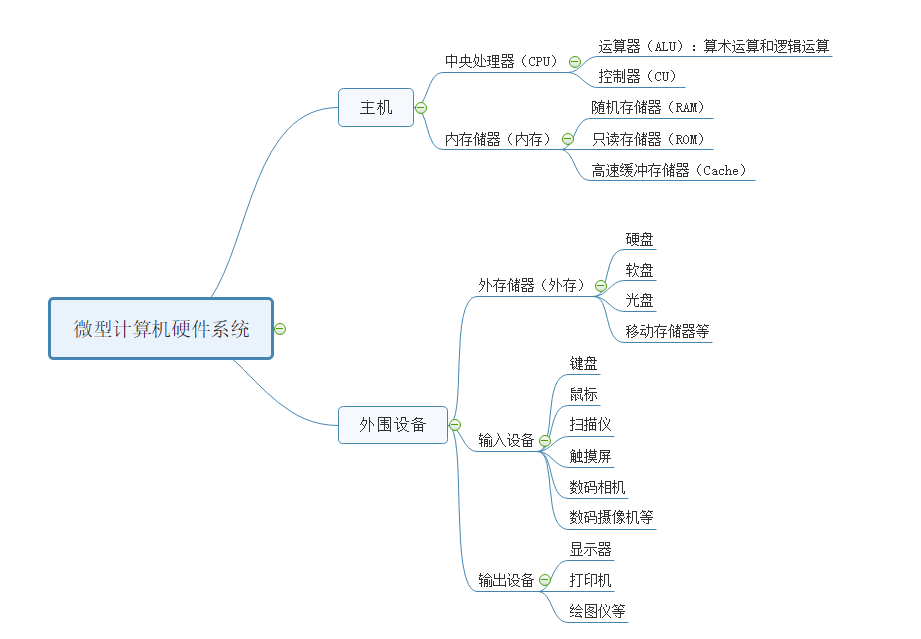

- 🔵 计算机是电子计算机的简称，又称电脑。是一种能够按照指令对各种数据和信息进行自动加工与处理的电子设备。
- 🔵 计算机的特点：运算速度快、计算精度高、能记忆、会判断、高度自动化
- 🔵 计算机的发展：
	- 第一代（1946-1958）电子管计算机，使用机器语言编程，用于军事和科学研究
	- 第二代（1959-1964）晶体管计算机，出现了管理程序和高级编程语言
	- 第三代（1965-1970）集成电路计算机，出现了操作系统和诊断程序、高级语言更加流行
	- 第四代（1971年至今）超大规模集成电路计算机，计算机技术与通信技术相结合，使计算机技术进入了网络时代，多媒体技术的兴起扩大了计算机的应用领域。
- 🔵 计算机的应用领域：科学计算、信息处理、过程控制、计算机辅助设计（CAD）/辅助教学（CAI）、人工智能。
- 计算机辅助制造（CAM）
- 🔵 计算机的分类：
	- ①按功能和用途分为：通用计算机和专用计算机
	- ②按工作原理分为：数字计算机、模拟计算机和混合计算机
	- ③按性能和规模分为：巨型计算机、大型计算机、中型计算机、小型计算机、微型计算机和单片机六大类。
	- 最常见的是通用数字微型计算机。
- 🔵 计算机的发展趋势：
	- 巨型化、微型化、网络化、智能化、多媒体化
- 🔵 计算机的组成：
	- 一台完整的计算机应包含硬件和软件两部分。
	- 计算机系统包括硬件系统和软件系统。
	- 计算机的硬件是指计算机中的电子线路和物理装置，计算机的硬件系统是计算机的物质基础。
	- 计算机软件是指能在硬件设备上运行的各种程序、数据和有关的技术资料，如操作系统、数据管理系统等。
- 🔵 计算机的硬件系统至少包含5个部分：运算器、控制器、存储器、输入设备和输出设备。
	- 运算器和控制器构成计算机的中央处理器CPU；
	- 中央处理器与内存储器构成计算机的主机；
	- 其他外存储器、输入输出设备统称为外围设备
	- 
- 🔵 运算器：
	- 又称算术逻辑部件（ALU），用来进行加减乘除等算术运算和“与”、“或”、“非”等逻辑运算。
- 🔵 控制器（CU）：
	- 是计算机的指挥中心，计算机的各部件在它的指挥下协调工作。控制器通过执行程序使计算机完成规定的处理任务。
- 🔵 存储器（Memory）：
	- 是计算机的记忆部件，用来存放数据、程序和计算结果。存储器分为：内存储器和外存储器。
	- 内存储器简称内存，又称主存。内存容量小、速度快，它是计算机运算过程中主要使用的存储器，是计算机主机的一个部分。
	- 内存包括：只读存储器（ROM）和随机存储器（RAM）。ROM中存放计算机运行所必需的程序，关机后不会丢失。RAM提供系统程序和用户程序的运行空间，关机后内容丢失。
	- 外存储器简称外存，也称辅助存储器。外存容量大、价格低、存取速度慢，用于存放暂时不用的程序和数据，作为主存储器的后援存储器。常用的有硬盘和光盘等。
- 🔵 输入设备：
	- 用于向计算机输入程序和数据，将数据从人类习惯的形式转换成计算机内部的二进制代码存放在内存中。常见的输入设备有：键盘、鼠标、扫描仪等。
- 🔵 输出设备：
	- 将计算机处理器结果从内存中输出，将计算机内的二进制代码形式的数据转换成人类习惯的文字、图形和声音等形式。常见的输出设备有：显示器、打印机、绘图仪等。
- 🔵 计算机工作过程的简单描述：原始数据和处理程序通过输入设备输入计算机并存放于存储器中，控制器执行程序指挥运算器从内存中取出数据，进行处理后将结果放入存储器中，然后通过输出设备把存储器中的结果输出。
	- 
- 🔵 计算机软件系统：
	- 计算机软件系统由系统软件和应用软件组成。
	- 
-
- 🔵 软件：是指计算机运行所需的指令及相关文档的集合。
- 🔵 软件系统：是指各种软件的集合。
- 🔵 系统软件：是指构成操作系统的程序及相关程序的集合。
	- 系统软件运行在计算机基本硬件之上，通过对计算机各种资源的控制和管理，为用户提供各种可能的计算机应用手段和应用方式。
- 🔵 应用软件：是指为解决计算机用户的特定问题而编制的软件。
	- 应用软件运行在系统软件之上，运用系统软件提供的手段和方法，完成用户实际要做的工作，例如文字处理、绘图等。
- {:height 186, :width 238}
- 🔵 裸机：指未安装软件的计算机。
- 🔵 计算机的基本功能是对数据进行运算和加工处理。
	- 计算机中的数据有两类：数值型数据和非数值型数据。无论是数值型数据还是非数值型数据，在计算机内部都是用二进制代码表示的。
- 🔵 数制：指计数的方法。在计算机中常用的数制有十进制、二进制、八进制和十六进制。
- 为区分不同进制的数，十进制用D表示，或无后缀；十六进制用H表示；二进制用B表示；八进制用Q表示，因为O与0容易混淆，所以用Q表示。
- 🔵 十进制：
	- 0-9，逢十进一,后缀用D表示，或无后缀。
	- 例如,78.42 这个数，小数点左边的第一位是个位,表示它本身的数值是8:左边的第二位是十位,表示 7x10^1;而小数点右边的第一位4,表示4x10^-1;小数点右边的第二位是2,表示 2x10^-2。因此这个数可以写成:78.42=7x10^1+8x10^0+4x10^-1+2x10^-2
	- 
	- 🔵 注意：==不是所有的十进制小数都可以转换为有限位的二进制==。
- 🔵 二进制：
	- 只有0和1两个不同的数码，逢2进1。可通过按权相加法，转换为十进制数。
	- 例如：
		- 1111.11B = 1 x 2^3+1 x 2^2+1 x 2^1+1 x 2^0+1 x 2^-1+1 x 2^-2
		- =8+4+2+1+0.5+0.25
		- =15.75D
- 🔵 八进制：
	- 0-7，逢八进一。
	- 例如：二进制010 100 101.010 111 010
		- 八进制  2       4      5  .  2       7       2
		- 010100101.010111010B=245.272Q
		- 八进制   3     6      7   .  5      0      5
		- 二进制011 110 111.101 000 101
		- 367.505Q=011110111.101000101B
- 🔵 十六进制：
	- 0-9，A-F，逢十六进一。
- 🔵 二进制特点：
	- 抗干扰能力强、运算规则简单、可以节省设备、利用机器结构的简化
- 🔵 **1. ==十进制到其他进制的转换==：**
	- **十进制到二进制：** 使用除2取余的方法。将十进制数不断除以2，直到余数为0。记录下每次的余数，然后从下往上读取余数来得到二进制数。
	  例如，将十进制数43转换为二进制：
	  ```
	  43 ÷ 2 = 21 余 1
	  21 ÷ 2 = 10 余 1
	  10 ÷ 2 = 5  余 0
	  5 ÷ 2 = 2   余 1
	  2 ÷ 2 = 1   余 0
	  1 ÷ 2 = 0   余 1        👆
	  ```
	  
	  然后从下往上读取余数，得到的二进制数是101011
	- 所以（43）D=（101011）B。
	- **十进制到八进制：**整数部分，使用除8取余的方法，类似于十进制到二进制的转换。小数部分，乘8取整。
		- 
	- **十进制到十六进制：** 使用除16取余的方法，同时将余数转换为对应的十六进制字符（0-9和A-F）。
		- 
- 🔵 **2. ==二进制、八进制、十六进制到十进制的转换==：**
	- **二进制到十进制：** 将二进制数从右往左，每位上的数字乘以2的相应次幂，然后将结果相加。例如，二进制数1010转换为十进制：
	  
	  ```
	  1 * 2^3 + 0 * 2^2 + 1 * 2^1 + 0 * 2^0 = 8 + 0 + 2 + 0 = 10
	  ```
	- 即：（1010）B=（10）D
	- **八进制到十进制：** 类似地，将八进制数从右往左，每位上的数字乘以8的相应次幂，然后将结果相加。例如，将八进制数753转换为十进制：
	- ```
	  7 * 8^2 + 5 * 8^1 + 3 * 8^0 = 448 + 40 + 3 = 491
	  ```
	- 即：（753）O=（491）
	- **十六进制到十进制：** 同样，将十六进制数从右往左，每位上的数字或字母对应的十进制值乘以16的相应次幂，然后将结果相加。
- 🔵 **3. ==二进制、八进制、十六进制之间的转换==：**
	- **二进制到八进制或十六进制：** 将二进制数从右到左按照每3位或4位一组分割，不够的前面补0，然后将每组二进制数转换成对应的八进制或十六进制字符。每个二进制数组的转换可以使用一个对照表来完成（对照表放在文章最后了）。
	- 例如，二进制数101101110101可以分为101 101 110 101或1011 0111 0101然后转换为八进制和十六进制：
	  ```
	  101 = 5 ，110=6(八进制)，即：（101101110101）B=（5565）O
	  1011 = B ，0111=7，0101=5(十六进制)，即 （101101110101）B=（B75）H
	  ```
	- **八进制或十六进制到二进制：** 将八进制或十六进制字符转换成对应的二进制数，然后将它们连接在一起。
	  例如，八进制数53转换为二进制：5 = 101，3 = 011，所以53的二进制表示是101011。
	- 例如，十六进制数3A7转换为二进制：3=0011，A=1010，7=0111，所以3A7的二进制表示是001110100111。
- 🔵 **==进制对照表==：**
	- | 二进制（Binary） | 十进制（Decimal） | 八进制（Octal） | 十六进制（Hexadecimal） |
	  |------------------|--------------------|-----------------|--------------------------|
	  | 0000             | 0                  | 0               | 0                        |
	  | 0001             | 1                  | 1               | 1                        |
	  | 0010             | 2                  | 2               | 2                        |
	  | 0011             | 3                  | 3               | 3                        |
	  | 0100             | 4                  | 4               | 4                        |
	  | 0101             | 5                  | 5               | 5                        |
	  | 0110             | 6                  | 6               | 6                        |
	  | 0111             | 7                  | 7               | 7                        |
	  | 1000             | 8                  | 10              | 8                        |
	  | 1001             | 9                  | 11              | 9                        |
	  | 1010             | 10                 | 12              | A                        |
	  | 1011             | 11                 | 13              | B                        |
	  | 1100             | 12                 | 14              | C                        |
	  | 1101             | 13                 | 15              | D                        |
	  | 1110             | 14                 | 16              | E                        |
	  | 1111             | 15                 | 17              | F                        |
-